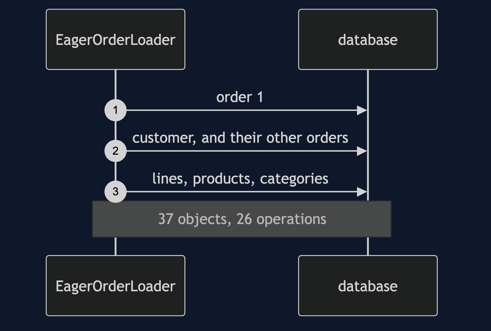
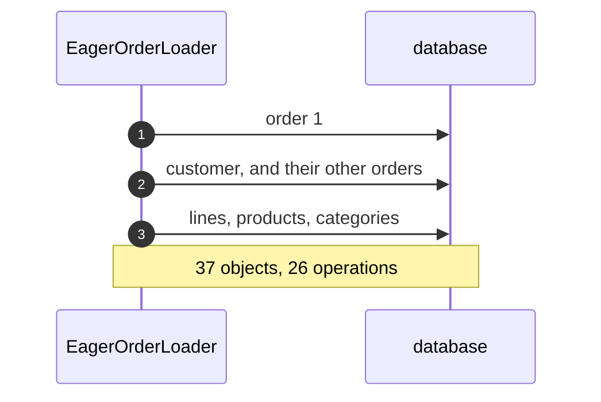
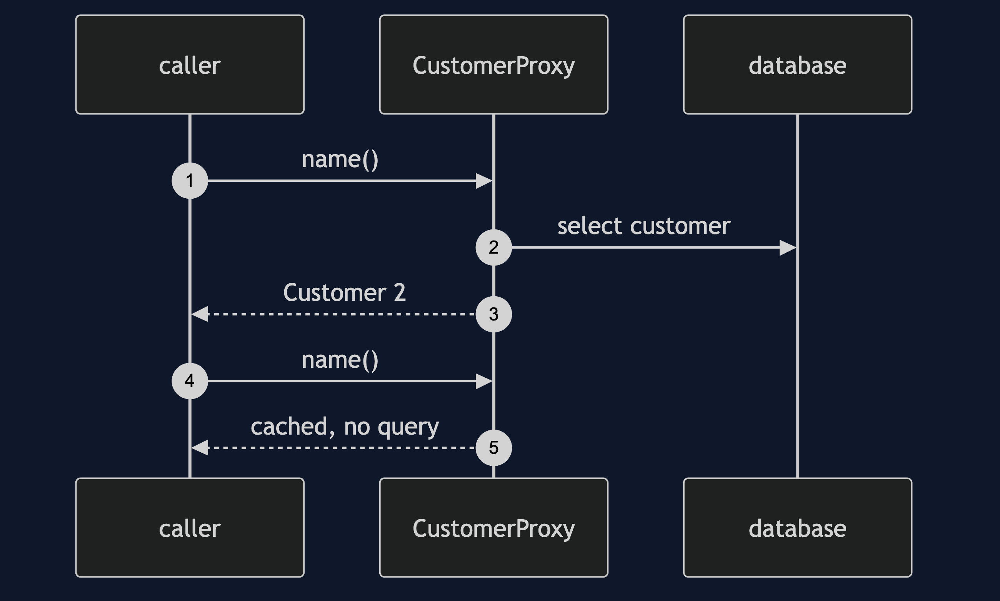
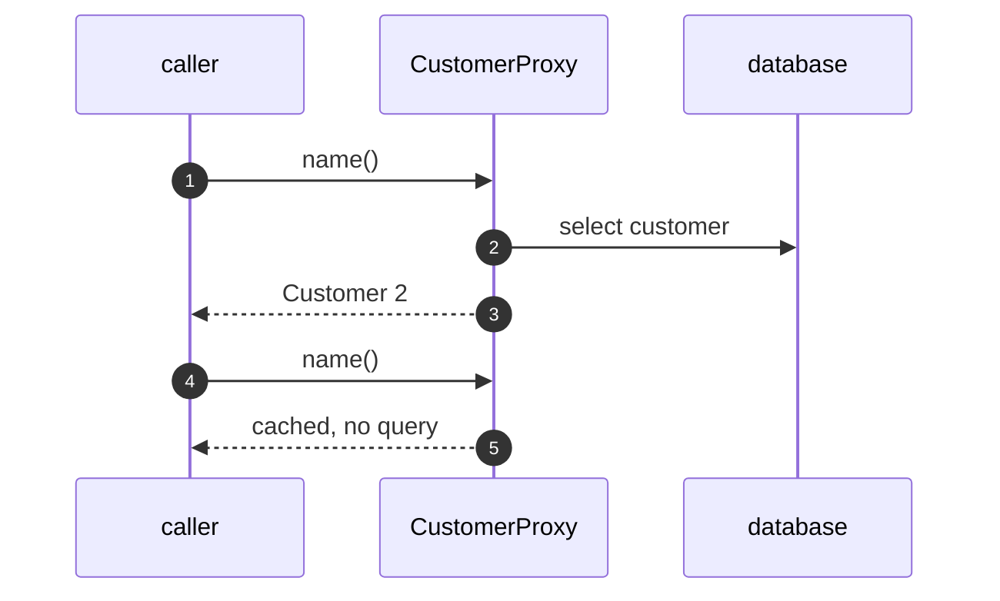
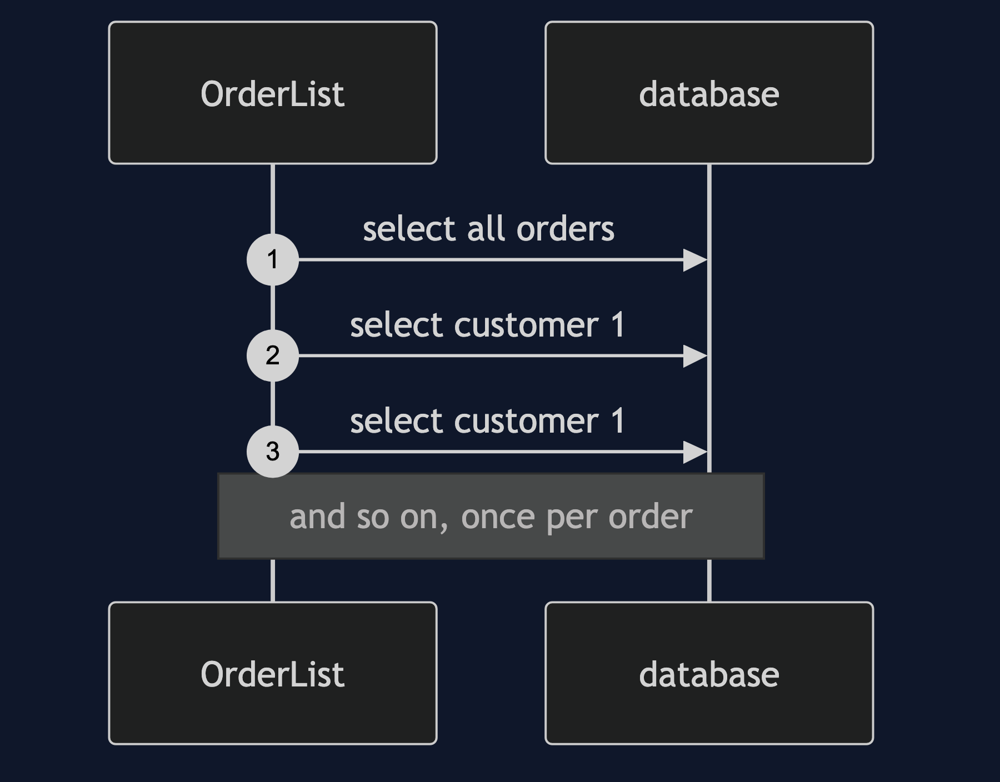
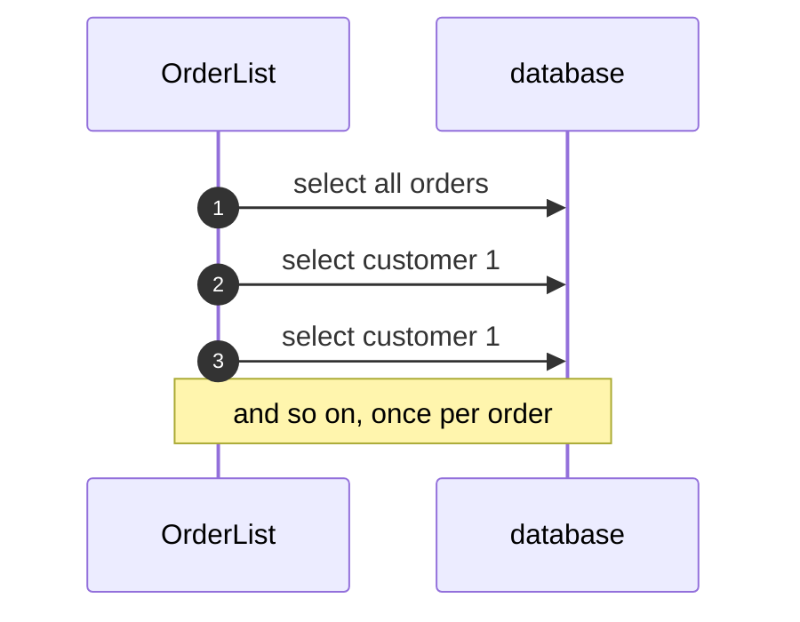
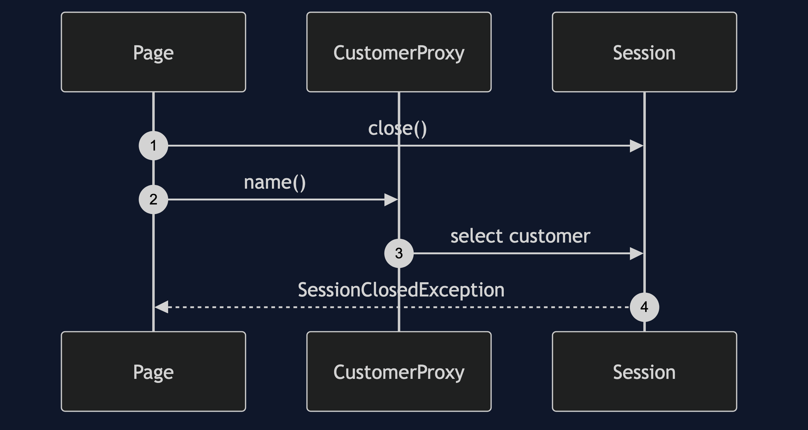
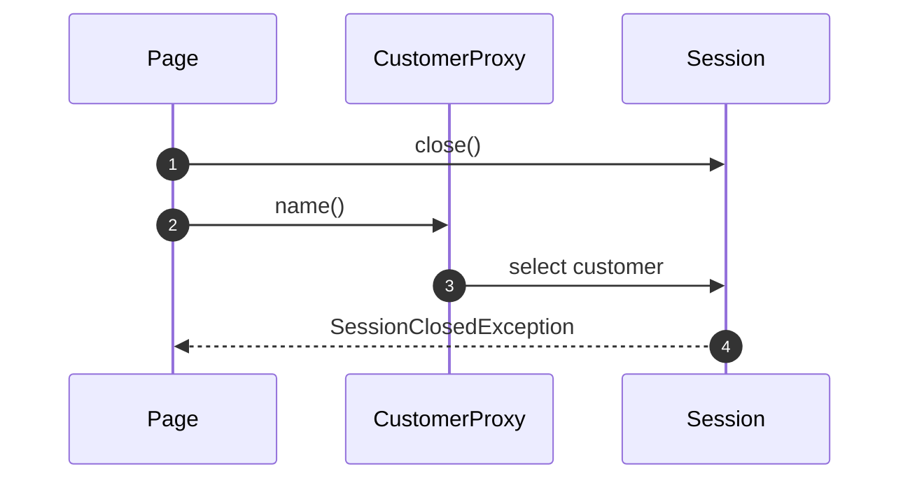

# Lazy Load Pattern — UML Sequence Diagrams

Four sequences.

## 1. Eager: Everything Reachable

Mermaid source

## 2. A Proxy Loads On First Use

Mermaid source

## 3. N Plus One

Mermaid source

## 4. The Session Has Closed

Mermaid source

