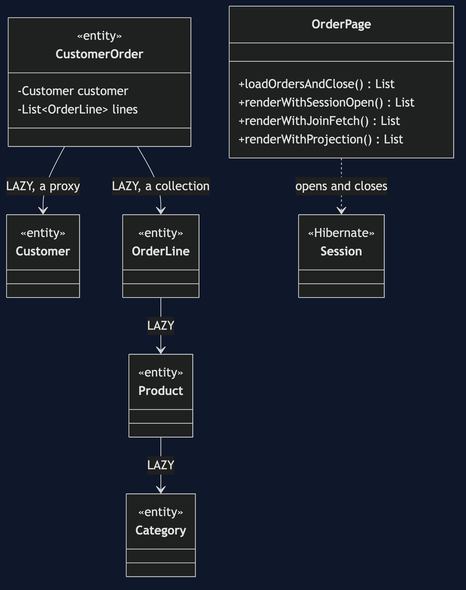
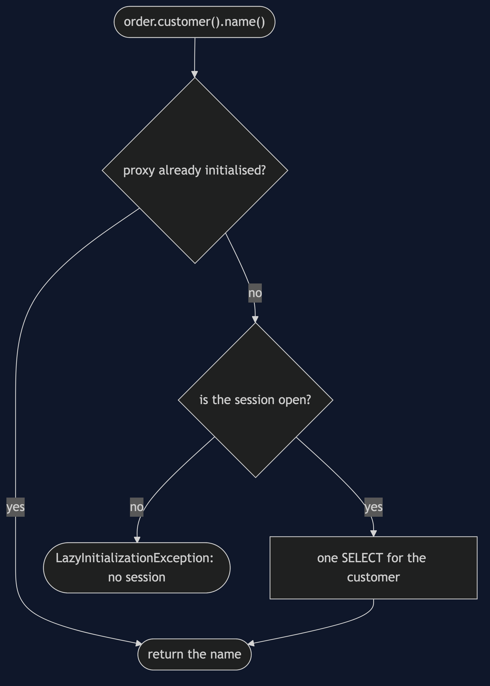
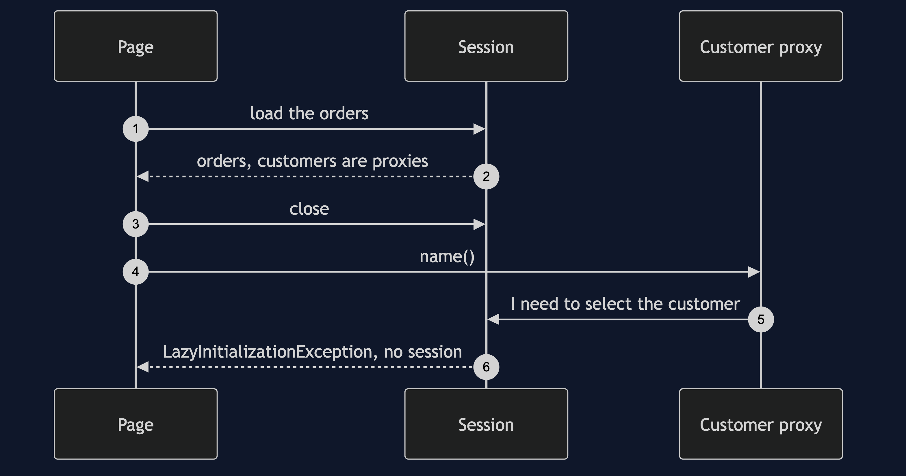
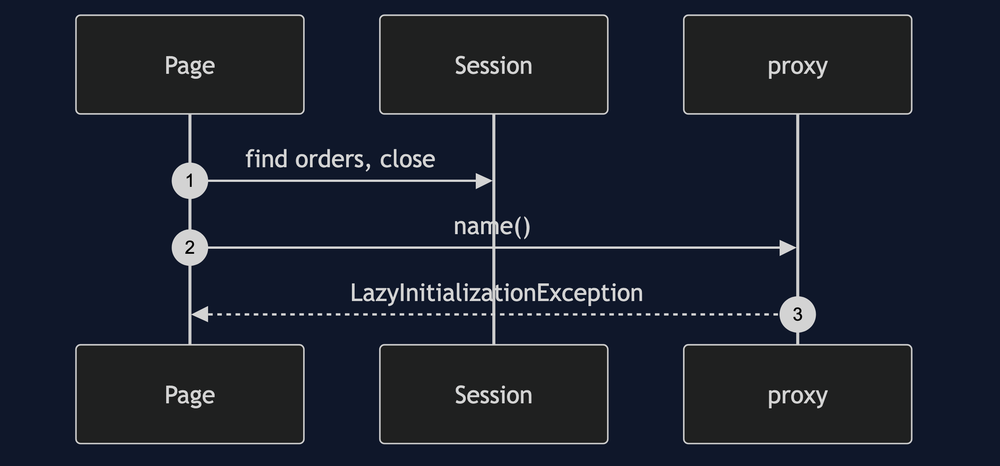
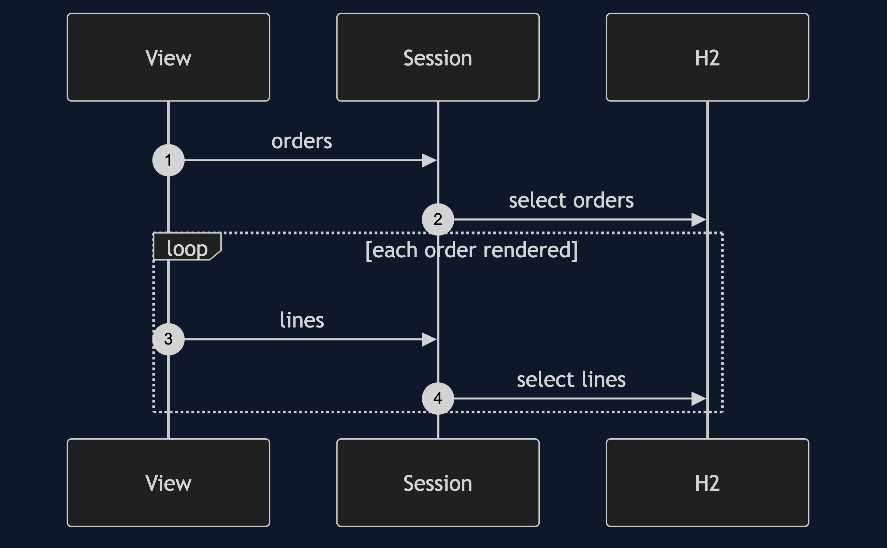
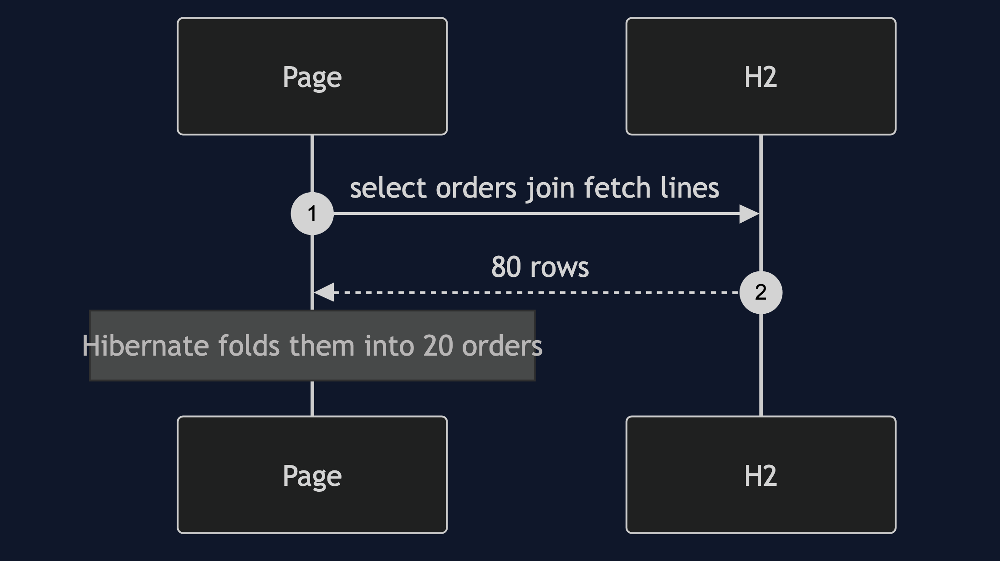
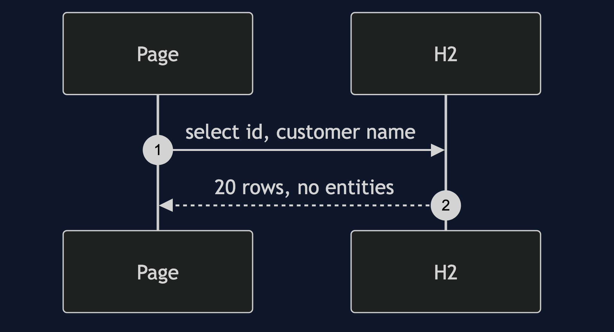

# Lazy Load with Hibernate Pattern

```
src/main/java/com/jk/explore/lazyloadhibernate/
├── LazyHibernateDemo.java           composition root — the six acts
├── HibernateSetup.java              a SessionFactory over in-memory H2, seeded like the partner's store
├── OrderPage.java                   one page, loaded four ways: the failure and the three fixes
│
└── domain/                          ← the partner's store, as entities
    ├── Customer.java  Category.java  Product.java
    ├── CustomerOrder.java            FetchType.LAZY on its customer and its lines
    └── OrderLine.java
```

**A lazy field holds a proxy that loads on first use, and the proxy needs its session: use it after the session closes and you get LazyInitializationException.**

This project is the framework version of [Lazy Load](../lazy-load-pattern). That project built a session-closed failure by hand; this one makes Hibernate raise its own, on purpose, and explains it from its mechanism rather than offering the usual workaround. It does not re-teach the pattern. It shows the one exception, and what each usual fix costs.

## Run

```bash
./gradlew run
```

Six acts. The partner project, Lazy Load, built a session-closed exception by hand. Here Hibernate raises its own, on purpose, and every statement count comes from Hibernate's statistics.

```
LAZY LOAD WITH HIBERNATE — the exception everybody has met

ONE. Load an order, close the session, use the customer.
  the order loaded fine: order 1
  asking for the customer's name threw LazyInitializationException:
  Could not initialize proxy [com.jk.explore.lazyloadhibernate.domain.Customer#1] - no session
  the failure is where it was used, not where it was loaded.

TWO. What is actually in the field.
  order.customer() is a generated subclass of Customer, initialised: false
  the proxy holds only the id (1) and a reference to the session. it has not loaded the customer.
  after asking for the name, inside the session, initialised: true
  when the session closes, the proxy has nothing to load with. that is the exception.

THREE. Fix one: keep the session open.
  20 orders, each with its customer's name: 6 statements. one for the orders, then one for each of the 5 distinct customers,
  because the session loads each customer once. the identity map, again.
  20 orders, each with its line count: 21 statements. one for the orders, then one for each order's lines. that is N+1.
  it works. the cost: the session, and its connection, stay open while the page renders,
  and the extra queries are hidden inside the view, where nobody looks.

FOUR. Fix two: fetch it in the same query.
  join fetch of the customer: 20 orders, 1 statement.
  join fetch of the lines:    20 orders, 1 statement.
  the cost: that one statement makes the database send 80 rows for 20 orders,
  each order repeated once per line, and Hibernate folds them back together. and every caller
  of this query now gets the lines, wanted or not.

FIVE. Fix three: ask for exactly what the page needs.
  projection: 20 rows, 1 statement, first row OrderRow[orderId=1, customerName=Customer 1]
  no entity, no proxy, nothing lazy to fail. the cost: a class for every query,
  and a row is not an object with behaviour. this is the DTO project's idea.

SIX. Where you have already met this.
  that exception is one of the most searched Java errors there is.
  now you know its mechanism: a proxy, and a session that has gone.
  making the mapping eager would remove it, and bring back the partner's act one.
```

## Test

```bash
./gradlew test
```

2 test classes, 8 test methods, offline, over an in-memory H2 database that needs no installation.

## Technologies and versions

| What | Version | Why it is here |
| --- | --- | --- |
| Java | 21 | The repository standard, via the Gradle toolchain block |
| Gradle | 9.2.1 | The wrapper in this directory; no separate install needed |
| Hibernate ORM | 7.4.5.Final | The JPA implementation whose lazy loading is being explained |
| H2 | 2.4.240 | An in-memory database that starts inside the test, so nothing is installed |
| JUnit 5 | 5.10.2 | Test runner |

Versions come from Spring Boot 4.1.1's bill of materials. Spring Boot itself is not a dependency. See [`docs/dependencies.md`](docs/dependencies.md).

## Learning Material

| Document | What it covers |
| --- | --- |
| [`docs/problem-statement.md`](docs/problem-statement.md) | The partner's store, and the exception |
| [`docs/lazy-load-with-hibernate-pattern-explained.md`](docs/lazy-load-with-hibernate-pattern-explained.md) | The proxy, the three fixes, and what each costs |
| [`docs/class-diagram.md`](docs/class-diagram.md) | The types |
| [`docs/architecture-diagram.md`](docs/architecture-diagram.md) | A proxy and a session |
| [`docs/data-flow-diagram.md`](docs/data-flow-diagram.md) | One access to a lazy field |
| [`docs/sequence-diagram.md`](docs/sequence-diagram.md) | Written for a listener with the screen off |
| [`docs/uml-diagram.md`](docs/uml-diagram.md) | Four sequences |
| [`docs/animation.html`](docs/animation.html) | The six acts in a browser |
| [`docs/prerequisites.md`](docs/prerequisites.md) | What you need to know |
| [`docs/session.md`](docs/session.md) | A one-hour taught session |
| [`docs/spec.md`](docs/spec.md) | The generated specification |
| [`docs/youtube.md`](docs/youtube.md) | Title, description and chapters |
| [`docs/dependencies.md`](docs/dependencies.md) | What Hibernate and H2 are, what they cost, and that skipping this project loses none of the pattern |

### The pattern in one picture



### Where each piece sits


### How one request moves



### Who calls whom, in order



### All four sequences









### Video

Built from [`video/scenes.py`](video/scenes.py) by
[`video/build_video.sh`](video/build_video.sh). The rendered file is not
committed; see the repository README for why.

## Where you have already met this

`LazyInitializationException` is one of the most searched Java errors there is. In a Spring application it is almost always a controller or view using a lazy field after the transaction ended.

## When this is too much

If you almost always need the related data, lazy loading only adds queries.

## Where this sits

This project pairs with [Lazy Load](../lazy-load-pattern), and is the second of four framework projects in [`enterprise-design-patterns`](..).
