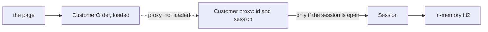

# Lazy Load with Hibernate Pattern — Architecture Diagram

A proxy in the entity, and a session that has to be open to fill it.

Mermaid source

```mermaid
flowchart LR
    Page["the page"] --> O["CustomerOrder, loaded"]
    O -.->|proxy, not loaded| P["Customer proxy: id and session"]
    P -->|only if the session is open| S["Session"]
    S --> DB["in-memory H2"]
```

