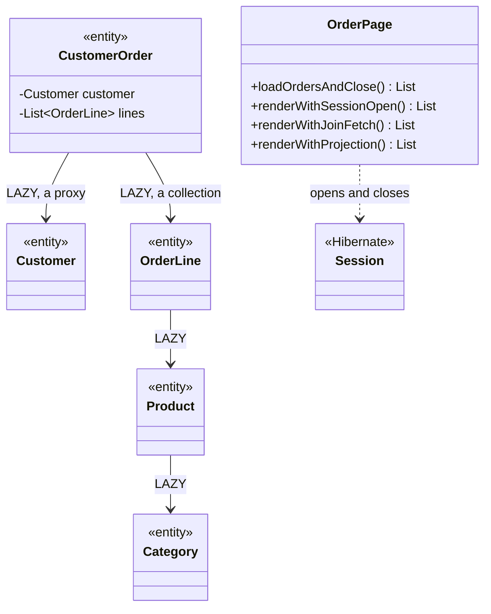

# Lazy Load with Hibernate Pattern — Class Diagram

Every association on `CustomerOrder` is lazy. The proxy needs a `Session`.

Mermaid source

```mermaid
classDiagram
    class CustomerOrder {
        <<entity>>
        -Customer customer
        -List~OrderLine~ lines
    }
    class Customer {
        <<entity>>
    }
    class OrderLine {
        <<entity>>
    }
    class Product {
        <<entity>>
    }
    class Category {
        <<entity>>
    }
    class OrderPage {
        +loadOrdersAndClose() List
        +renderWithSessionOpen() List
        +renderWithJoinFetch() List
        +renderWithProjection() List
    }
    class Session {
        <<Hibernate>>
    }
    CustomerOrder --> Customer : LAZY, a proxy
    CustomerOrder --> OrderLine : LAZY, a collection
    OrderLine --> Product : LAZY
    Product --> Category : LAZY
    OrderPage ..> Session : opens and closes
```

