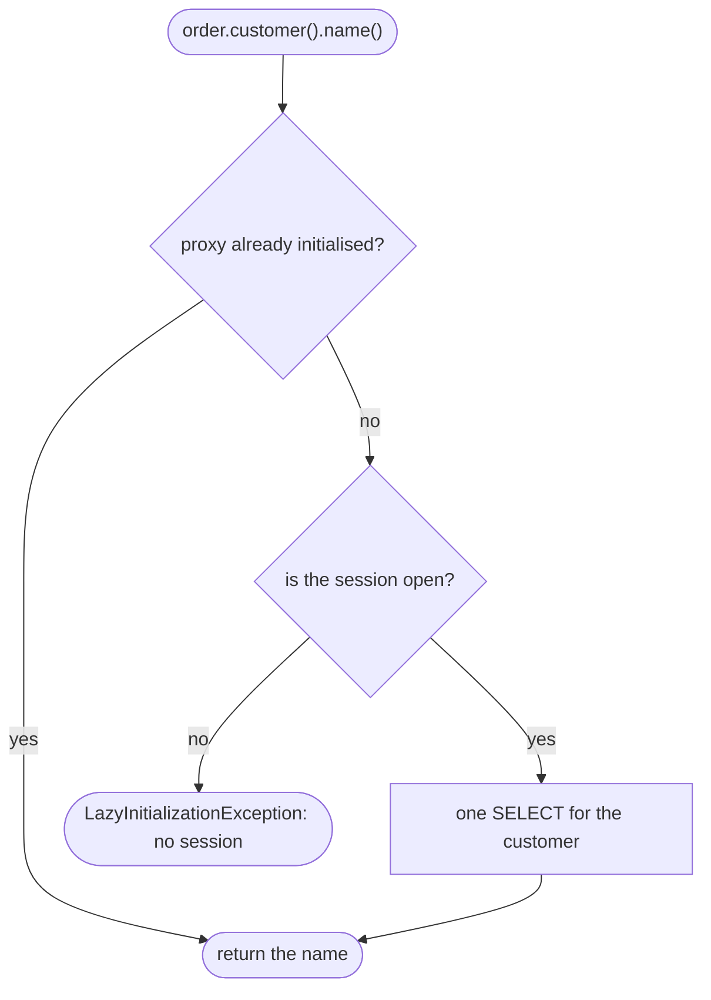

# Lazy Load with Hibernate Pattern — Data Flow Diagram

One access to a lazy field: initialised, loading, or failing.

Mermaid source

```mermaid
flowchart TD
    Ask(["order.customer().name()"])
    Init{"proxy already initialised?"}
    Open{"is the session open?"}
    Ret(["return the name"])
    Load["one SELECT for the customer"]
    Fail(["LazyInitializationException: no session"])
    Ask --> Init
    Init -- yes --> Ret
    Init -- no --> Open
    Open -- yes --> Load --> Ret
    Open -- no --> Fail
```

