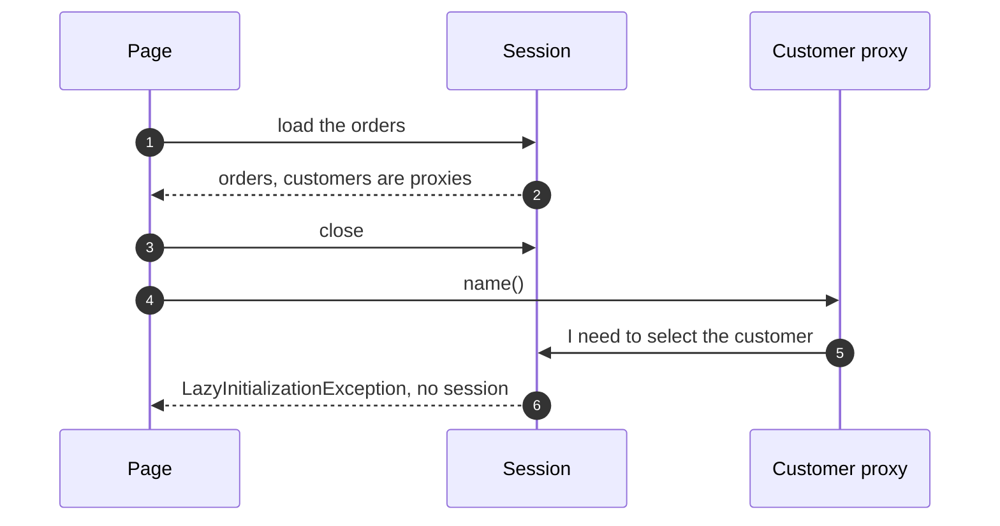

# Lazy Load with Hibernate Pattern — Sequence Diagram

Written for a listener with the screen off.

Say it in words. The page asks for the orders, and Hibernate loads them, leaving each order's customer as a proxy that holds only an id. The session then closes. Later the page asks a proxy for the customer's name. The proxy needs to select the customer, and it needs the session to do it. The session is gone, so it throws the lazy initialization exception. It fails where it was used, not where it was loaded.

Mermaid source

The load-bearing sentence: **the exception comes from where it was used, not from where it was loaded.**
