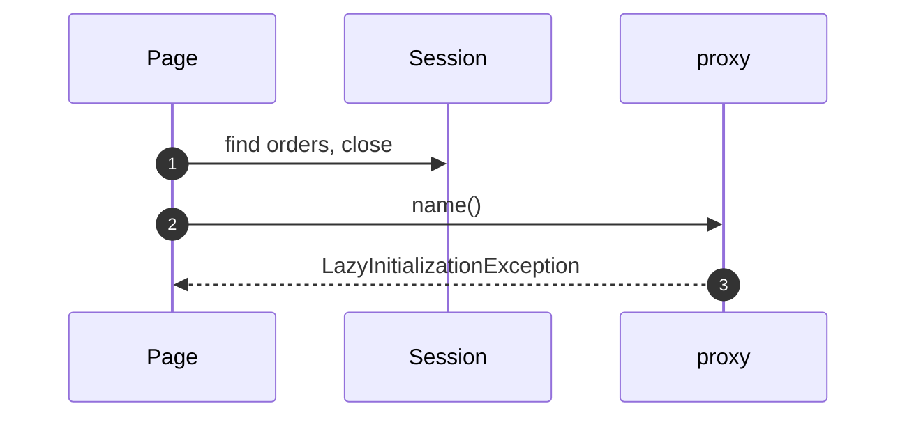
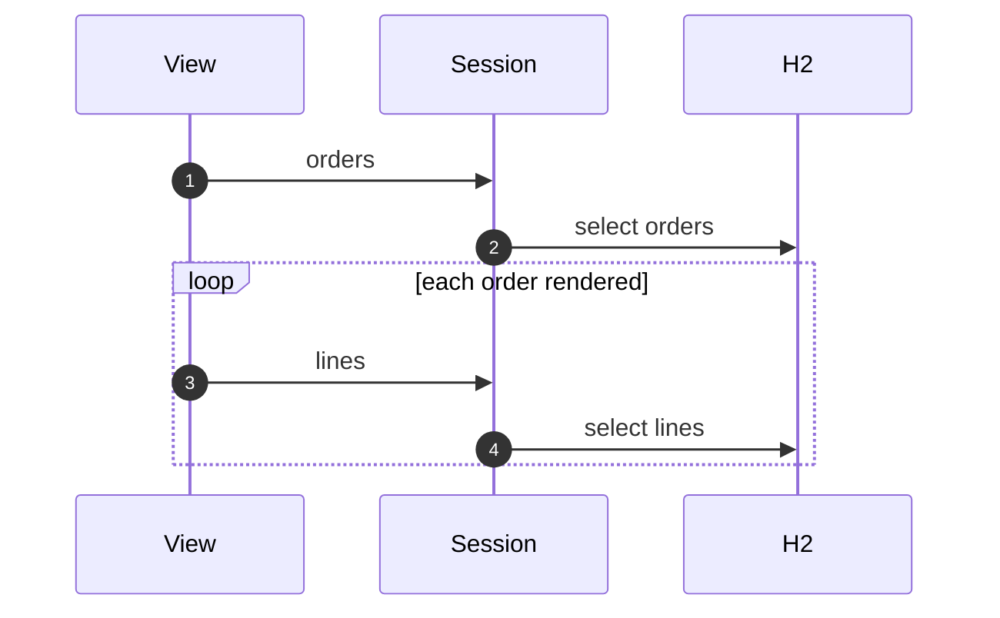
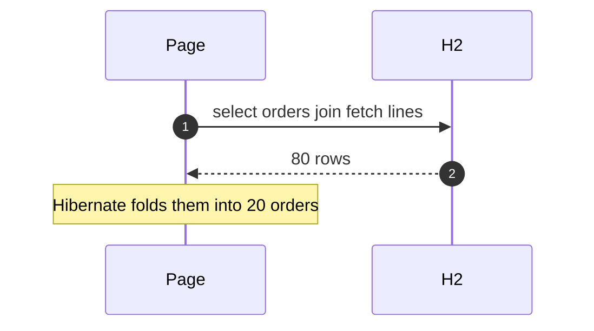
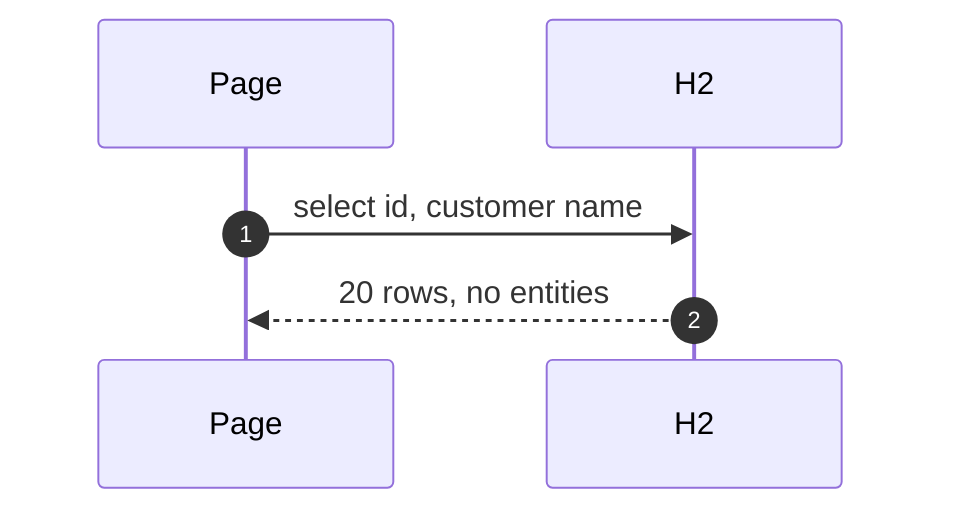

# Lazy Load with Hibernate Pattern — UML Sequence Diagrams

Four sequences.

## 1. The Exception

Mermaid source

## 2. Fix One: Keep The Session Open

Mermaid source

## 3. Fix Two: Join Fetch

Mermaid source

## 4. Fix Three: A Projection

Mermaid source

