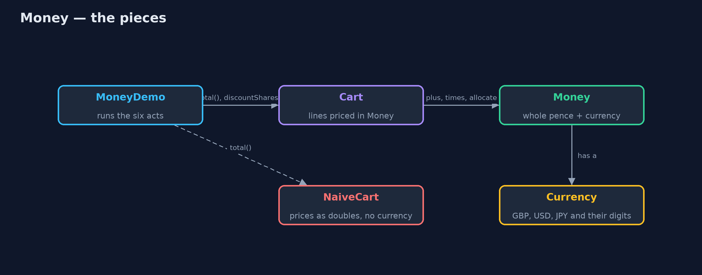

# Money Pattern — Architecture Diagram

The demo drives two carts. The naive one holds doubles; the other holds Money, which knows its currency and how to split itself.

The naive cart is kept in the project on purpose, so the difference can be run
and read side by side. Nothing depends on it.
