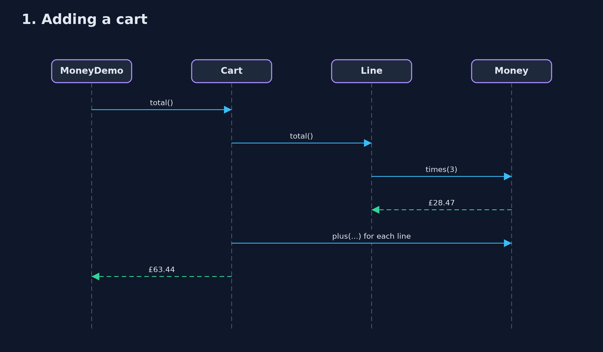
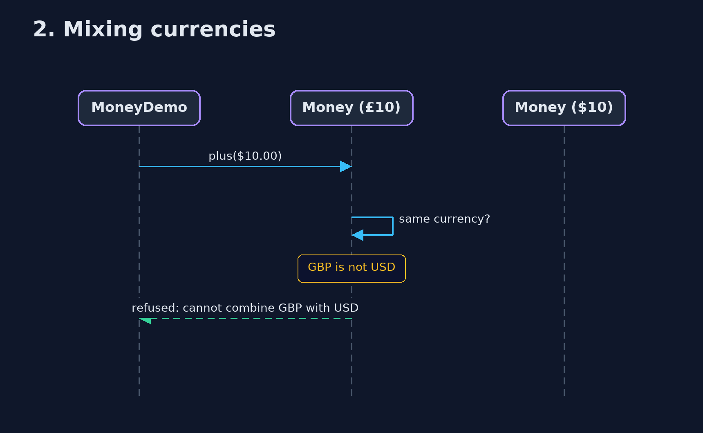

# Money Pattern — UML Sequence Diagrams

## 1. 1. Adding a cart

Each line multiplies exactly, and the cart adds the line totals.

## 2. 2. Mixing currencies

The currency check happens inside Money, so no caller can forget it.

