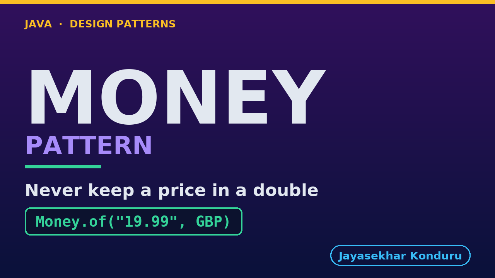

# YouTube — Money Pattern

Everything needed to publish `video/money-pattern-explained.mp4`. Copy the fields straight out of this file.

Chapter timings are generated from the video's `.srt`. Re-run `python3 docs/make_youtube_docs.py money` after any change to the narration, or they will be wrong.

## Title

```
Money
```

5 characters — under the 60 YouTube shows before truncating in search results.

## Description

The first two lines are what a viewer sees above the fold, so they carry the hook rather than the boilerplate.

```
Money pattern in Java: a price is kept as a whole number of the smallest coin, such as pence, together with its currency, never as a decimal number, so every sum is exact, like counting coins in a cash drawer. Explained with an online store that adds up baskets, charges VAT, gives discounts, and sells in pounds, dollars and yen. We hear why ten pence plus twenty pence is not thirty in a double, replace doubles with Money, refuse to add pounds to dollars, treat rounding as a decision, and split ten pounds three ways without losing a penny. We finish with the bill.

CHAPTERS
00:00 Introduction
01:25 The Scenario
02:00 Act One — Prices as Doubles
02:51 Why A Double Gets It Wrong
03:34 The Pattern
04:03 Act Two — Prices as Money
04:43 Act Three — Currencies
05:24 Act Four — Rounding Is A Choice
06:14 Act Five — Splitting
07:07 The Pieces
07:45 Act Six — The Bill
08:22 How To Recognise It
08:59 The Verdict
09:33 Thanks for Watching

SOURCE CODE, WRITTEN NOTES AND AN INTERACTIVE ANIMATION
https://github.com/jk-boot-up/java-design-patterns/tree/main/gradle-java/enterprise-design-patterns/money-pattern

WHAT YOU NEED FIRST
Java 21 and a working knowledge of classes and interfaces. No prior design-pattern knowledge is assumed. The full prerequisites are in docs/prerequisites.md in the repository.
```

## Chapters

YouTube renders these as chapters only if there are at least three and the first is at `00:00`.

```
00:00 Introduction
01:25 The Scenario
02:00 Act One — Prices as Doubles
02:51 Why A Double Gets It Wrong
03:34 The Pattern
04:03 Act Two — Prices as Money
04:43 Act Three — Currencies
05:24 Act Four — Rounding Is A Choice
06:14 Act Five — Splitting
07:07 The Pieces
07:45 Act Six — The Bill
08:22 How To Recognise It
08:59 The Verdict
09:33 Thanks for Watching
```

## Tags

```
money pattern, java money, floating point, rounding, enterprise patterns, design patterns, java design patterns, gang of four, java 21, software design, clean code, object oriented design, java tutorial, ecommerce, programming tutorial
```

235 characters, under YouTube's 500 limit.

## Thumbnail



**Upload `docs/thumbnail.png`** — 1280×720, the size YouTube recommends, generated by `docs/make_thumbnails.py`. It is deliberately not the same image as the video's opening frame: a thumbnail is judged at about 360 pixels wide in a search result, so this one carries only the pattern name, one line of promise and one short piece of code, each set large enough to survive the shrink.

`video/poster.png` is the 1920×1080 opening frame, produced by the video build. It stays in the repository as the title card; it is not what gets uploaded.

YouTube will not pick the thumbnail up on its own — upload it under **Details → Thumbnail → Upload file**. A custom thumbnail requires a verified channel.

## Upload checklist

- [ ] Upload `video/money-pattern-explained.mp4` (1080p, H.264, 30 fps, AAC 48 kHz — already YouTube's recommended settings, no re-encode needed)
- [ ] Set the video language to **English** first, or the subtitle option may not appear
- [ ] Add subtitles: *Video elements → Add subtitles → Upload file → With timing* → `video/money-pattern-explained.srt`
- [ ] Upload `docs/thumbnail.png` as the thumbnail — do not let YouTube auto-pick a frame
- [ ] Paste the title, description and tags from above
- [ ] Add to the **Java Design Patterns** playlist, in learning order
- [ ] Wait for 1080p processing before sharing the link — code slides are unreadable at 360p

## Cards and end screen

End screen links to whichever pattern video goes up next — set it at upload time rather than assuming an order.

Add a card partway through pointing at the playlist, so a viewer who arrives at this pattern from search can find the rest of the series.

## Runtime

Approximately 10:22, narrated at 145 words per minute.
