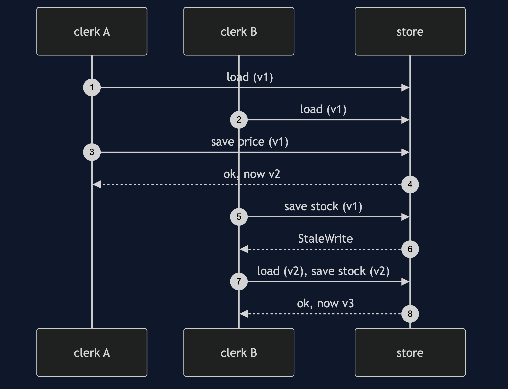

# Optimistic Offline Lock Pattern

```
src/main/java/com/jk/explore/optimisticlock/
├── OptimisticLockDemo.java          the six acts
├── OptimisticStore.java             a version per row; a save succeeds only at the version it read
├── LastWriteWinsStore.java          no lock at all
├── Versioned.java  StaleWrite.java  Product.java
```

**An optimistic lock assumes nobody will clash, and checks a version at save time to find out.**

This project is in [enterprise-design-patterns](..). Its opposite is [Pessimistic Offline Lock](../pessimistic-offline-lock-pattern), which stops the clash before it starts. The aggregate version check in [Aggregate](../../domain-driven-design-patterns/aggregate-pattern) is this pattern applied to one aggregate.

## Run

```bash
./gradlew run
```

Six acts. Every number quoted below comes from this program's own output.

```
ONE. No lock: the last write wins.
  clerk A raises the price to 12.00 and saves. clerk B counts 40 in stock and saves.
  the row now: price £10.00, stock 40. clerk A's price has vanished, and no error was raised.
TWO. A version on every row.
  clerk A saves: accepted. the row is now at version 2.
  clerk B saves: MUG-BLUE was changed by someone else since you read it.
  the row still says: price £12.00, stock 50.
THREE. Reload, reapply, save.
  clerk B is refused, reloads, reapplies the stock count, and saves after 2 attempts.
  the row: price £12.00, stock 40. both changes survived.
FOUR. The version is per row, not per field.
  one clerk changed the price and another changed the stock. different fields. second save refused: true.
  a conflict that was not one. a finer version, per field, would have let both through, at the price of more bookkeeping.
FIVE. The bill: a busy row.
  10 clerks each add one to the stock of the same product, all having read it at the start.
  final stock: 10. saves attempted: 19. saves refused: 9.
  nothing was lost, and a row that everyone wants is a row where most of the work is repeated.
SIX. The bill: you find out at the end.
  a user makes 5 changes over a long session. on save: MUG-BLUE was changed by someone else since you read it.
  all 5 changes are discarded, and the user learns it only now. the cost of a conflict is paid when it is found.
```

## Test

```bash
./gradlew test
```

2 test classes, 8 test methods, offline, with nothing installed and no framework.

## Technologies and versions

| What | Version | Why it is here |
| --- | --- | --- |
| Java | 21 | The repository standard, via the Gradle toolchain block |
| Gradle | 9.2.1 | The wrapper in this directory; no separate install needed |
| JUnit 5 | 5.10.2 | Test runner |

No framework. A hand-built project stays plain Java so the mechanism is the whole lesson.

## Learning Material

| Document | What it covers |
| --- | --- |
| [`docs/problem-statement.md`](docs/problem-statement.md) | Two clerks, one product |
| [`docs/optimistic-offline-lock-pattern-explained.md`](docs/optimistic-offline-lock-pattern-explained.md) | The pattern, and six acts |
| [`docs/class-diagram.md`](docs/class-diagram.md) | The types |
| [`docs/architecture-diagram.md`](docs/architecture-diagram.md) | Two writers and a versioned row |
| [`docs/data-flow-diagram.md`](docs/data-flow-diagram.md) | What a save does |
| [`docs/sequence-diagram.md`](docs/sequence-diagram.md) | Written for a listener with the screen off |
| [`docs/uml-diagram.md`](docs/uml-diagram.md) | Four sequences |
| [`docs/animation.html`](docs/animation.html) | The six acts in a browser |
| [`docs/prerequisites.md`](docs/prerequisites.md) | What you need to know |
| [`docs/session.md`](docs/session.md) | A one-hour taught session |
| [`docs/spec.md`](docs/spec.md) | The generated specification |
| [`docs/youtube.md`](docs/youtube.md) | Title, description and chapters |

### The pattern in one picture


### Where each piece sits


### How one request moves


### Who calls whom, in order



### All four sequences


### Video

Built from [`video/scenes.py`](video/scenes.py) by
[`video/build_video.sh`](video/build_video.sh). The rendered file is not
committed; see the repository README for why.

## Where you have already met this

JPA's `@Version`, HTTP's `ETag` and `If-Match`, and every database that offers compare-and-set.

## When this is too much

Where conflicts are frequent and costly, retrying wastes work and a lock is kinder. Where only one writer exists, a version is pure overhead.

## Where this sits

This project is in [`enterprise-design-patterns`](..), and is meant to be read with its neighbours there.
