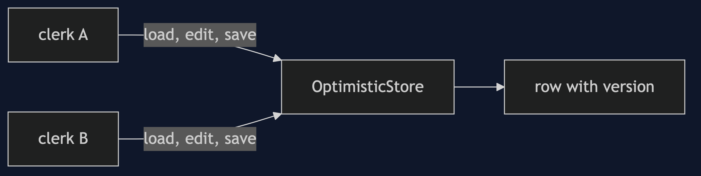
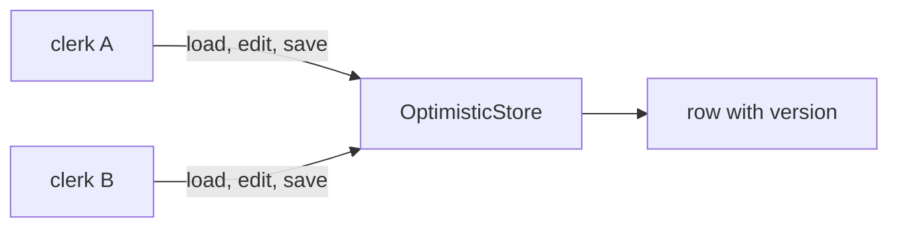

# Optimistic Offline Lock Pattern — Architecture Diagram

Nothing is locked. The store checks the version when a save arrives.

Mermaid source

```mermaid
flowchart LR
    A["clerk A"] -->|load, edit, save| S["OptimisticStore"]
    B["clerk B"] -->|load, edit, save| S
    S --> R["row with version"]
```

