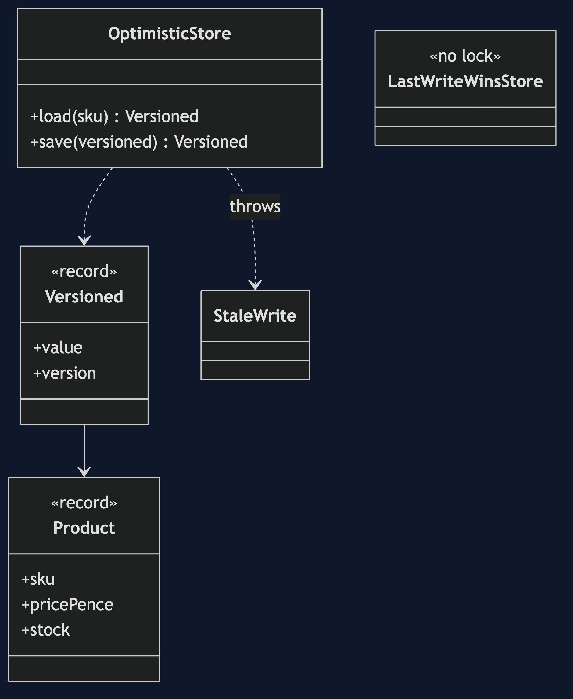
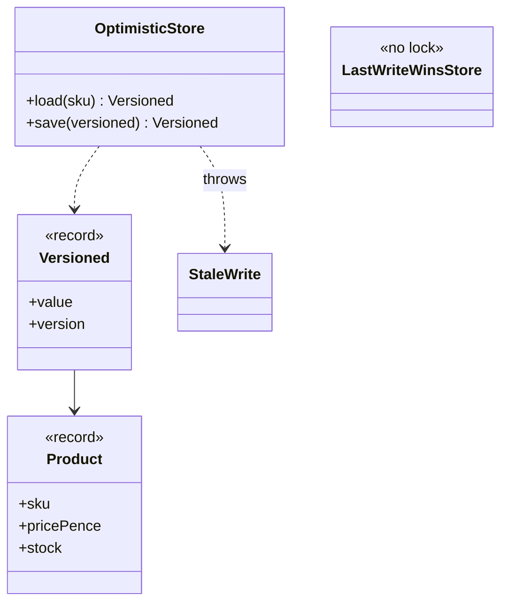

# Optimistic Offline Lock Pattern — Class Diagram

A row carries a version. A save succeeds only at the version that was read.

Mermaid source

```mermaid
classDiagram
    class OptimisticStore {
        +load(sku) Versioned
        +save(versioned) Versioned
    }
    class Versioned {
        <<record>>
        +value
        +version
    }
    class Product {
        <<record>>
        +sku
        +pricePence
        +stock
    }
    class StaleWrite
    class LastWriteWinsStore {
        <<no lock>>
    }
    OptimisticStore ..> Versioned
    Versioned --> Product
    OptimisticStore ..> StaleWrite : throws
```

