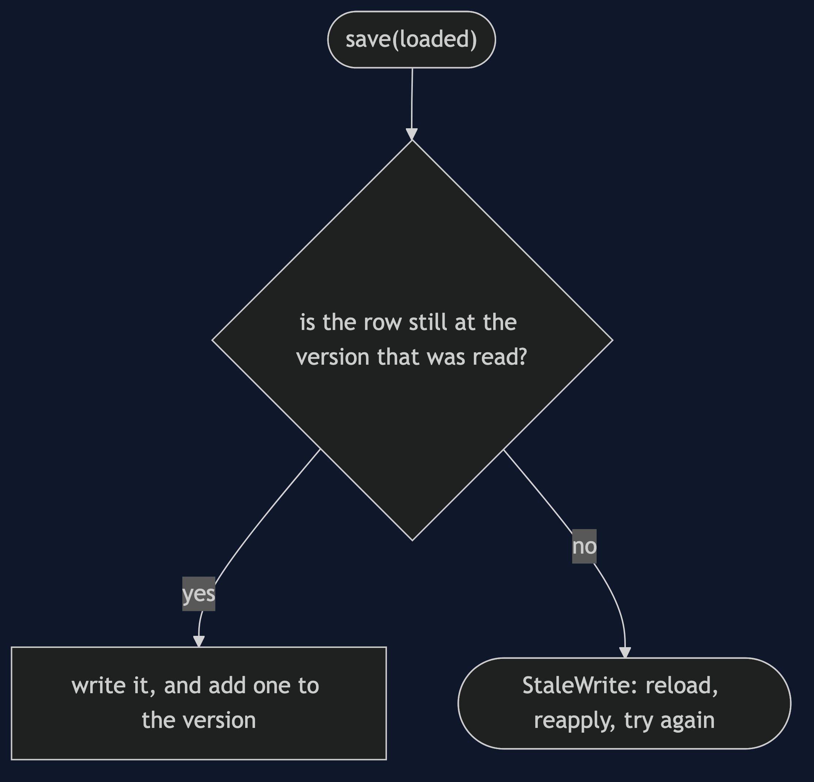
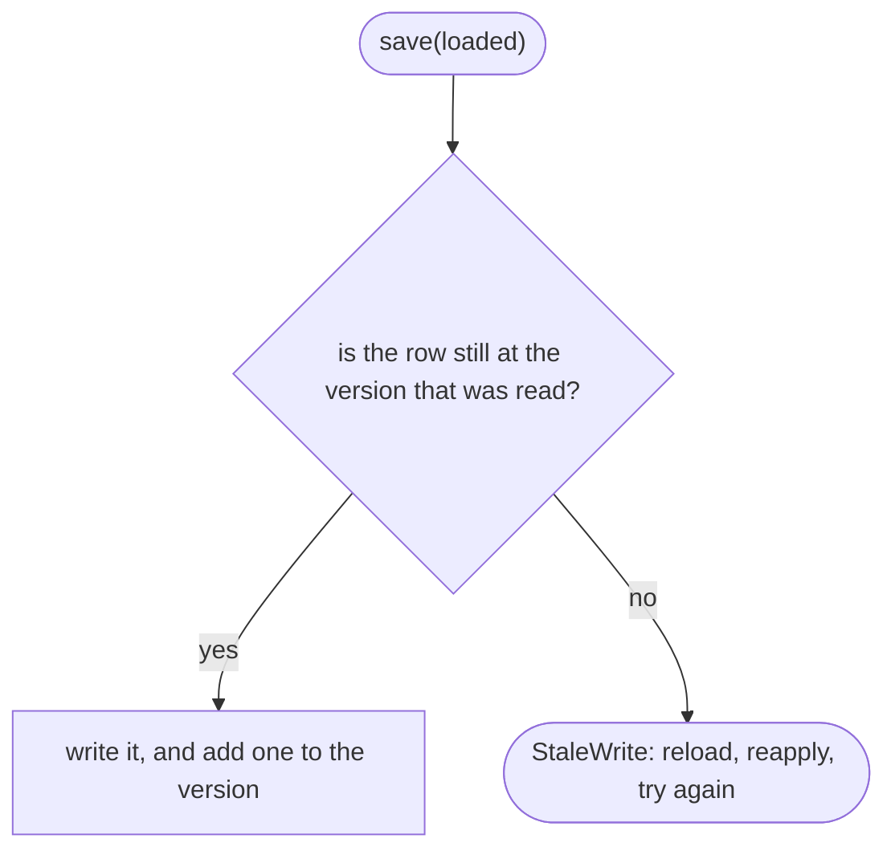

# Optimistic Offline Lock Pattern — Data Flow Diagram

What happens when a save arrives.

Mermaid source

```mermaid
flowchart TD
    Save(["save(loaded)"])
    Same{"is the row still at the version that was read?"}
    Ok["write it, and add one to the version"]
    No(["StaleWrite: reload, reapply, try again"])
    Save --> Same
    Same -- yes --> Ok
    Same -- no --> No
```

