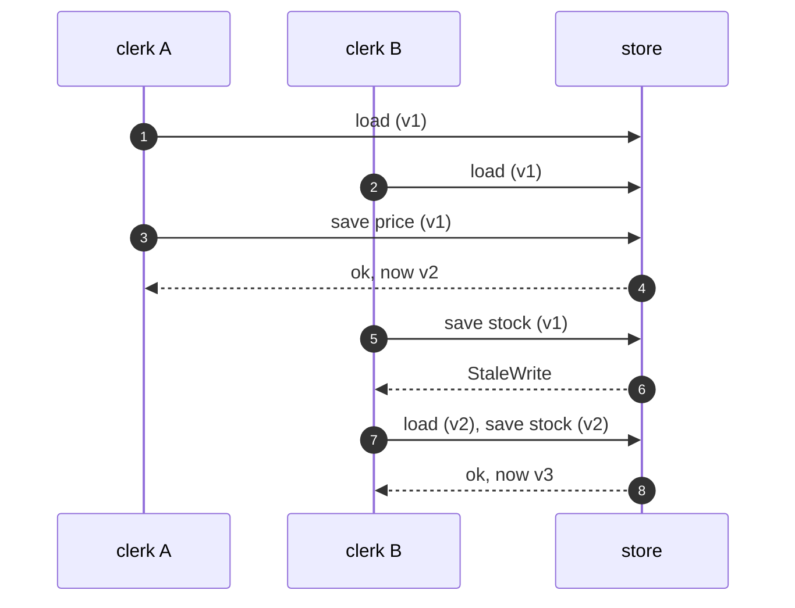

# Optimistic Offline Lock Pattern — Sequence Diagram

Written for a listener with the screen off.

Say it in words. Both clerks load the product at version one. Clerk A saves a new price. The store sees version one, matches, writes it, and moves to version two. Clerk B saves the stock count, still holding version one. The store sees the row is at version two, and refuses with a stale write error. Clerk B reloads, gets version two with the new price, reapplies the count, and saves at version two. It is accepted.

Mermaid source

The load-bearing sentence: **a clash is found when someone saves, not before.**
