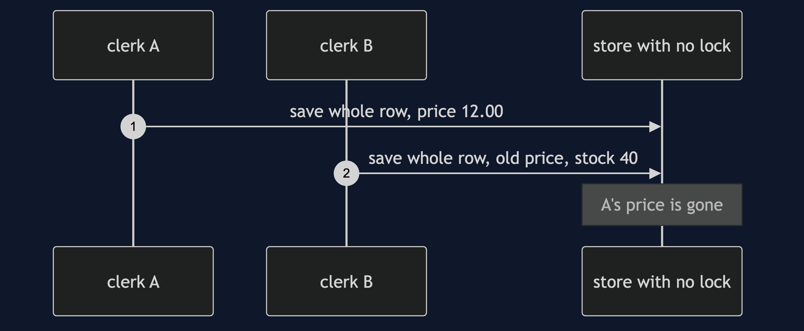
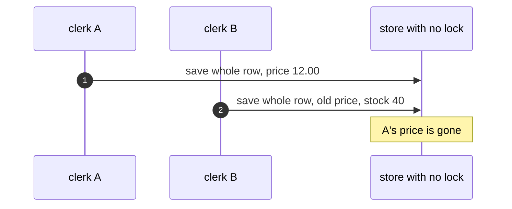

# Optimistic Offline Lock Pattern — UML Sequence Diagrams

Four sequences.

## 1. A Lost Update

Mermaid source

```mermaid
sequenceDiagram
    autonumber
    participant A as clerk A
    participant B as clerk B
    participant S as store with no lock
    A->>S: save whole row, price 12.00
    B->>S: save whole row, old price, stock 40
    Note over S: A's price is gone
```

