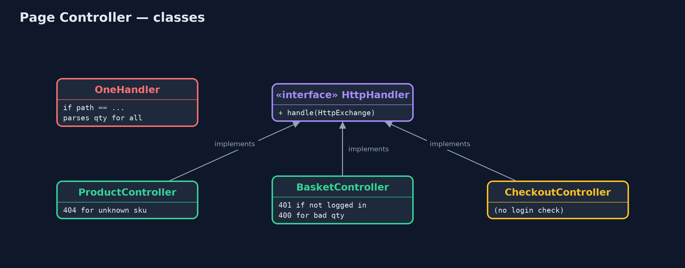

# Page Controller Pattern

```
src/main/java/com/jk/explore/pagecontroller/
├── Controllers.java         The pattern: one controller per page
├── OneHandler.java          Without the pattern: one handler for every page, choosing by path in one long method
├── PageControllerDemo.java  The five acts: one handler for every page, a controller per page, errors that stay on their page, a new page, and the bill
├── Shop.java                The shop's catalogue, shared by the pages
└── Web.java                 Small helpers for the JDK's built-in web server: read the query string, send a reply, and make a request
```

**Give every page of a web site its own small controller that reads that page's input, decides what to do and sends the reply, instead of one handler for everything.**

Page Controller is one of Martin Fowler's web presentation patterns. Each page
or action of a web site, such as the product page or the basket, gets its own
controller: a small class that reads that page's input, decides what to do,
and sends the reply. The web server maps each address to its controller.

Each page's logic lives in one place, errors stay on their page, and adding a
page means adding a class. The price is that checks every page needs, such as
"is the customer logged in?", are repeated in each controller.

## The idea in everyday terms

Think of a department store with a separate desk for each service: a returns
desk, a gift-wrapping desk, a café till. Each desk knows only its own job, and
a queue at one does not slow the others. But a store-wide rule, "check the
receipt", has to be taught at every desk, and one desk will eventually forget.

## The scenario

The online store's web site has a product page, a basket and a checkout. They
were all served by one handler that chose what to do by looking at the
address, in one long method. Someone added quantity parsing at the top of it
for the basket, and the product page, which has no quantity, started failing.

## Run

```bash
./gradlew run
```

The demo tells the story in 5 acts, each printing exact numbers that the tests check:

| Act | What it shows |
| --- | --- |
| 1. One handler for every page | The basket works, but the product page returns 500: quantity parsing added for the basket runs for every page. |
| 2. A controller per page | ProductController, BasketController and CheckoutController each serve one address; the product page and basket both work. |
| 3. Errors stay on their page | An unknown product is 404 from the product page; qty=two is 400 from the basket; the product page still works. |
| 4. A new page | ReviewsController is one new class and one registration line: /reviews answers 4.5 stars from 12 customers. |
| 5. The bill | Not logged in: the basket says 401, but checkout says 200, because its author forgot the login check. |

## Test

```bash
./gradlew test
```

8 tests in `ControllersTest`, `DemoRunsTest`. Every number the demo prints is asserted, and nothing depends on the clock, so every run gives the same result.

## Technologies and versions

| Technology | Version | Used for |
| --- | --- | --- |
| Java | 21 | the code (toolchain set in `build.gradle`) |
| Gradle | 9.2.1 (wrapper) | build and run, nothing to install |
| JUnit | 5.10.2 | the tests |
| videokit | repository tool | the narrated video and animation: Piper `en_US-amy-medium`, speed 0.8, longer pauses (the approved `amy-slow` voice) |

## Learning Material

| Document | What it is for |
| --- | --- |
| [Problem statement](docs/problem-statement.md) | the situation and what the project must show |
| [Prerequisites](docs/prerequisites.md) | what you need to know first |
| [Page Controller, explained](docs/page-controller-pattern-explained.md) | the acts in prose |
| [Session guide](docs/session.md) | a one-hour lesson with exercises |
| [Animated walkthrough](docs/animation.html) | the acts step by step, narrated |
| [Spec](docs/spec.md) | what this project must be true of |

### The pattern in one picture

The server sends each address to its own controller.


### Where each piece sits

Every controller implements the JDK's HttpHandler.



### How the data moves

The basket controller does its own checks, in its own order.


### Who calls whom, in order

One request, one controller, one reply.


### Video

`video/page-controller-pattern-explained.mp4` (with `.m4a` audio and `.srt` subtitles) is built by `video/build_video.sh`. Rendered media is not committed.

## What it costs

- **Shared checks are repeated.** The login check is written in each controller that needs it; checkout's author forgot.
- **Common code needs a home.** Logging, headers and error pages end up copied or in a base class.
- **Many small classes.** One per page or action.

## When this is too much

When most pages share a lot of handling (authentication, logging, layout,
error pages), a Front Controller that runs the shared steps once and then
hands over to page commands is a better fit. Page Controller suits sites where
pages are simple and mostly independent.

## Where you have already met this

- Classic JSP and PHP pages, where each file handles one page.
- Servlets mapped one per URL in `web.xml`.
- Spring MVC `@Controller` classes with one handler method per page.
- `HttpServer.createContext(path, handler)` in the JDK.

## Where this sits

This project is in [enterprise-design-patterns](..), next to
[Front Controller](../front-controller-pattern), which puts the shared steps
in one place and fixes this pattern's forgotten-check problem, and near
[MVC](../../architectural-design-patterns/mvc-pattern), where controllers
first appeared.
