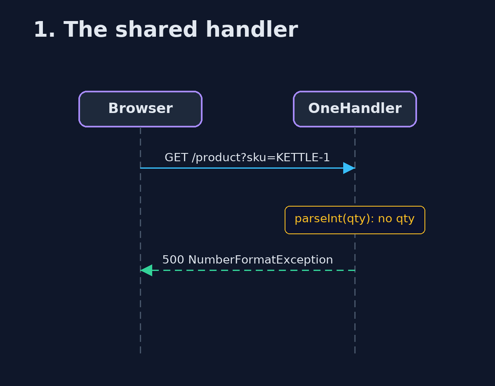
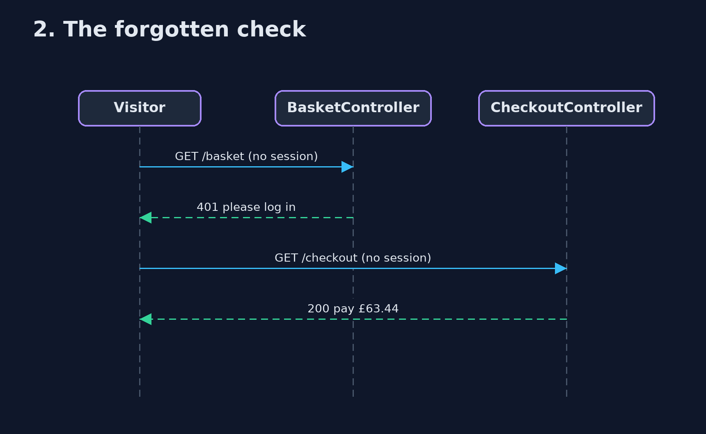

# Page Controller Pattern — UML Sequence Diagrams

## 1. 1. The shared handler

A line added for the basket runs for the product page.

## 2. 2. The forgotten check

Basket checks the login; checkout does not.

