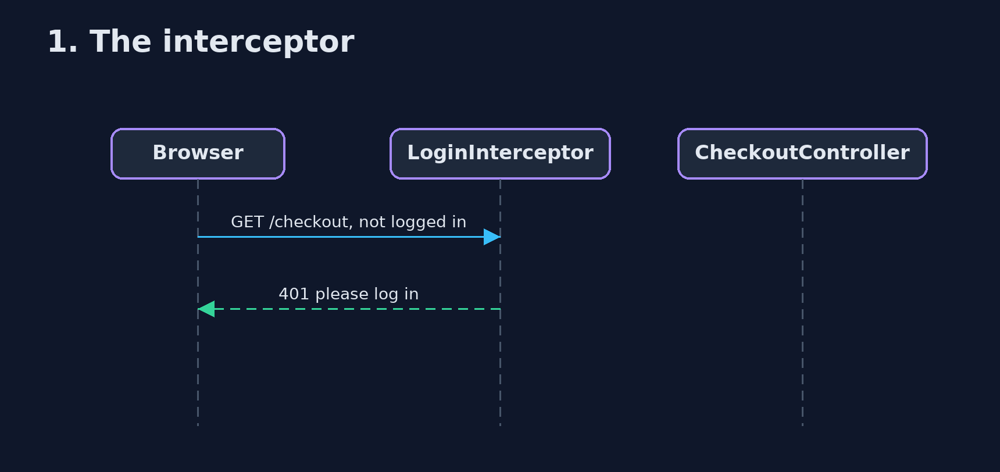
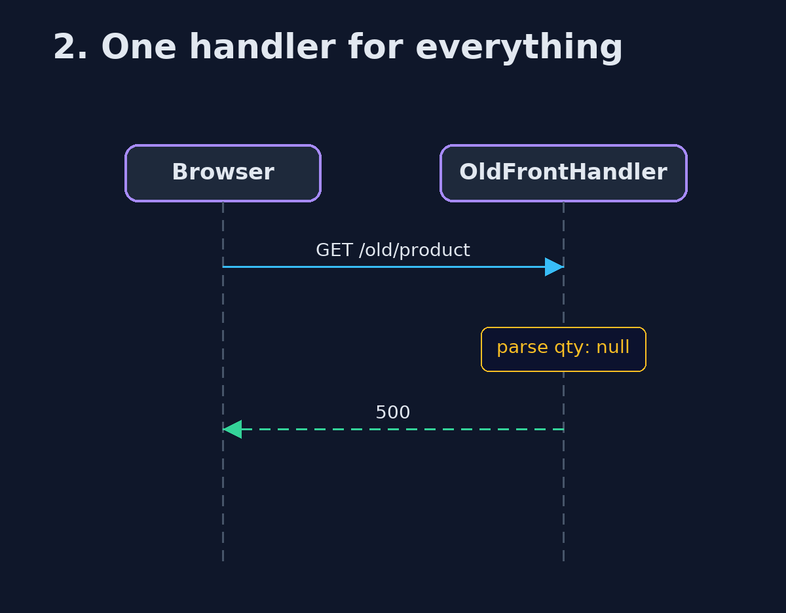

# Page Controller with Spring MVC Pattern — UML Sequence Diagrams

## 1. 1. The interceptor

The shared check runs first.

## 2. 2. One handler for everything

Basket code runs for the product page.

