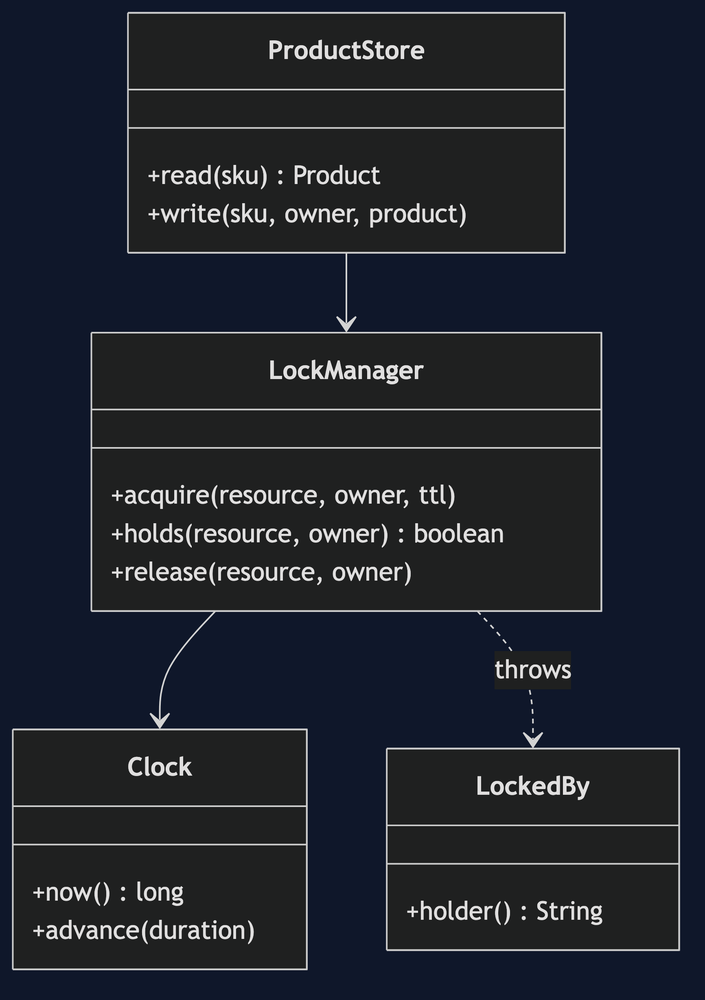
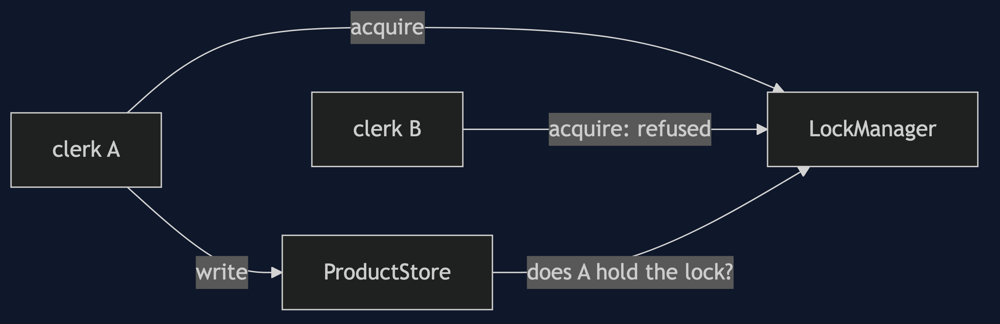
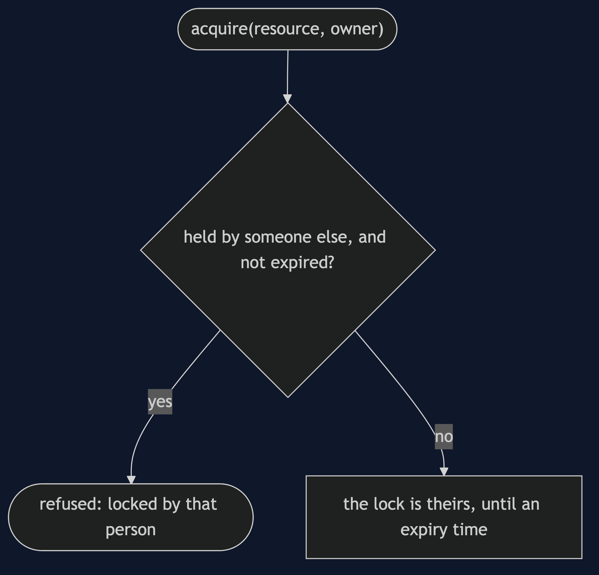
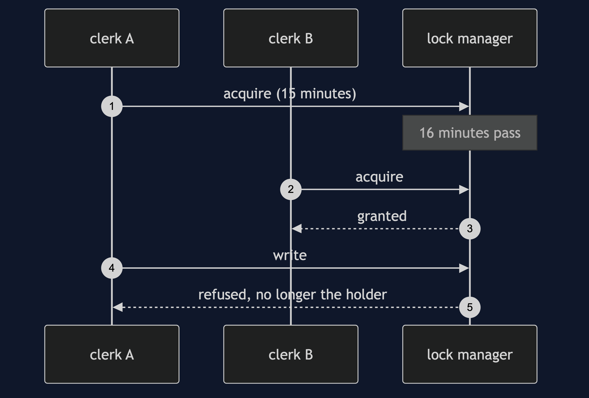

# Pessimistic Offline Lock Pattern

```
src/main/java/com/jk/explore/pessimisticlock/
├── PessimisticLockDemo.java         the six acts
├── LockManager.java                 exclusive locks, with an owner and an expiry
├── ProductStore.java                writes only for the holder of the lock
├── Clock.java                       moves only when the demo says so
└── LockedBy.java
```

**A pessimistic lock assumes a clash will happen, and stops it by making people ask before they edit.**

This project is in [enterprise-design-patterns](..). It is the opposite choice to [Optimistic Offline Lock](../optimistic-offline-lock-pattern), which lets everyone edit and checks a version on save.

## Run

```bash
./gradlew run
```

Six acts. Every number quoted below comes from this program's own output.

```
ONE. Lock first, then edit.
  clerk A asks for MUG-BLUE: got the lock.
  clerk B asks for MUG-BLUE: refused, MUG-BLUE is locked by A.
  the clash was stopped before B could start editing.
TWO. No lost update.
  A raised the price and let go. B then locks and reads: price 1200, stock 50.
  B saves the stock count: Product[sku=MUG-BLUE, pricePence=1200, stock=40]. nothing was overwritten.
THREE. The bill: waiting.
  B tries once a minute while A edits: 3 refusals, and B has done nothing useful.
  a lock trades lost updates for waiting.
FOUR. The bill: a lock nobody let go of.
  A goes to lunch without letting go. B, straight away: refused, MUG-BLUE is locked by A.
  after 10 minutes: refused, MUG-BLUE is locked by A.
  after 16 minutes the lock has expired: got the lock.
  A comes back and saves: A does not hold the lock on MUG-BLUE, so the write is refused.
FIVE. The bill: two clerks, each waiting for the other.
  A holds MUG-BLUE and now needs TEA-050: refused, TEA-050 is locked by B.
  B holds TEA-050 and now needs MUG-BLUE: refused, MUG-BLUE is locked by A.
  neither can move. that is a deadlock, and it lasts until a lock expires.
  taking locks in a fixed order, A took both.
  taking locks in a fixed order, B stopped at MUG-BLUE holding nothing else.
SIX. How much to lock.
  one lock on the whole catalogue: A got the lock. B, editing a different product: refused, catalogue is locked by A.
  a lock per product: A got the lock. B on TEA-050: got the lock.
  the smaller the thing locked, the fewer people wait. the more things locked, the more there is to forget and to deadlock on.
```

## Test

```bash
./gradlew test
```

2 test classes, 9 test methods, offline, with nothing installed and no framework.

## Technologies and versions

| What | Version | Why it is here |
| --- | --- | --- |
| Java | 21 | The repository standard, via the Gradle toolchain block |
| Gradle | 9.2.1 | The wrapper in this directory; no separate install needed |
| JUnit 5 | 5.10.2 | Test runner |

No framework. A hand-built project stays plain Java so the mechanism is the whole lesson.

## Learning Material

| Document | What it covers |
| --- | --- |
| [`docs/problem-statement.md`](docs/problem-statement.md) | Two clerks, and a clash that would cost a lot |
| [`docs/pessimistic-offline-lock-pattern-explained.md`](docs/pessimistic-offline-lock-pattern-explained.md) | The pattern, and six acts |
| [`docs/class-diagram.md`](docs/class-diagram.md) | The types |
| [`docs/architecture-diagram.md`](docs/architecture-diagram.md) | Two people, a lock and a record |
| [`docs/data-flow-diagram.md`](docs/data-flow-diagram.md) | What happens when someone asks for a lock |
| [`docs/sequence-diagram.md`](docs/sequence-diagram.md) | Written for a listener with the screen off |
| [`docs/uml-diagram.md`](docs/uml-diagram.md) | Four sequences |
| [`docs/animation.html`](docs/animation.html) | The six acts in a browser |
| [`docs/prerequisites.md`](docs/prerequisites.md) | What you need to know |
| [`docs/session.md`](docs/session.md) | A one-hour taught session |
| [`docs/spec.md`](docs/spec.md) | The generated specification |
| [`docs/youtube.md`](docs/youtube.md) | Title, description and chapters |

### The pattern in one picture



### Where each piece sits



### How one request moves



### Who calls whom, in order


### All four sequences




### Video

Built from [`video/scenes.py`](video/scenes.py) by
[`video/build_video.sh`](video/build_video.sh). The rendered file is not
committed; see the repository README for why.

## Where you have already met this

Document editors that say who has a file checked out, and ticket systems that warn that someone else is editing.

## When this is too much

Where conflicts are rare and edits short, a lock is waiting and bookkeeping for nothing. A long database lock held across a user's thinking time is almost always a mistake.

## Where this sits

This project is in [`enterprise-design-patterns`](..), and is meant to be read with its neighbours there.
