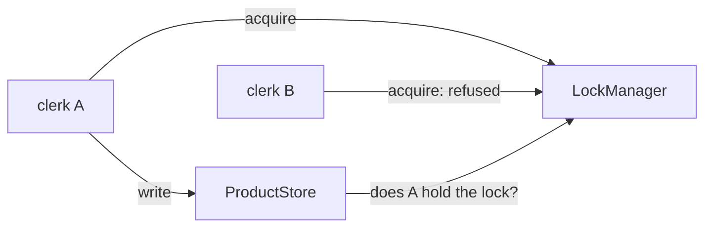

# Pessimistic Offline Lock Pattern — Architecture Diagram

People ask the lock manager first. The store trusts only the manager.

Mermaid source

```mermaid
flowchart LR
    A["clerk A"] -->|acquire| L["LockManager"]
    B["clerk B"] -->|acquire: refused| L
    A -->|write| S["ProductStore"]
    S -->|does A hold the lock?| L
```

