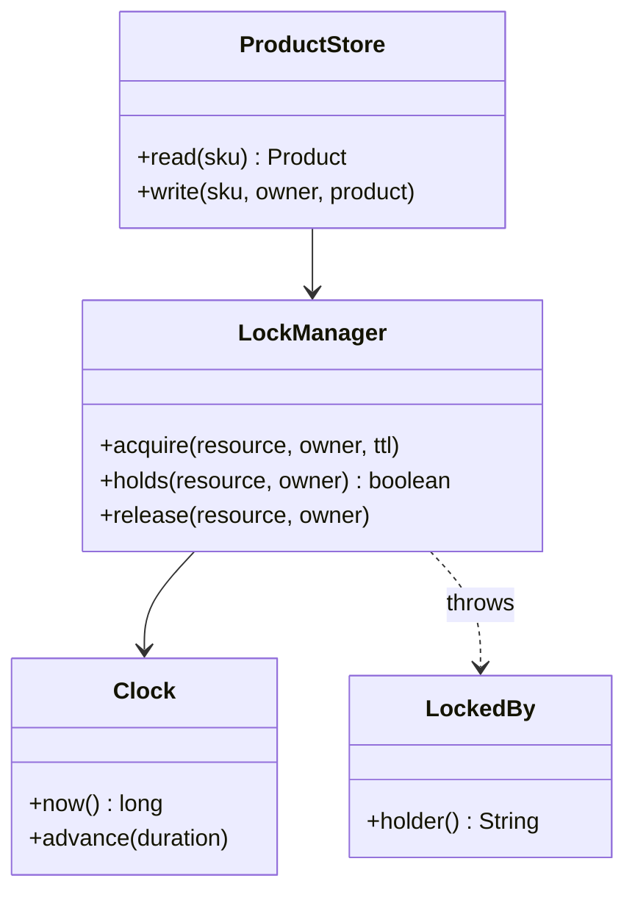

# Pessimistic Offline Lock Pattern — Class Diagram

A lock manager decides who may edit. The store refuses writes from anyone else.

Mermaid source

```mermaid
classDiagram
    class LockManager {
        +acquire(resource, owner, ttl)
        +holds(resource, owner) boolean
        +release(resource, owner)
    }
    class ProductStore {
        +read(sku) Product
        +write(sku, owner, product)
    }
    class Clock {
        +now() long
        +advance(duration)
    }
    class LockedBy {
        +holder() String
    }
    ProductStore --> LockManager
    LockManager --> Clock
    LockManager ..> LockedBy : throws
```

