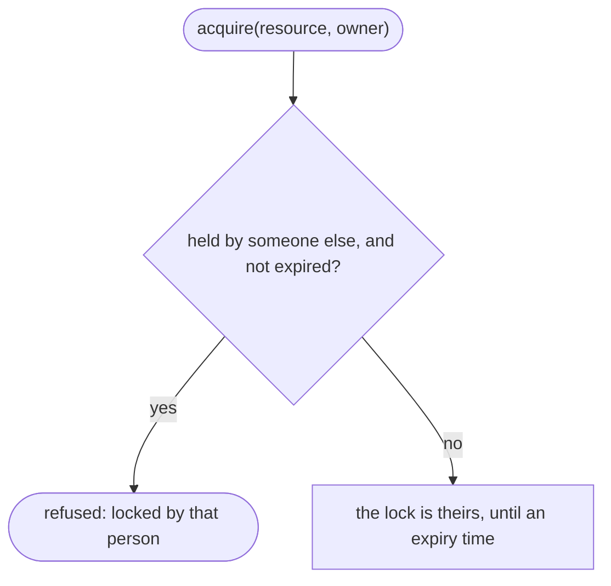

# Pessimistic Offline Lock Pattern — Data Flow Diagram

What happens when someone asks for a lock.

Mermaid source

```mermaid
flowchart TD
    Ask(["acquire(resource, owner)"])
    Held{"held by someone else, and not expired?"}
    No(["refused: locked by that person"])
    Yes["the lock is theirs, until an expiry time"]
    Ask --> Held
    Held -- yes --> No
    Held -- no --> Yes
```

