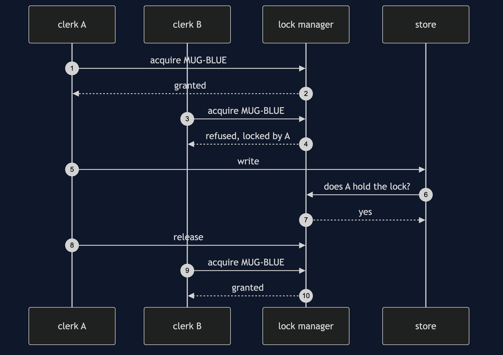
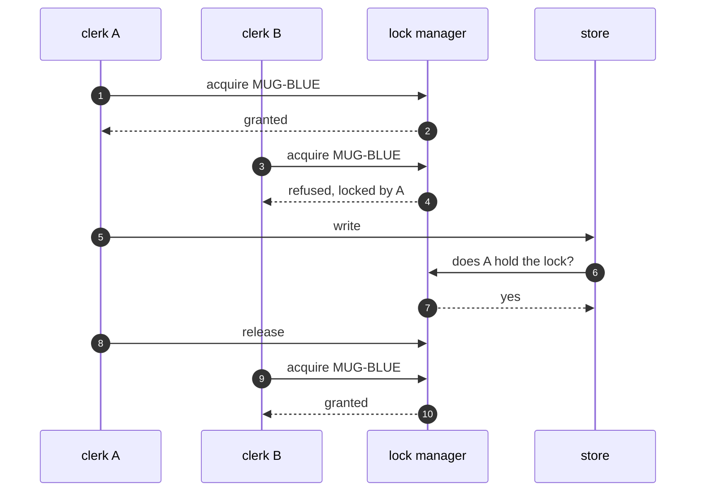

# Pessimistic Offline Lock Pattern — Sequence Diagram

Written for a listener with the screen off.

Say it in words. Clerk A asks the lock manager for the blue mug and gets it, with a fifteen minute expiry. Clerk B asks for the same lock, and the manager refuses and says A holds it. A edits and writes, and the store checks with the manager that A holds the lock, which it does. A lets go. B asks again, and now gets the lock.

Mermaid source

The load-bearing sentence: **the clash never starts, because the second clerk is stopped at the door.**
