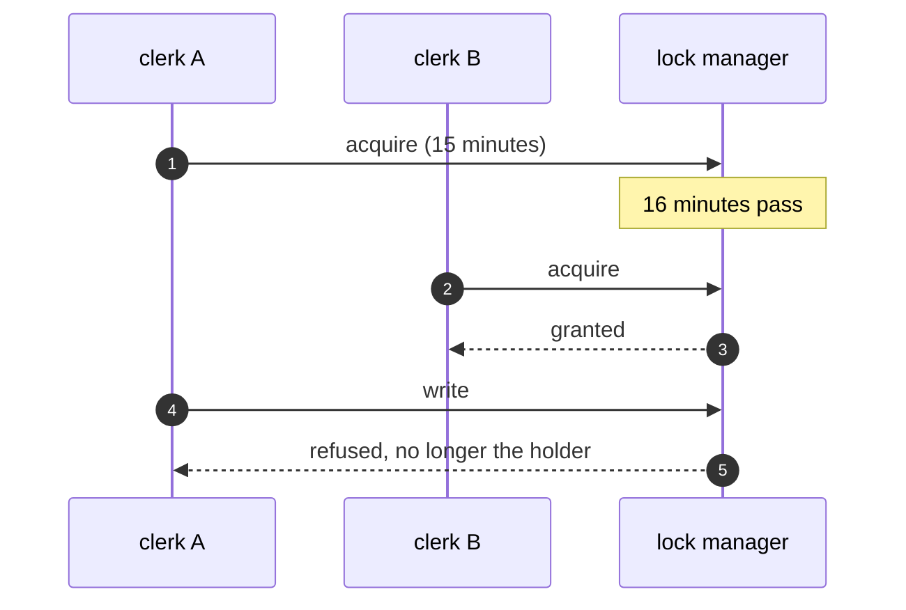

# Pessimistic Offline Lock Pattern — UML Sequence Diagrams

Four sequences.

## 1. An Expired Lock

Mermaid source

```mermaid
sequenceDiagram
    autonumber
    participant A as clerk A
    participant B as clerk B
    participant L as lock manager
    A->>L: acquire (15 minutes)
    Note over L: 16 minutes pass
    B->>L: acquire
    L-->>B: granted
    A->>L: write
    L-->>A: refused, no longer the holder
```

