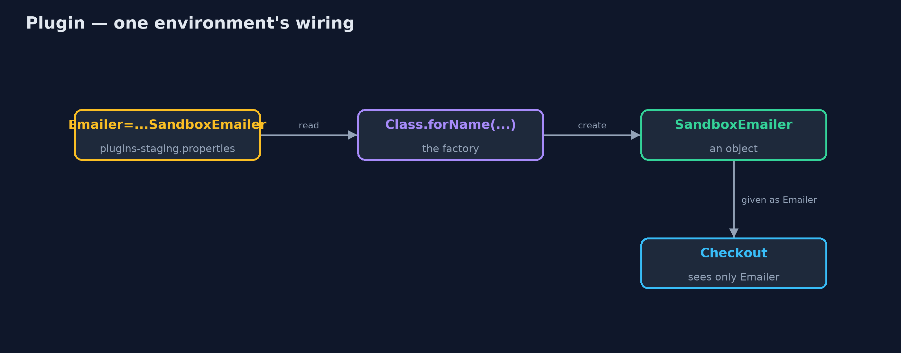
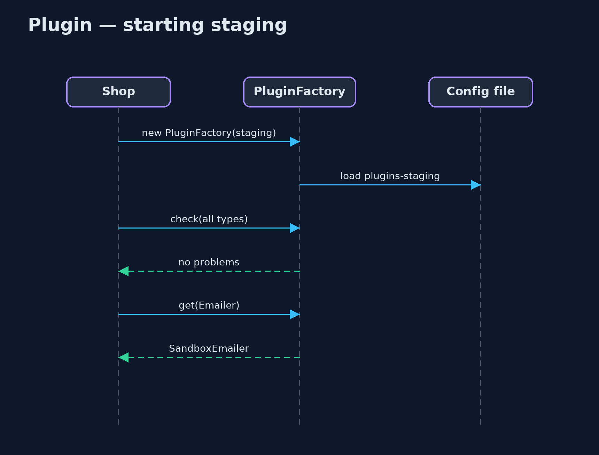

# Plugin Pattern

```
src/main/java/com/jk/explore/plugin/
├── Checkout.java          Checkout, which only knows the interfaces it is given
├── Implementations.java   The real and the safe versions of each service
├── PluginDemo.java        The five acts: choices scattered in code, plugins from configuration, a new environment, a bad entry caught at startup, and the bill
├── PluginFactory.java     The pattern: reads which class implements each interface from the environment's configuration file, and creates it
├── ScatteredChoices.java  Without the pattern: every place that needs a service picks the implementation itself, from the environment name
└── Services.java          What the shop needs from the outside world
```

**Let the code name only interfaces, and let one configuration file per environment say which class plays each part.**

Plugin is one of Martin Fowler's enterprise application patterns. The code
asks for an interface, such as `PaymentGateway`, and never names the class
that implements it. A configuration file for each environment (development,
staging, production) says which class to use, and one factory reads the file
and creates the object.

Choosing a different implementation for an environment becomes a change to a
text file, made in one place, instead of an `if` statement repeated wherever
the service is needed.

## The idea in everyday terms

Think of a theatre. The script says "Hamlet enters". It never says which actor.
A cast sheet on the noticeboard says who plays each part tonight: the lead
actor in the evening, the understudy at the matinee. To change who plays
Hamlet, you change the sheet, not the script.

## The scenario

The online store runs in three environments: development on laptops, staging
for testing, and production for real customers. Real card payments and real
emails must only happen in production. Each place in the code that needed a
payment gateway or an emailer chose one itself with an `if` on the environment
name. When staging was added, the payment choice was updated and the email
choice was missed, and staging emailed real customers.

## Run

```bash
./gradlew run
```

The demo tells the story in 5 acts, each printing exact numbers that the tests check:

| Act | What it shows |
| --- | --- |
| 1. Choices scattered in code | In staging, the gateway choice gives the fake gateway, but the email choice falls through to the REAL emailer. |
| 2. Plugins from configuration | plugins-dev.properties and plugins-prod.properties name the classes; dev gets fakes, prod gets the real services. |
| 3. A new environment | Staging is a two-line file: fake gateway and sandbox emailer; no Java changed. |
| 4. Caught at startup | A demo file misspells SandboxEmailer; the startup check reports it before any customer arrives. |
| 5. The bill | A misspelt class is a startup error, not a compile error; find usages of SandboxEmailer shows nothing. |

## Test

```bash
./gradlew test
```

8 tests in `DemoRunsTest`, `PluginFactoryTest`. Every number the demo prints is asserted, and nothing depends on the clock, so every run gives the same result.

## Technologies and versions

| Technology | Version | Used for |
| --- | --- | --- |
| Java | 21 | the code (toolchain set in `build.gradle`) |
| Gradle | 9.2.1 (wrapper) | build and run, nothing to install |
| JUnit | 5.10.2 | the tests |
| videokit | repository tool | the narrated video and animation: Piper `en_US-amy-medium`, speed 0.8, longer pauses (the approved `amy-slow` voice) |

## Learning Material

| Document | What it is for |
| --- | --- |
| [Problem statement](docs/problem-statement.md) | the situation and what the project must show |
| [Prerequisites](docs/prerequisites.md) | what you need to know first |
| [Plugin, explained](docs/plugin-pattern-explained.md) | the acts in prose |
| [Session guide](docs/session.md) | a one-hour lesson with exercises |
| [Animated walkthrough](docs/animation.html) | the acts step by step, narrated |
| [Spec](docs/spec.md) | what this project must be true of |

### The pattern in one picture

The factory reads the environment's file and hands checkout the right objects.


### Where each piece sits

Interfaces for the code, implementations named only in configuration.


### How the data moves

From a line of text to an object checkout can use.



### Who calls whom, in order

Read, check, then serve.



### Video

`video/plugin-pattern-explained.mp4` (with `.m4a` audio and `.srt` subtitles) is built by `video/build_video.sh`. Rendered media is not committed.

## What it costs

- **Errors at startup, not compile time.** A misspelt class name compiles fine and fails when the shop starts.
- **Invisible wiring.** "Find usages" of an implementation shows nothing, because it is only named in text files.
- **Reflection.** Classes are created from their names, which needs a public no-argument constructor.
- **Config files to keep in step.** One per environment, each listing every plugin.

## When this is too much

When there is only one implementation, or the choice never changes between
environments, just create the object. And a dependency injection framework
such as Spring already provides this pattern with profiles; use it rather than
writing your own factory in an application that has one.

## Where you have already met this

- Java's `ServiceLoader` and `META-INF/services` files.
- Spring profiles and `@ConditionalOnProperty`, which choose beans per environment.
- JDBC drivers, logging back ends such as SLF4J bindings, and servlet containers loading web apps.

## Where this sits

This project is in [enterprise-design-patterns](..), next to
[Service Stub](../service-stub-pattern), which is what a plugin often swaps
in for development and testing.
