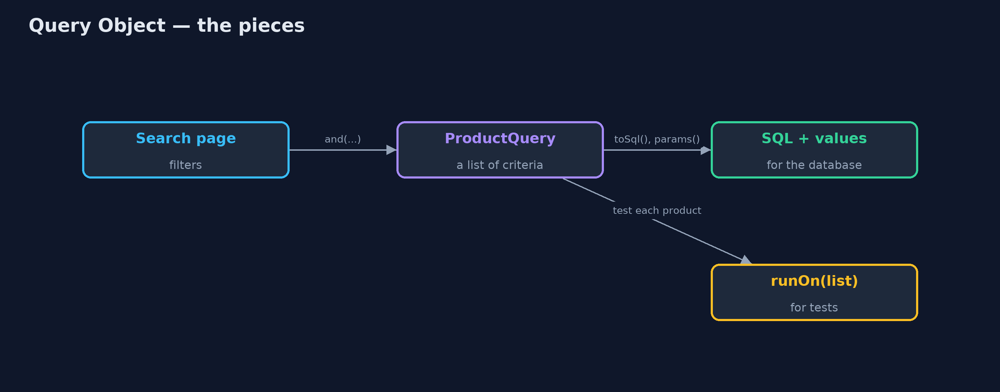
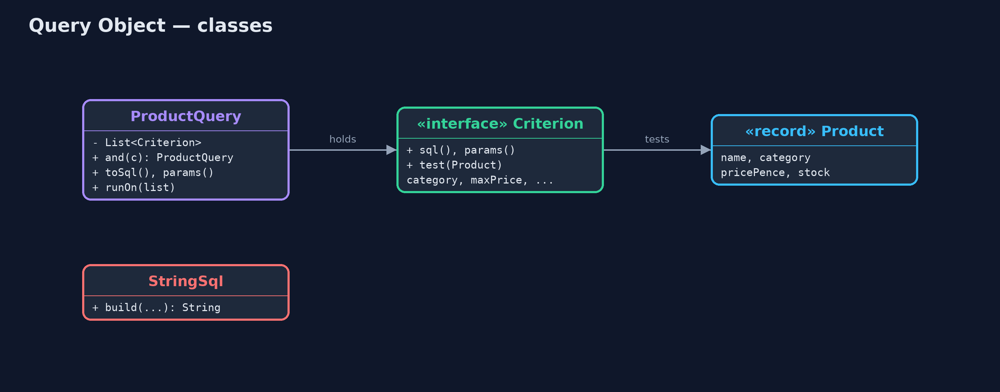
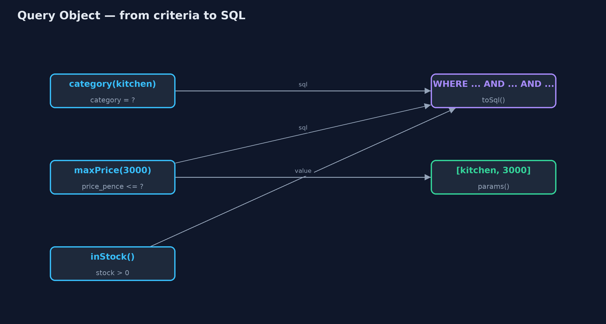
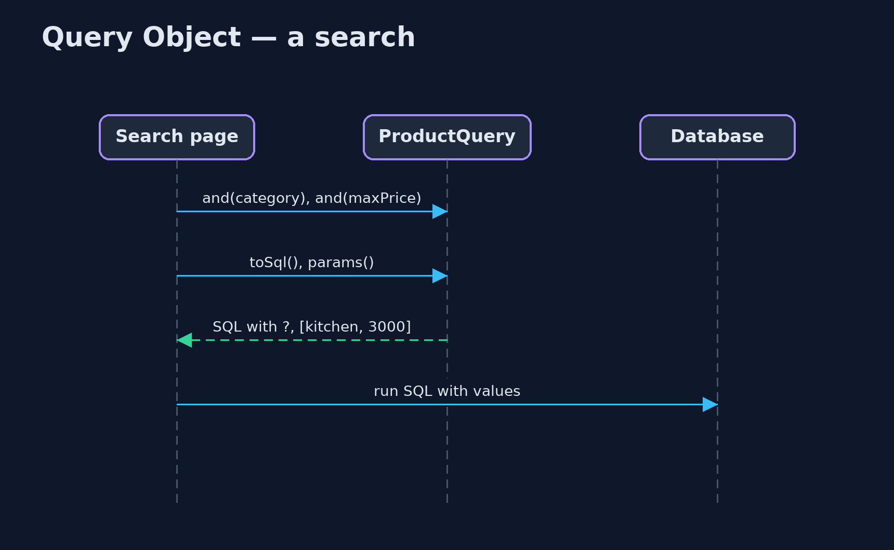

# Query Object Pattern

```
src/main/java/com/jk/explore/queryobject/
├── Criterion.java        One condition of a query
├── Product.java          One row of the product table
├── ProductQuery.java     The pattern: a search held as an object made of criteria, which can become safe SQL or run over a list in memory
├── QueryObjectDemo.java  The five acts: SQL glued from strings, a query object, the same query in memory, safe and reusable, and the bill
└── StringSql.java        Without the pattern: the search page glues SQL together from whichever filters were filled in
```

**Represent a search as an object made of criteria, which can write itself as safe SQL with placeholders and can also run over a list in memory.**

Query Object is one of Martin Fowler's enterprise application patterns. A
search is held as an object built from small criteria: "category is kitchen",
"price at most £30", "in stock". The query object can turn itself into SQL,
using placeholders for every value so no customer text ever becomes part of
the SQL, and the same object can run over a plain list in memory, which makes
it easy to test.

Queries become values you can pass around, save, and extend with one more
criterion, instead of strings glued together in page code.

## The idea in everyday terms

Think of a library request form. Instead of shouting a sentence at the
librarian, you fill in boxes: subject, author, published after. Whatever you
write in the author box is treated as a name, never as an instruction to the
librarian. The same form can be used to search the catalogue computer or to
walk along the shelves, and a form you filled in last week can be copied with
one more box ticked.

## The scenario

The online store's search page lets customers filter by category, maximum
price and part of the product name. The page built its SQL by gluing strings
together. Leaving the category empty produced broken SQL, "WHERE AND", and a
customer searching for "O'Brien's mug" put an apostrophe straight into the
SQL, which is how SQL injection attacks begin.

## Run

```bash
./gradlew run
```

The demo tells the story in 5 acts, each printing exact numbers that the tests check:

| Act | What it shows |
| --- | --- |
| 1. SQL glued from strings | Without a category the SQL reads "WHERE AND"; searching for O'Brien puts the apostrophe inside the SQL. |
| 2. A query object | category, maxPrice and inStock criteria produce "WHERE category = ? AND price_pence <= ? AND stock > 0" with values [kitchen, 3000]. |
| 3. The same query in memory | Run over a list, the query finds the kettle, the tea towel and O'Brien's mug; the out-of-stock teapot and the lamp are left out. |
| 4. Safe and reusable | Adding nameContains("O'Brien") sends %O'Brien% as a value; 1 product found; the saved query still has its 2 values. |
| 5. The bill | Only the criteria you wrote exist (no OR, joins or sorting yet); each is written in SQL and in Java, which must agree. |

## Test

```bash
./gradlew test
```

10 tests in `DemoRunsTest`, `ProductQueryTest`. Every number the demo prints is asserted, and nothing depends on the clock, so every run gives the same result.

## Technologies and versions

| Technology | Version | Used for |
| --- | --- | --- |
| Java | 21 | the code (toolchain set in `build.gradle`) |
| Gradle | 9.2.1 (wrapper) | build and run, nothing to install |
| JUnit | 5.10.2 | the tests |
| videokit | repository tool | the narrated video and animation: Piper `en_US-amy-medium`, speed 0.8, longer pauses (the approved `amy-slow` voice) |

## Learning Material

| Document | What it is for |
| --- | --- |
| [Problem statement](docs/problem-statement.md) | the situation and what the project must show |
| [Prerequisites](docs/prerequisites.md) | what you need to know first |
| [Query Object, explained](docs/query-object-pattern-explained.md) | the acts in prose |
| [Session guide](docs/session.md) | a one-hour lesson with exercises |
| [Animated walkthrough](docs/animation.html) | the acts step by step, narrated |
| [Spec](docs/spec.md) | what this project must be true of |

### The pattern in one picture

One query, two ways to run it.



### Where each piece sits

Criteria know their SQL and their Java test.



### How the data moves

SQL fragments join with AND; values go in a separate list.



### Who calls whom, in order

Build the query, then hand SQL and values to the database.



### Video

`video/query-object-pattern-explained.mp4` (with `.m4a` audio and `.srt` subtitles) is built by `video/build_video.sh`. Rendered media is not committed.

## What it costs

- **Your own small language.** Only the criteria you wrote exist; OR, joins and sorting must be added as needed.
- **Said twice.** Each criterion is written as SQL and as Java, and the two must agree.
- **Not a full query engine.** For complex reporting, plain SQL or a query library is clearer.

## When this is too much

For a fixed query that never changes shape, a single SQL string with
placeholders in a repository method is simpler. Query objects pay off when
searches are built from optional filters, saved, combined, or run in more than
one place.

## Where you have already met this

- JPA's Criteria API and Hibernate's `Criteria`.
- Spring Data `Specification` and QueryDSL.
- jOOQ, which builds type-safe SQL from Java objects.
- Saved searches and filters in online shops.

## Where this sits

This project is in [enterprise-design-patterns](..), next to
[Repository](../repository-pattern), which often accepts query
objects as its search method's argument.
