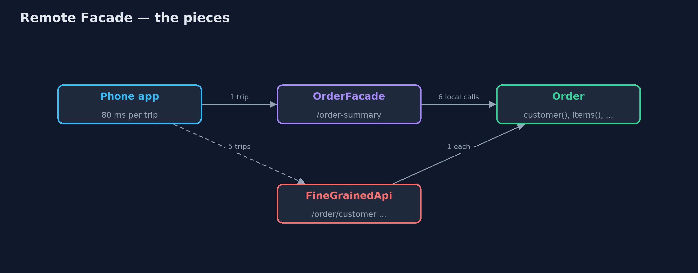
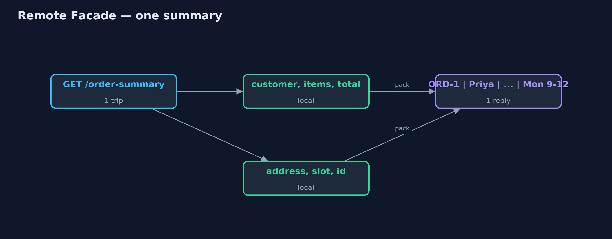
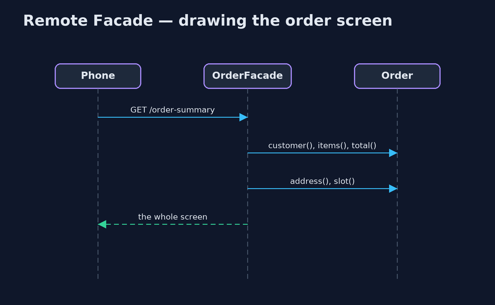

# Remote Facade Pattern

```
src/main/java/com/jk/explore/remotefacade/
├── FineGrainedApi.java    Without the pattern: the order's small methods published one by one over the network
├── Http.java              Helpers for the JDK web server, and a client that counts its round trips like a phone on a mobile network
├── Order.java             The domain object: fine-grained, with a small method for each fact and each change
├── OrderFacade.java       The pattern: a coarse-grained front for remote callers
└── RemoteFacadeDemo.java  The five acts: many small remote calls, one facade call, a change in one call, cheap calls inside, and the bill
```

**Keep objects fine-grained inside the server, but give remote callers a coarse-grained front that answers a whole screen or makes a whole change in one call.**

Remote Facade is one of Martin Fowler's distribution patterns. Inside a
program, small methods are good design and calling them is almost free. Across
a network, every call is a round trip that can cost tens of milliseconds. A
remote facade is a coarse-grained front for remote callers: one call returns
everything a screen needs, and one call makes a whole change, all or nothing.

The facade holds no business rules. It calls the fine-grained objects
in-process, where calls are cheap, and packs the result into one reply.

## The idea in everyday terms

Think of ordering from a shop by post. You would not send five letters, one
asking the price, one asking the colours, one asking the delivery date, and
wait days for each reply. You send one letter with every question, and the
shop replies with one letter that answers them all. And to order, you fill in
one order form, not a letter per item.

## The scenario

The online store's phone app shows an order screen: customer, items, total,
delivery address and delivery slot. The server published the order's small
methods one by one over HTTP, so the app made five round trips to draw one
screen, 400 milliseconds on a mobile network. Changing the address and the
slot took two calls, and when the second failed the order was left half
changed.

## Run

```bash
./gradlew run
```

The demo tells the story in 5 acts, each printing exact numbers that the tests check:

| Act | What it shows |
| --- | --- |
| 1. Many small remote calls | The app asks for customer, items, total, address and slot separately: 5 round trips, 400 ms on a mobile network. |
| 2. One facade call | GET /order-summary returns the whole screen in one reply: 1 round trip, 80 ms. |
| 3. A change in one call | Two small calls leave a new address with the old slot; the facade call either changes both or neither. |
| 4. Fine-grained inside | The facade makes 6 small in-process calls in under 5 ms; the slot rule stays on Order. |
| 5. The bill | A widget showing only the slot downloads 73 bytes instead of 8; each new screen may want its own facade method. |

## Test

```bash
./gradlew test
```

7 tests in `DemoRunsTest`, `OrderFacadeTest`. Every number the demo prints is asserted, and nothing depends on the clock, so every run gives the same result.

## Technologies and versions

| Technology | Version | Used for |
| --- | --- | --- |
| Java | 21 | the code (toolchain set in `build.gradle`) |
| Gradle | 9.2.1 (wrapper) | build and run, nothing to install |
| JUnit | 5.10.2 | the tests |
| videokit | repository tool | the narrated video and animation: Piper `en_US-amy-medium`, speed 0.8, longer pauses (the approved `amy-slow` voice) |

## Learning Material

| Document | What it is for |
| --- | --- |
| [Problem statement](docs/problem-statement.md) | the situation and what the project must show |
| [Prerequisites](docs/prerequisites.md) | what you need to know first |
| [Remote Facade, explained](docs/remote-facade-pattern-explained.md) | the acts in prose |
| [Session guide](docs/session.md) | a one-hour lesson with exercises |
| [Animated walkthrough](docs/animation.html) | the acts step by step, narrated |
| [Spec](docs/spec.md) | what this project must be true of |

### The pattern in one picture

Coarse calls across the network, fine calls inside.



### Where each piece sits

The facade is thin: it calls the order and packs the reply.


### How the data moves

Six facts gathered locally, sent once.



### Who calls whom, in order

One trip over the network; the small calls happen inside.



### Video

`video/remote-facade-pattern-explained.mp4` (with `.m4a` audio and `.srt` subtitles) is built by `video/build_video.sh`. Rendered media is not committed.

## What it costs

- **Sometimes too much.** A widget that shows only the slot downloads the whole summary: 73 bytes instead of 8 in the demo, far more in real life.
- **One more layer.** Each new screen may want its own facade method, and the facade must be kept in step with the screens.
- **Not a place for rules.** It is tempting to put business logic in the facade; it belongs on the domain objects.

## When this is too much

Inside one program, fine-grained calls are cheap and a facade adds nothing.
And when many different clients need very different shapes of data, a query
language such as GraphQL, or a Backend for Frontend per client, may fit
better than one facade.

## Where you have already met this

- "Summary" or "details" endpoints in REST APIs that return a whole screen's data.
- Session facades in older Java EE applications.
- Backend for Frontend services, one coarse API per app.
- GraphQL, which lets the client ask for a whole screen in one request.

## Where this sits

This project is in [enterprise-design-patterns](..). It is the network-sized
cousin of the [Facade](../../structural/facade-pattern) pattern, and pairs
with [Data Transfer Object](../data-transfer-object-pattern), if present, for
the shape of the reply.
