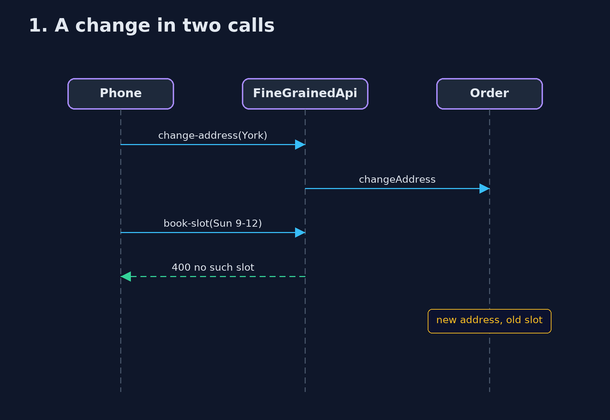
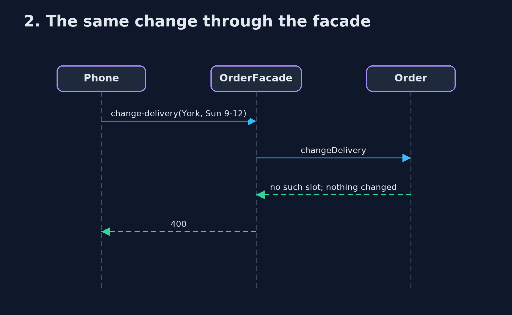

# Remote Facade Pattern — UML Sequence Diagrams

## 1. 1. A change in two calls

The second fails; the first has already happened.

## 2. 2. The same change through the facade

Checked first, then both, or neither.

