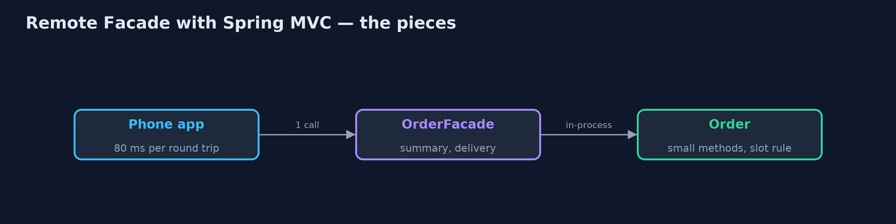
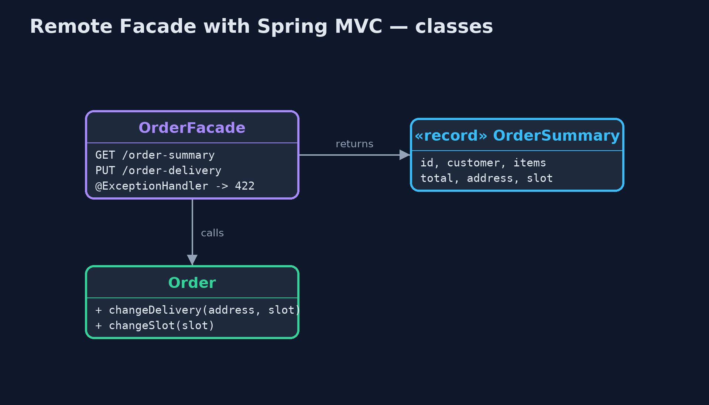
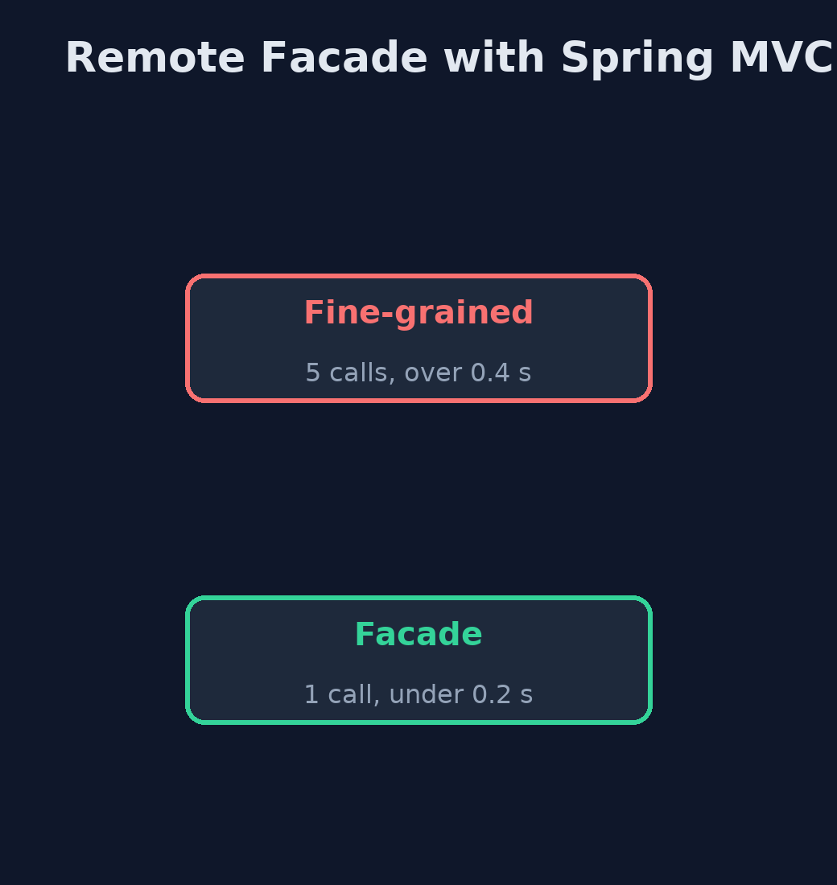
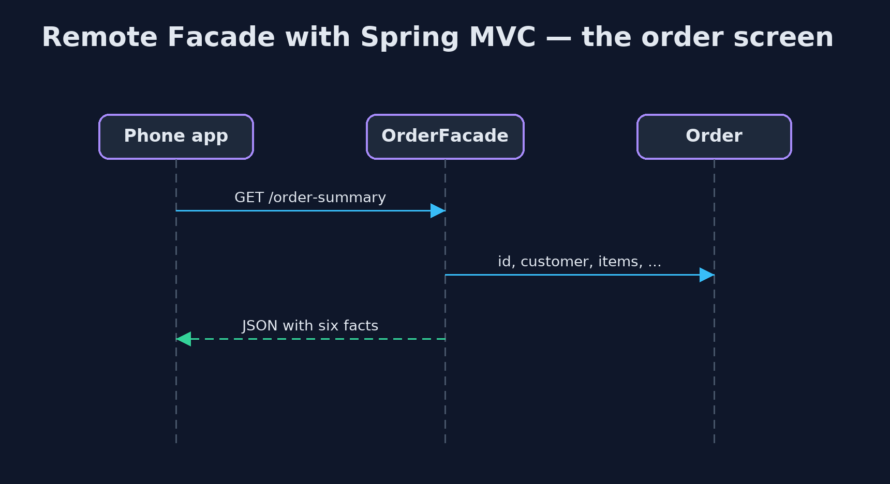

# Remote Facade with Spring MVC Pattern

```
src/main/java/com/jk/explore/remotefacademvc/
├── FineGrainedController.java   Before: the order's small methods published one by one, so the phone app needs a call per fact
├── MobileNetwork.java           Plays a mobile network: every request takes an extra 80 ms, as a round trip over 4G often does
├── Order.java                   The order, fine-grained inside the server: small methods, and the business rule about valid slots
├── OrderFacade.java             The pattern: a coarse-grained facade for remote callers
├── OrderStore.java              Holds the one order the demo works with
├── ShopApp.java                 The shop's order service, as a Spring MVC web application
└── SpringRemoteFacadeDemo.java  The five acts: a real Spring MVC service on a local port, called over HTTP by the "phone app"
```

**Give the phone app a coarse-grained Spring MVC facade: one GET returns the whole order screen as JSON, one PUT changes the whole delivery all-or-nothing, and a refusal comes back as a standard problem report.**

This is the framework version of the Remote Facade pattern. The plain Java
version, a separate project in this category, builds the facade on the JDK's
HTTP server and writes its own text format. Here Spring MVC does it, with
Jackson turning Java records into JSON, in a real Spring Boot service called
over HTTP.

Inside the server, the order keeps its small methods and its business rule
about valid delivery slots. The facade, `OrderFacade`, is a thin controller for
remote callers: `GET /order-summary` returns everything the order screen needs
in one JSON document, and `PUT /order-delivery` changes address and slot
together, or not at all. A refusal comes back as a standard problem report,
HTTP 422. To show why round trips matter, a filter adds 80 milliseconds to
every request, as a mobile network would.

## The idea in everyday terms

Think of ordering at a restaurant. You could call the waiter over five times:
once for a drink, once for a starter, once for a main. Or you give the whole
order in one visit. The kitchen still works dish by dish, but the trip across
the room happens once.

## The scenario

The online store's phone app showed an order screen by asking the server for
each fact separately: the customer, the items, the total, the address, the
delivery slot. On a mobile network each question took about 80 milliseconds.
Changing a delivery took two calls, and when the second failed, the order was
left half changed.

## Run

Nothing to install beyond a Java 21 JDK: the Spring Boot service starts inside
the program, on a local port.

```bash
./gradlew run
```

The demo tells the story in 5 acts, each printing exact numbers that the tests check:

| Act | What it shows |
| --- | --- |
| 1. A call for every fact | The phone app makes 5 separate GETs for customer, items, total, address and slot: over 0.4 s on a mobile network. |
| 2. The whole screen as JSON | GET /order-summary returns one JSON document with everything, in 1 round trip, under 0.2 s. |
| 3. All or nothing | Two small PUTs leave a new address with the old slot (the slot PUT got 500); the facade's one PUT is refused with 422 and nothing changes, then succeeds with a valid slot. |
| 4. Fine-grained inside | The facade calls Order's small methods in-process; the slot rule lives on Order, and refusals return application/problem+json. |
| 5. The bill | A widget showing only the slot fetches 130 bytes of summary instead of 8, and each new screen may want its own facade method. |

## Test

```bash
./gradlew test
```

1 tests in `DemoRunsTest`. Every result the demo prints is asserted, with a real Spring MVC service on a local port, called over HTTP. Timings are thresholds, and the 80 ms network delay is added on purpose by a filter.

## What the simulation got right, and what it left out

The plain Java version got the idea right: one coarse call for a screen, one
call for a whole change, fine-grained objects inside, and the costs of
over-fetching and a growing facade. What it left out is how a framework
supplies the parts: Jackson turns a Java record into JSON with no formatting
code, a refused change becomes a standard application/problem+json report
with status 422, and the fine-grained API, with no error handling at all,
answers a plain 500. Measuring round trips over real HTTP makes the cost of
chatty calls concrete.

## Technologies and versions

| Technology | Version | Used for |
| --- | --- | --- |
| Java | 21 | the code (toolchain set in `build.gradle`) |
| Gradle | 9.2.1 (wrapper) | build and run, nothing to install |
| JUnit | 5.10.2 | the tests |
| Spring Boot | 4.1.1 | the embedded web server |
| Spring MVC | with Spring Boot 4.1.1 | @RestController, @RequestBody, @ExceptionHandler, ProblemDetail |
| Jackson | with Spring Boot 4.1.1 | records to and from JSON |
| videokit | repository tool | the narrated video and animation: Piper `en_US-amy-medium`, speed 0.8, longer pauses (the approved `amy-slow` voice) |

## Learning Material

| Document | What it is for |
| --- | --- |
| [Dependencies](docs/dependencies.md) | what the framework and infrastructure are, and why they are here |
| [Problem statement](docs/problem-statement.md) | the situation and what the project must show |
| [Prerequisites](docs/prerequisites.md) | what you need to know first |
| [Remote Facade with Spring MVC, explained](docs/remote-facade-with-spring-mvc-pattern-explained.md) | the acts in prose |
| [Session guide](docs/session.md) | a one-hour lesson with exercises |
| [Animated walkthrough](docs/animation.html) | the acts step by step, narrated |
| [Spec](docs/spec.md) | what this project must be true of |

### The pattern in one picture

Coarse outside, fine-grained inside.



### Where each piece sits

The facade packs and unpacks.



### How the data moves

Five questions, or one.



### Who calls whom, in order

One request, the whole screen.



### Video

`video/remote-facade-with-spring-mvc-pattern-explained.mp4` (with `.m4a` audio and `.srt` subtitles) is built by `video/build_video.sh`. Rendered media is not committed.

## What it costs

- **Sometimes too much.** A widget that shows only the slot fetched 130 bytes of summary where 8 would do.
- **A method per screen.** Each new screen may want its own facade method.
- **One more layer.** The facade must be kept in step with the order and the screens.

## When this is too much

Inside one process, calls are cheap, and fine-grained objects are the right
shape. A remote facade pays off across a network, especially a slow one, where
every round trip costs.

## Where you have already met this

- REST endpoints that return a whole screen, such as order summaries.
- Backends for frontends, which give each app its own coarse API.
- GraphQL, which lets the client ask for a whole screen in one request.

## Where this sits

This project is in [enterprise-design-patterns](..). It is the framework
version of the plain Java Remote Facade project in the same category, which
is left unchanged.
