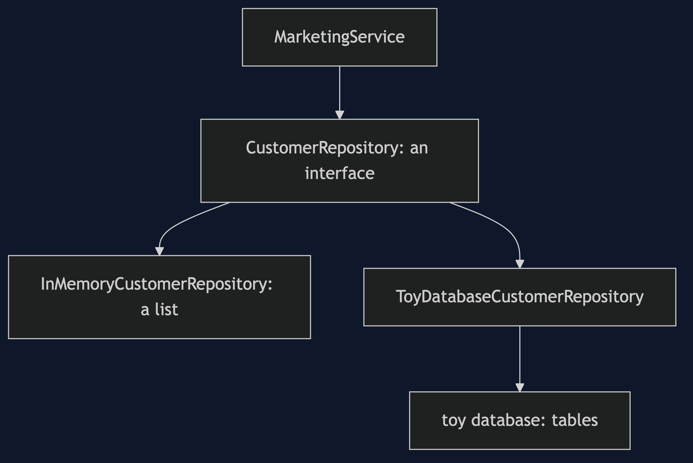
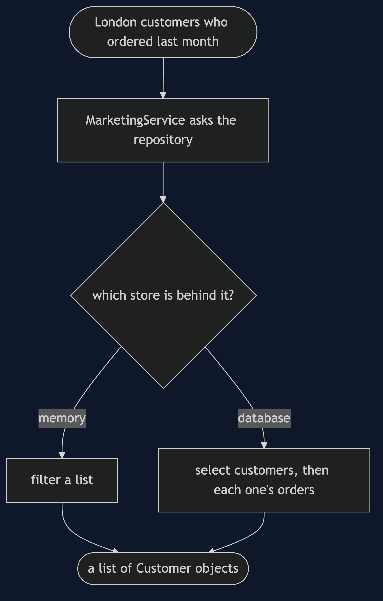
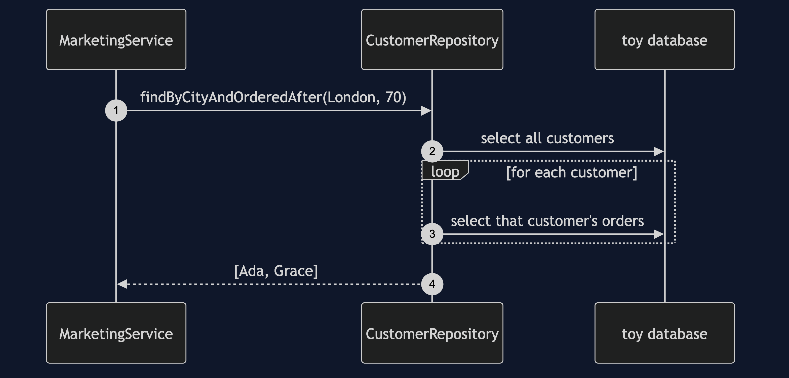
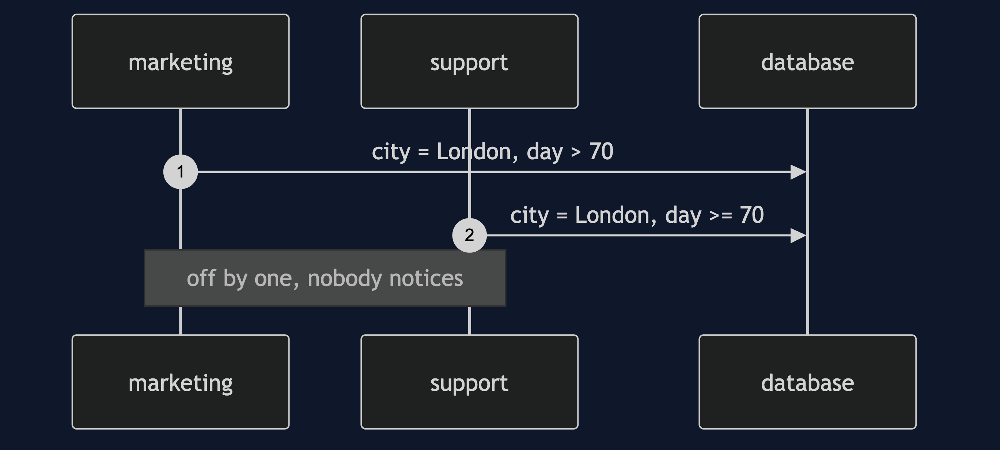
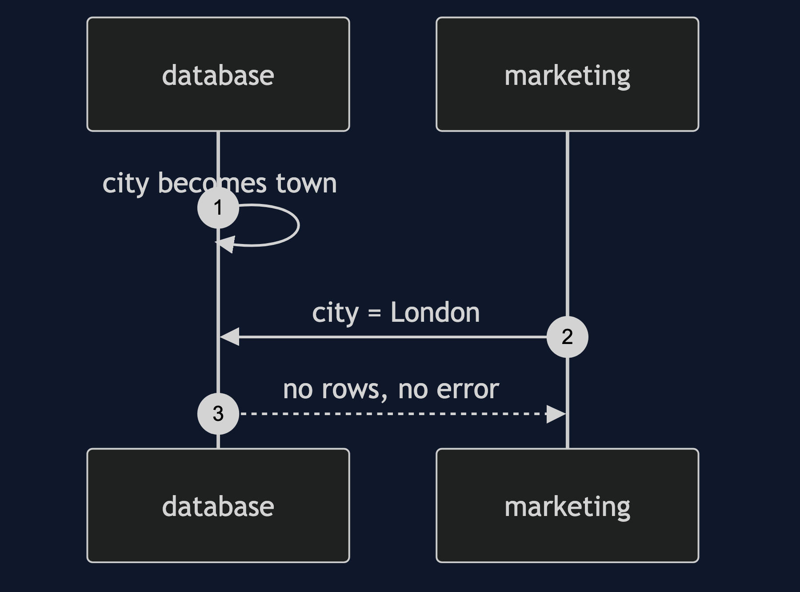
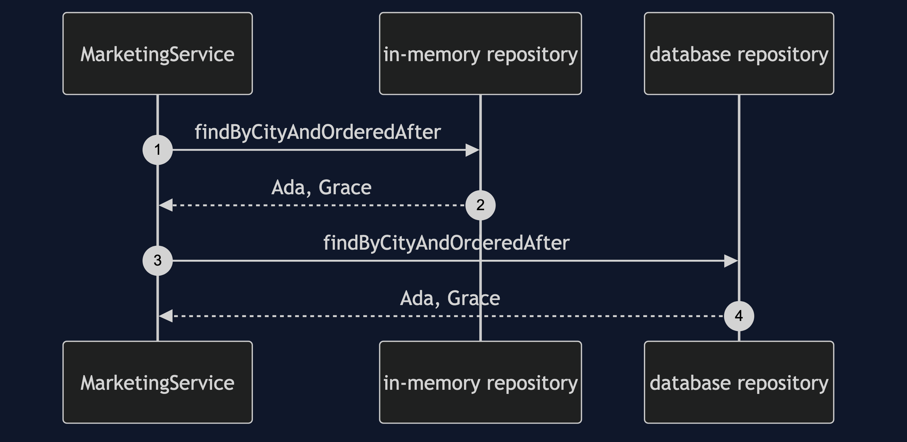
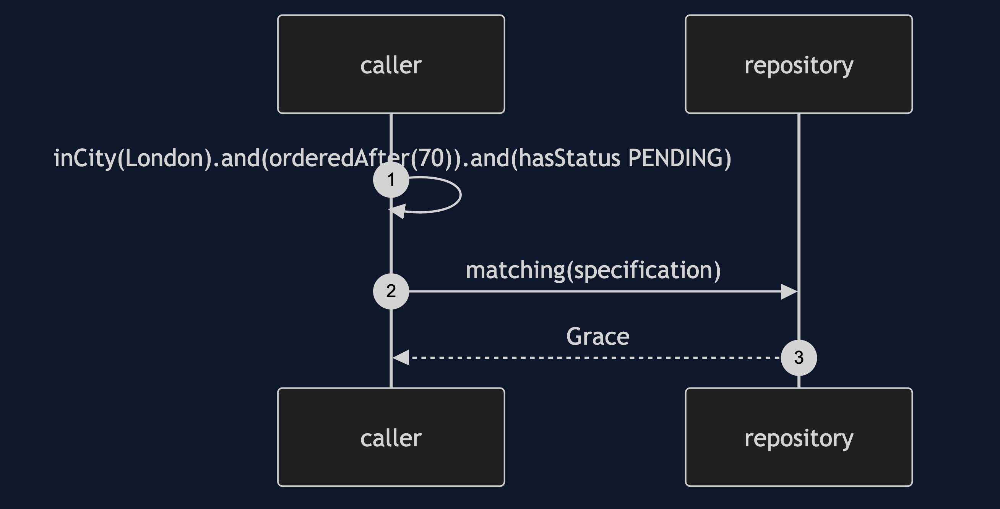

# Repository Pattern

```
src/main/java/com/jk/explore/repository/
├── CustomerDemo.java                composition root — the six acts
│
├── toydb/                           ← the category's toy database, copied
├── domain/
│   ├── Customer.java  Order.java
│   └── Shop.java                     six customers; today is day 100
├── naive/
│   └── SqlInTheService.java          the same query, written three ways
│
└── pattern/                         ← the real thing
    ├── CustomerRepository.java       looks like a collection of customers
    ├── InMemoryCustomerRepository.java
    ├── ToyDatabaseCustomerRepository.java
    ├── MarketingService.java         the caller: knows only the interface
    ├── Specification.java            a query as an object
    └── QueryMethodGrowth.java        the bill: a method per question
```

**An interface that looks like an in-memory collection of domain objects: the caller asks for customers and does not know a database exists.**

This is the fifth project in [enterprise-design-patterns](..). It hides the four before it behind one interface. It is not CQRS: the read and write split belongs to the microservices category.

## Run

```bash
./gradlew run
```

Six acts. Every operation against the toy database is counted, and every count quoted below comes from that counter.

```
REPOSITORY — query the collection, not the table

ONE. SQL in the service — the same question, asked three ways.
  marketing: [Ada, Grace]
  support:   [Ada, Grace, Ken]
  reports:   [Ada, Grace]
  three answers to one question. support is off by one day.

TWO. A schema change — every string that names a column.
  the column city is renamed to town.
  marketing: []
  support:   []
  reports:   []
  nothing threw. every list is empty. each string had to be found by hand.

THREE. The pattern — the service asks for customers.
  [Ada, Grace]
  MarketingService's constructor takes: CustomerRepository
  it knows no database, no table, no column.

FOUR. Swap the store — the calling code does not change.
  in memory: [Ada, Grace]
  database:  [Ada, Grace]
  the whole change is one line where the service is built:
    - new MarketingService(new InMemoryCustomerRepository())
    + new MarketingService(new ToyDatabaseCustomerRepository(db))
  MarketingService itself is untouched.

FIVE. The bill — a method per question.
    findByCity
    findByCityAndOrderDateAfterAndStatusIn
    findByCityAndOrderDateAfterAndStatusInOrderByNameAsc
    findByCityAndOrderedAfter
  every new question adds a method. a specification fixes it and costs a concept:
  London, ordered last month, and has a pending order: [Grace]
  no new repository method was written.

SIX. The abstraction leaks when performance matters.
  one question, against 6 customers: 7 database operations: one for the customers, then one per customer for their orders.
  the caller cannot say 'join' or 'fetch the orders together'.
  and 'you can swap the database' is claimed far more often than it is used.
  where you have met this: a Spring Data repository interface.
```

## Test

```bash
./gradlew test
```

4 test classes, 13 test methods, offline, with no database installed.

## Technologies and versions

| What | Version | Why it is here |
| --- | --- | --- |
| Java | 21 | The repository standard, via the Gradle toolchain block |
| Gradle | 9.2.1 | The wrapper in this directory; no separate install needed |
| JUnit 5 | 5.10.2 | Test runner |

No framework. A hand-built project stays plain Java so the mechanism is the whole lesson.

## Learning Material

| Document | What it covers |
| --- | --- |
| [`docs/problem-statement.md`](docs/problem-statement.md) | London customers who ordered last month |
| [`docs/repository-pattern-explained.md`](docs/repository-pattern-explained.md) | The pattern, the swap, and the bill |
| [`docs/class-diagram.md`](docs/class-diagram.md) | The types |
| [`docs/architecture-diagram.md`](docs/architecture-diagram.md) | Caller, interface, two stores |
| [`docs/data-flow-diagram.md`](docs/data-flow-diagram.md) | One question to the answer |
| [`docs/sequence-diagram.md`](docs/sequence-diagram.md) | Written for a listener with the screen off |
| [`docs/uml-diagram.md`](docs/uml-diagram.md) | Four sequences |
| [`docs/animation.html`](docs/animation.html) | The six acts in a browser |
| [`docs/prerequisites.md`](docs/prerequisites.md) | What you need to know |
| [`docs/session.md`](docs/session.md) | A one-hour taught session |
| [`docs/spec.md`](docs/spec.md) | The generated specification |
| [`docs/youtube.md`](docs/youtube.md) | Title, description and chapters |

### The pattern in one picture


### Where each piece sits



### How one request moves



### Who calls whom, in order



### All four sequences









### Video

Built from [`video/scenes.py`](video/scenes.py) by
[`video/build_video.sh`](video/build_video.sh). The rendered file is not
committed; see the repository README for why.

## Where you have already met this

A Spring Data repository interface is this pattern: collection-shaped methods, with the framework writing the implementation.

## When this is too much

For a handful of queries in one place, a repository is an extra layer. It earns its place when the same questions are asked from several places.

## Where this sits

This is the fifth project in [`enterprise-design-patterns`](..). Its Spring Data version is a later project, and the read and write split is CQRS in the microservices category.

## Also available with a framework

[Repository with Spring Data Pattern](../repository-with-spring-data-pattern) reruns this idea on a real framework, and shows what the framework adds and where it can undo the pattern. Watch this project first.
