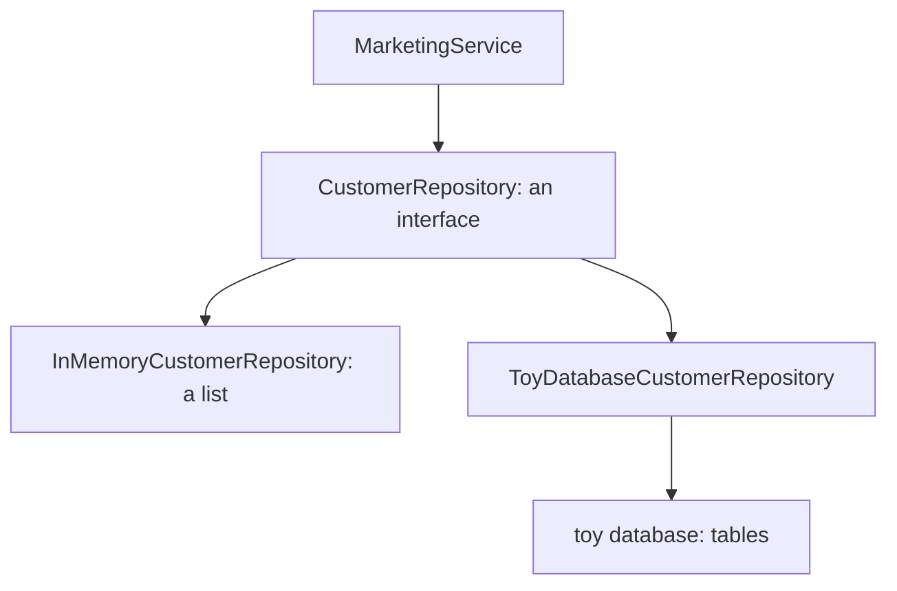

# Repository Pattern — Architecture Diagram

The caller sits above the interface; the stores sit below it.

Mermaid source

```mermaid
flowchart TB
    S["MarketingService"] --> R["CustomerRepository: an interface"]
    R --> M["InMemoryCustomerRepository: a list"]
    R --> D["ToyDatabaseCustomerRepository"]
    D --> DB["toy database: tables"]
```

