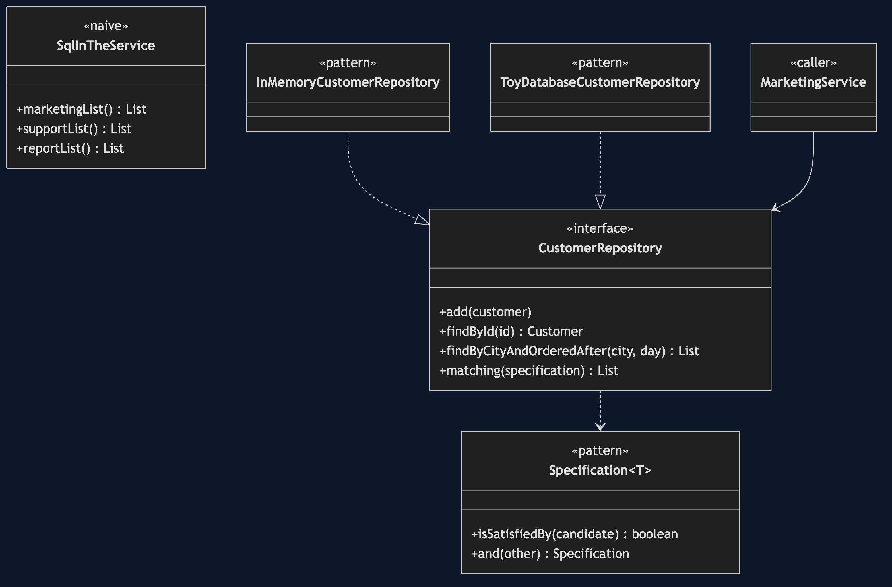
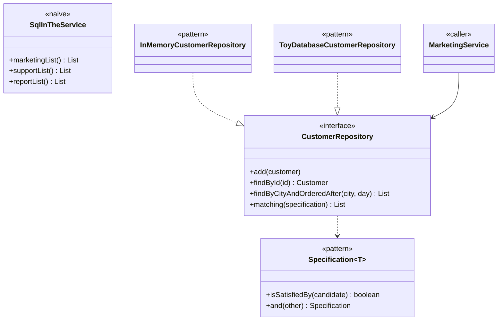

# Repository Pattern — Class Diagram

`MarketingService` depends on `CustomerRepository` and nothing else.

Mermaid source

```mermaid
classDiagram
    class SqlInTheService {
        <<naive>>
        +marketingList() List
        +supportList() List
        +reportList() List
    }
    class CustomerRepository {
        <<interface>>
        +add(customer)
        +findById(id) Customer
        +findByCityAndOrderedAfter(city, day) List
        +matching(specification) List
    }
    class InMemoryCustomerRepository {
        <<pattern>>
    }
    class ToyDatabaseCustomerRepository {
        <<pattern>>
    }
    class MarketingService {
        <<caller>>
    }
    class Specification~T~ {
        <<pattern>>
        +isSatisfiedBy(candidate) boolean
        +and(other) Specification
    }
    InMemoryCustomerRepository ..|> CustomerRepository
    ToyDatabaseCustomerRepository ..|> CustomerRepository
    MarketingService --> CustomerRepository
    CustomerRepository ..> Specification
```

