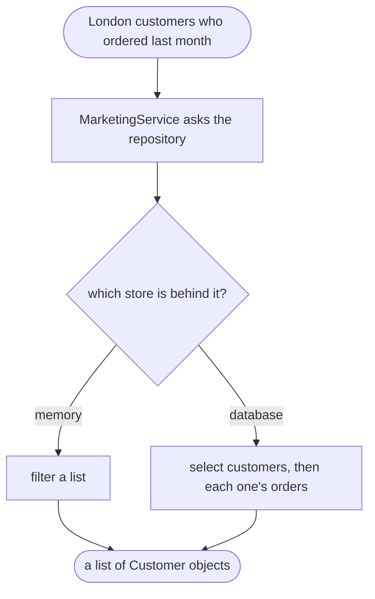

# Repository Pattern — Data Flow Diagram

One question, from the caller to the answer.

Mermaid source

```mermaid
flowchart TD
    Q(["London customers who ordered last month"])
    S["MarketingService asks the repository"]
    R{"which store is behind it?"}
    M["filter a list"]
    D["select customers, then each one's orders"]
    A(["a list of Customer objects"])
    Q --> S --> R
    R -- memory --> M --> A
    R -- database --> D --> A
```

