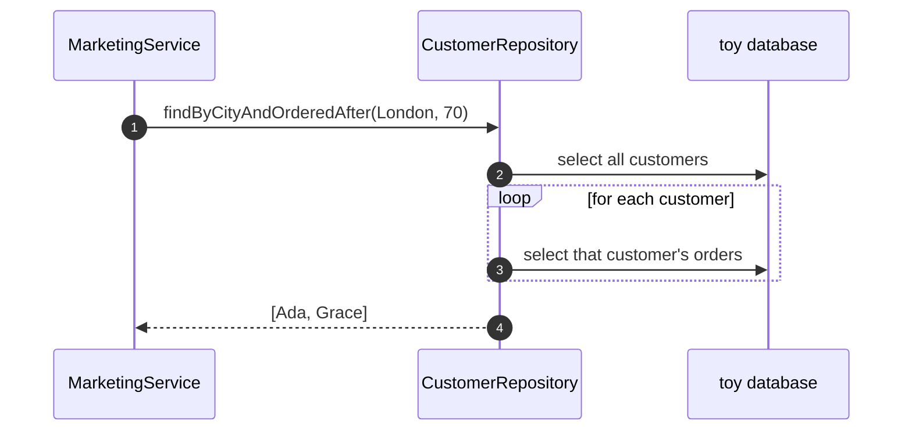

# Repository Pattern — Sequence Diagram

Written for a listener with the screen off.

Say it in words. The marketing service asks the repository for London customers who ordered after day seventy. The repository, whichever one it is, finds them and returns a list of customers. The service never mentions a table, a column or a query. If the repository is the database one, it selects every customer and then, for each one, selects their orders. The service cannot see that.

Mermaid source

The load-bearing sentence: **the service asked in the language of customers, and never saw a table.**
