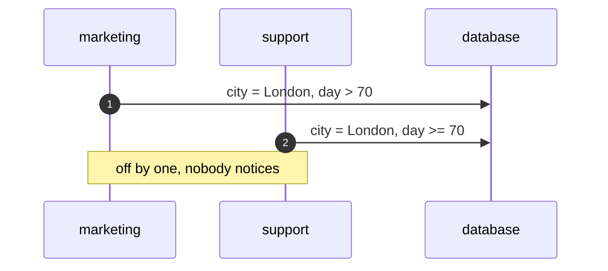
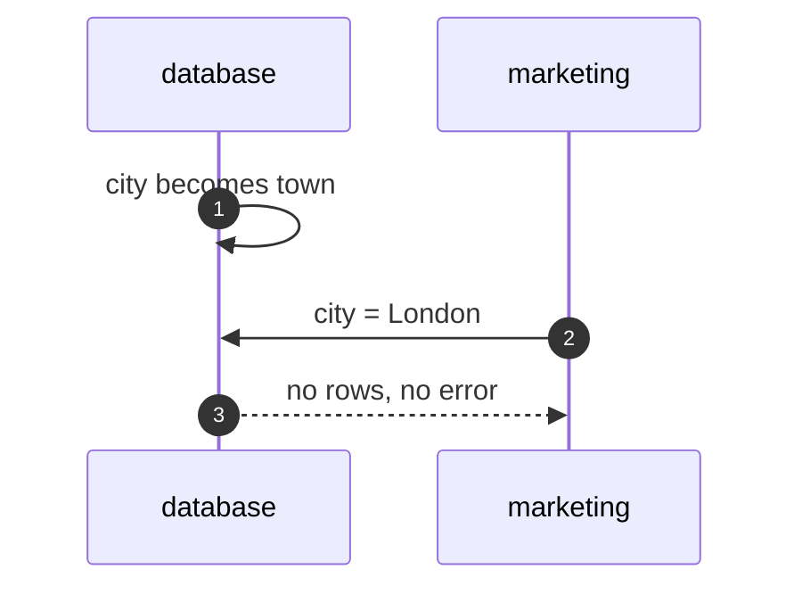
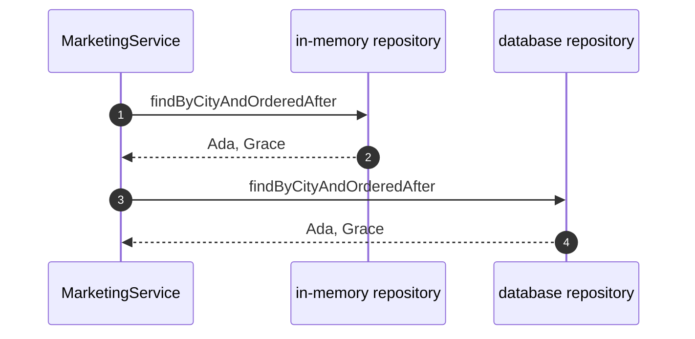
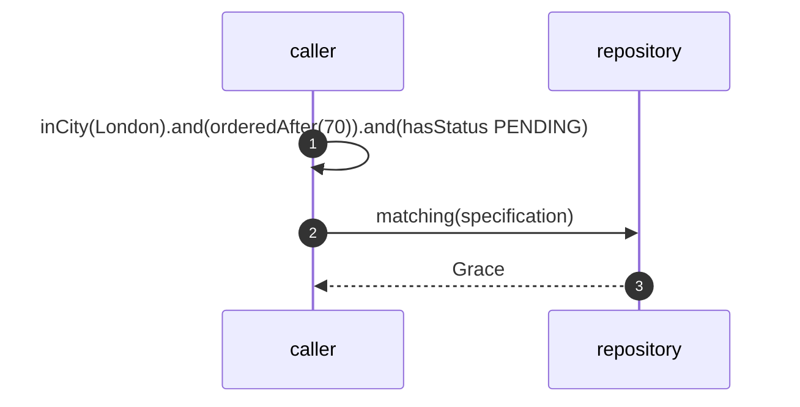

# Repository Pattern — UML Sequence Diagrams

Four sequences.

## 1. Three Services, Three Queries

Mermaid source

## 2. The Column Is Renamed

Mermaid source

## 3. The Same Service, Two Stores

Mermaid source

## 4. A Specification

Mermaid source

