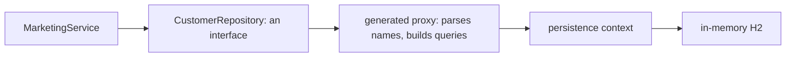

# Repository with Spring Data Pattern — Architecture Diagram

Spring generates the class between the interface and the database.

Mermaid source

```mermaid
flowchart LR
    S["MarketingService"] --> R["CustomerRepository: an interface"]
    R --> G["generated proxy: parses names, builds queries"]
    G --> EM["persistence context"]
    EM --> DB["in-memory H2"]
```

