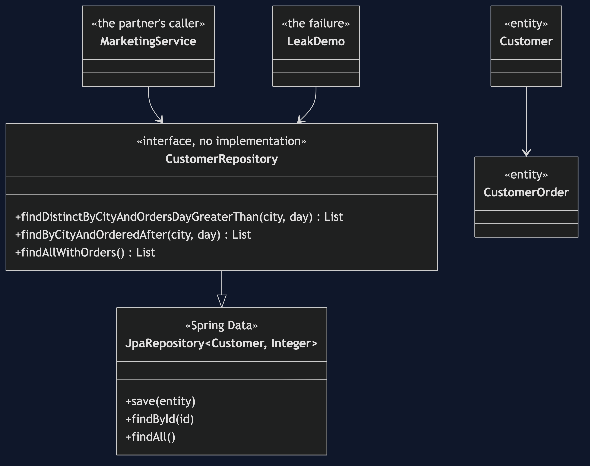
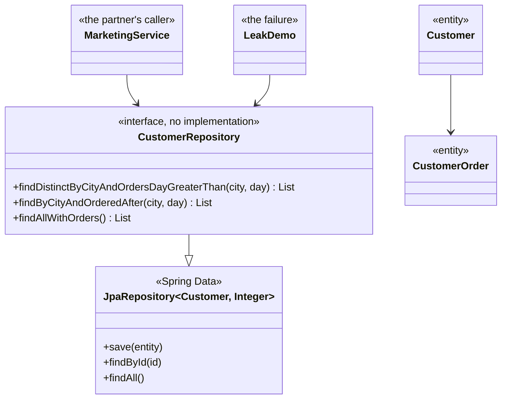

# Repository with Spring Data Pattern — Class Diagram

`CustomerRepository` is the only type. No class implements it.

Mermaid source

```mermaid
classDiagram
    class JpaRepository~Customer, Integer~ {
        <<Spring Data>>
        +save(entity)
        +findById(id)
        +findAll()
    }
    class CustomerRepository {
        <<interface, no implementation>>
        +findDistinctByCityAndOrdersDayGreaterThan(city, day) List
        +findByCityAndOrderedAfter(city, day) List
        +findAllWithOrders() List
    }
    class MarketingService {
        <<the partner's caller>>
    }
    class LeakDemo {
        <<the failure>>
    }
    class Customer {
        <<entity>>
    }
    class CustomerOrder {
        <<entity>>
    }
    CustomerRepository --|> JpaRepository
    MarketingService --> CustomerRepository
    LeakDemo --> CustomerRepository
    Customer --> CustomerOrder
```

