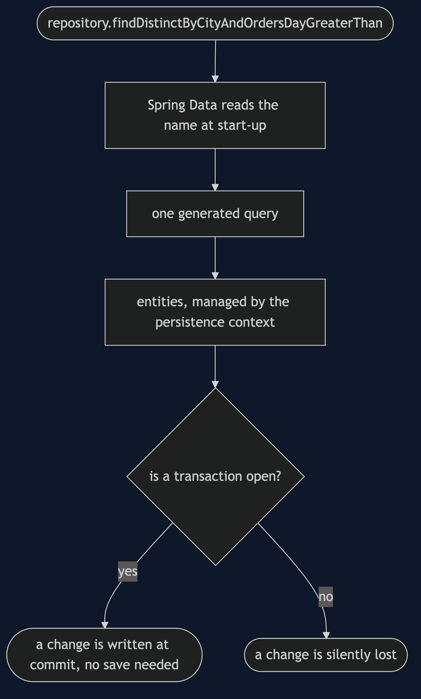
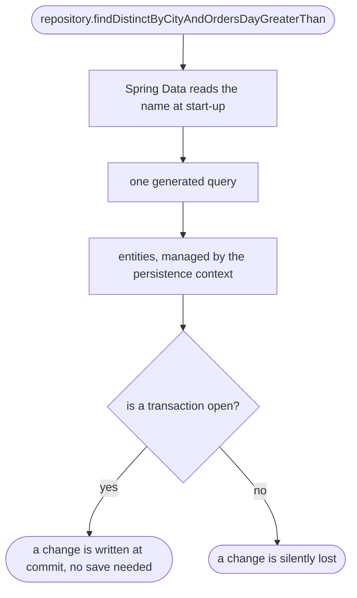

# Repository with Spring Data Pattern — Data Flow Diagram

One repository call, from a method name to a list of managed entities.

Mermaid source

```mermaid
flowchart TD
    Call(["repository.findDistinctByCityAndOrdersDayGreaterThan"])
    Parse["Spring Data reads the name at start-up"]
    Query["one generated query"]
    Ents["entities, managed by the persistence context"]
    Tx{"is a transaction open?"}
    Saved(["a change is written at commit, no save needed"])
    Lost(["a change is silently lost"])
    Call --> Parse --> Query --> Ents --> Tx
    Tx -- yes --> Saved
    Tx -- no --> Lost
```

