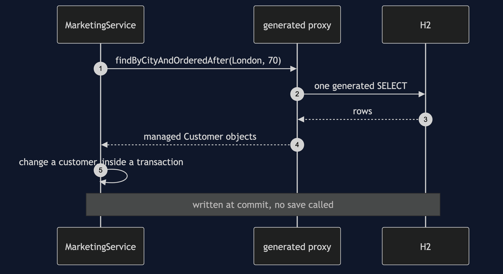
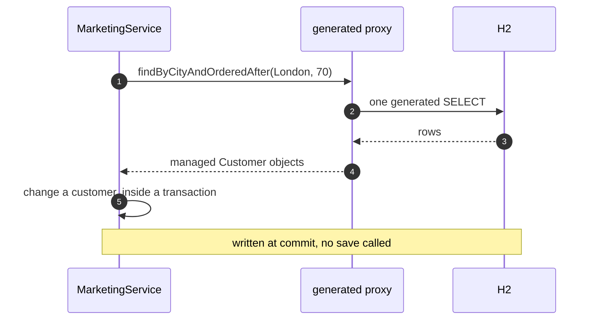

# Repository with Spring Data Pattern — Sequence Diagram

Written for a listener with the screen off.

Say it in words. The marketing service calls the finder on the repository. There is no class behind it that anyone wrote. Spring's generated proxy takes the call, uses the query it built from the method's name, and runs one statement. It hands back customer objects, and those objects are managed by the persistence context. If the caller is inside a transaction and changes one, the change is written at commit, though no one called save.

Mermaid source

The load-bearing sentence: **the interface looks like a collection, and the entities it returns are not plain objects.**
