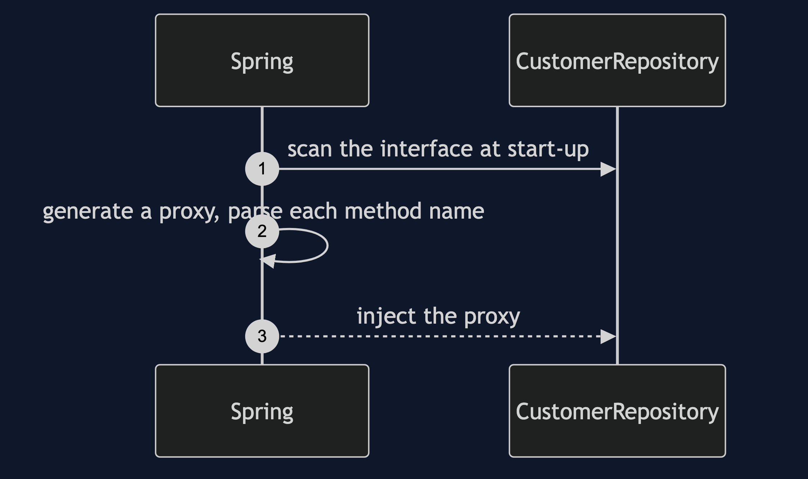
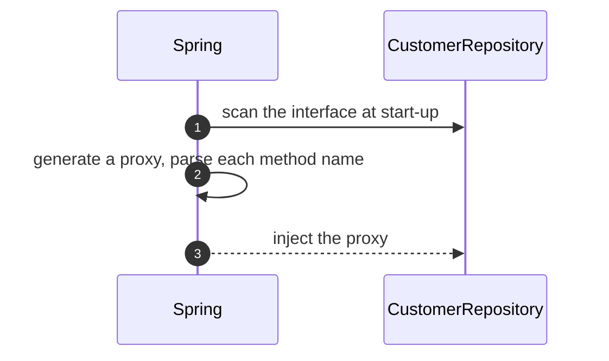
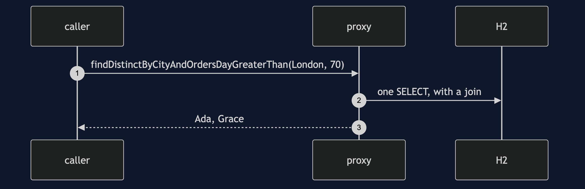
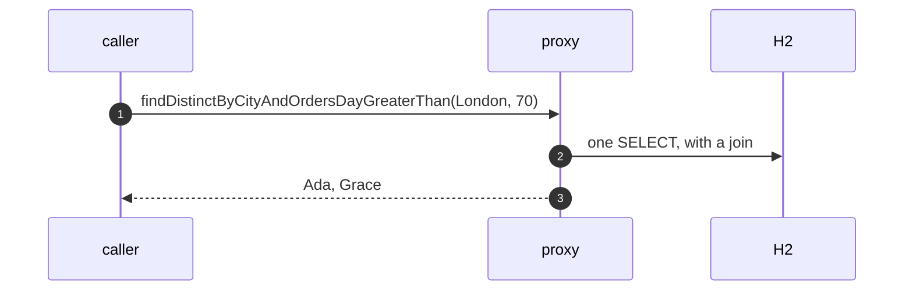
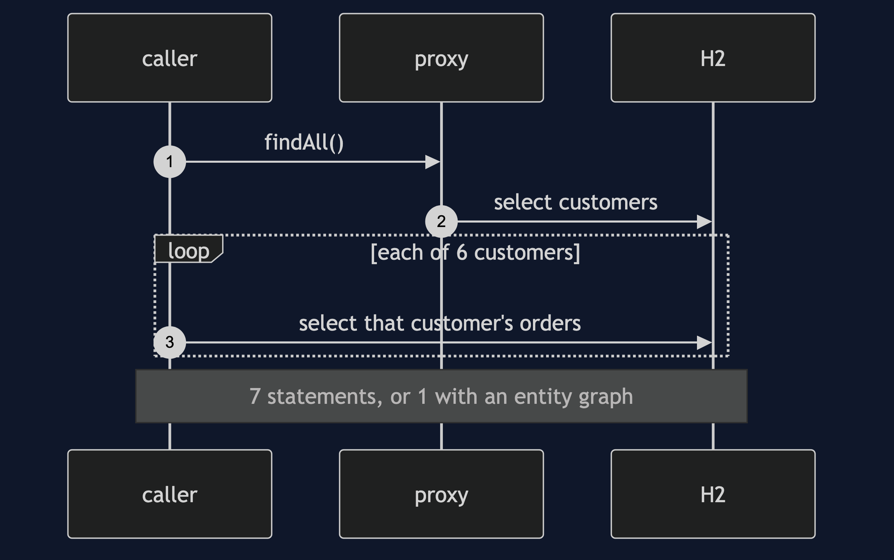
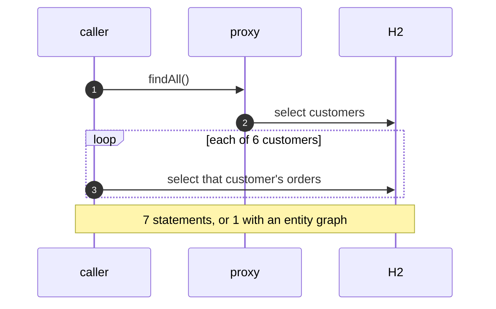
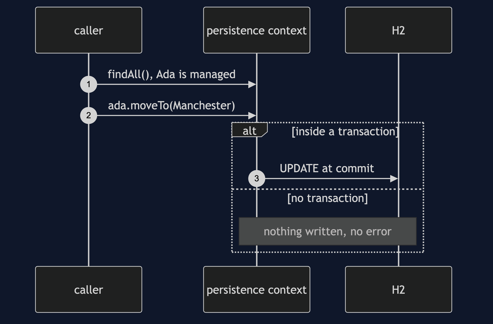
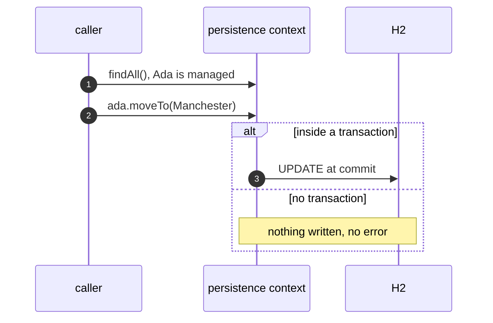

# Repository with Spring Data Pattern — UML Sequence Diagrams

Four sequences.

## 1. No Implementation

Mermaid source

## 2. A Query From A Name

Mermaid source

## 3. N Plus One, And A Graph

Mermaid source

## 4. The Leak

Mermaid source

