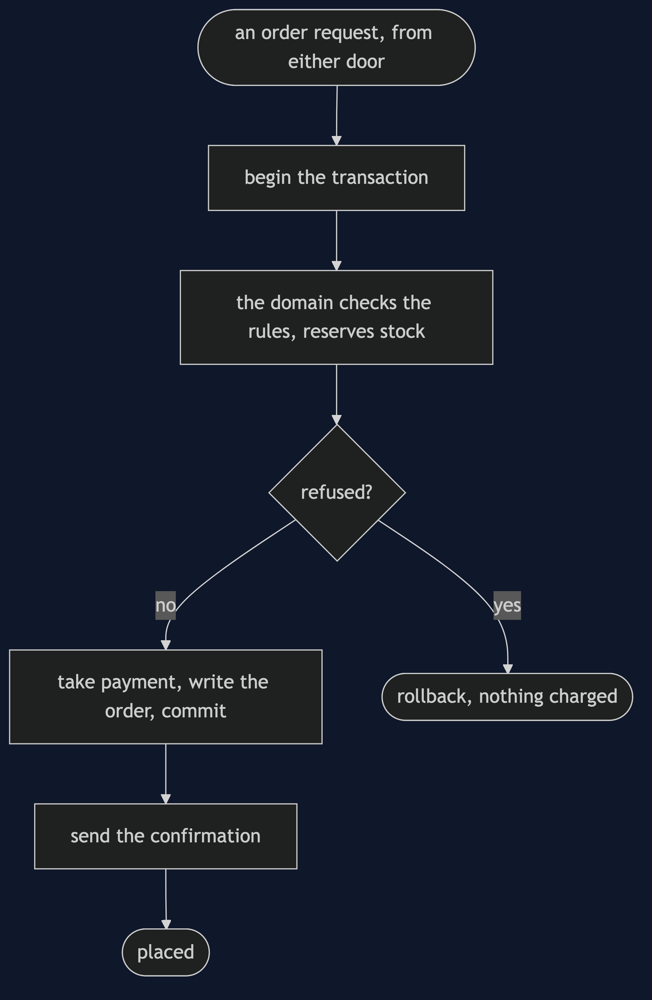
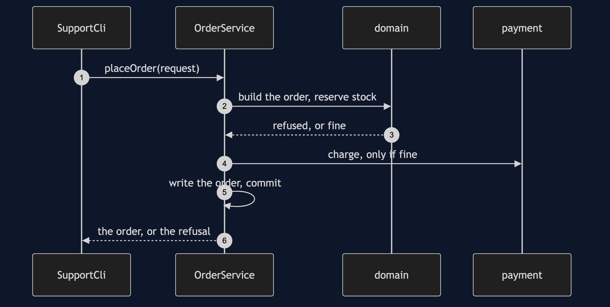
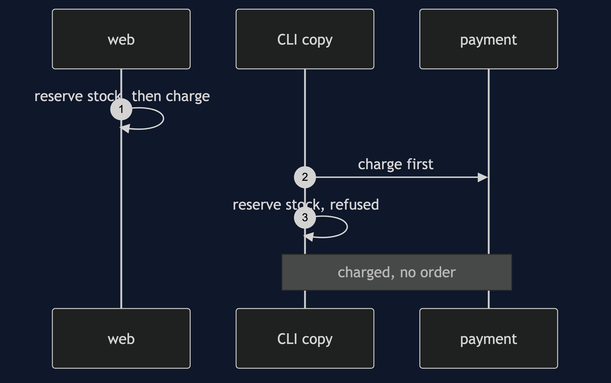
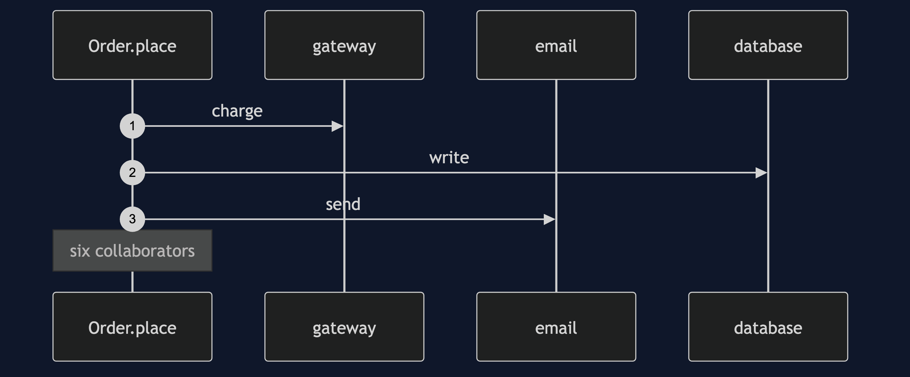
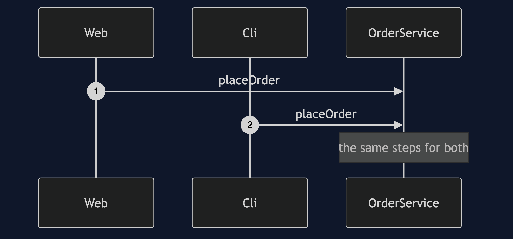
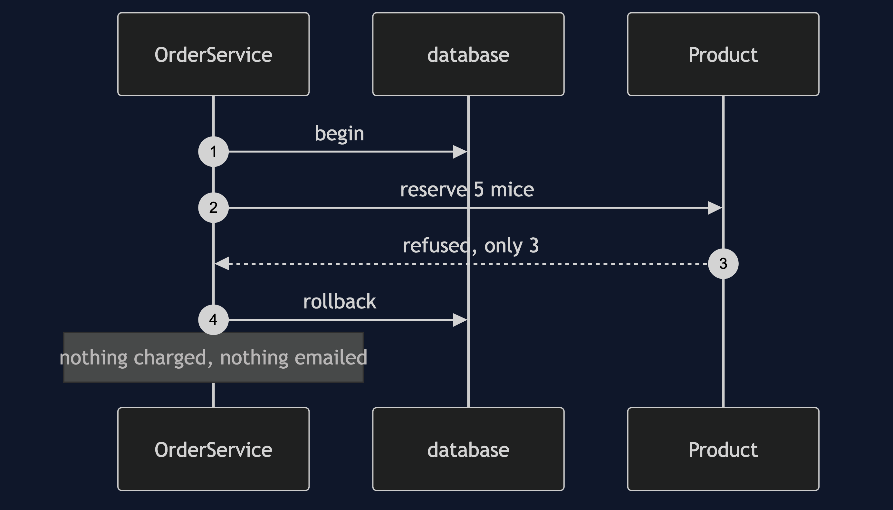

# Service Layer Pattern

```
src/main/java/com/jk/explore/servicelayer/
├── PlaceOrderDemo.java              composition root — the six acts
│
├── toydb/                           ← the toy database, with begin and rollback
├── domain/                          ← the rules live here
│   ├── Order.java                    rejects an empty cart; knows free delivery
│   ├── Product.java                  refuses to go below zero stock
│   ├── OrderRequest.java  CartLine.java  OrderRejectedException.java
│   ├── PaymentGateway.java  EmailService.java   fakes that remember what they did
│   └── Shop.java                     the seeded store
├── naive/
│   ├── ControllerLogic.java          the logic in the controller
│   ├── CopiedInTheCli.java           the same logic, copied for a second door
│   └── SelfPlacingOrder.java         the other version: it all in the domain object
│
└── pattern/                         ← the real thing
    ├── OrderService.java             one placeOrder: orchestration and transaction
    ├── WebController.java  SupportCli.java   two doors onto it
    └── AnemicOrder.java              the bill: fields and getters only
```

**A service layer defines the application's operations: one placeOrder, called by every door, owning the orchestration and the transaction while the domain owns the rules.**

This is the sixth project in [enterprise-design-patterns](..). "Put business logic in a service" is advice, not a pattern, so this project is anchored on something concrete: a second entry point, and the drift it causes.

## Run

```bash
./gradlew run
```

Six acts. Every operation against the toy database is counted, and every count quoted below comes from that counter.

```
SERVICE LAYER — where does "place an order" live?

ONE. The logic in the controller — with one door, it works.
  a good order:   placed
  charged: 20000 pence, emails sent: 1
  for one entry point this is fine. then support asks for a command line.

TWO. A second door — the logic is copied, and it drifts.
  the same request, 5 mice when 3 are in stock:
  through the web:  refused: only 3 Mouse in stock, 5 wanted, charged 0
  through the CLI:  refused: only 3 Mouse in stock, 5 wanted, charged 6000
  the web door was fixed to reserve stock first. the copy was not.
  a customer is charged or not, depending on which door they came through.

THREE. The other version — put it all in the domain object.
  Order.place() needs a payment gateway, an email service, a database and the products.
  its constructor takes 6 things.
  it is no longer a domain object.

FOUR. The pattern — one placeOrder, two doors.
  through the web:  refused: only 3 Mouse in stock, 5 wanted, charged 0
  through the CLI:  refused: only 3 Mouse in stock, 5 wanted, charged 0
  the same answer, because there is one placeOrder.
  the service owns the order of the steps and the transaction.
  the domain owns the rules: stock cannot go below zero.

FIVE. The bill — the anemic domain model.
  AnemicOrder has 8 methods. all getters and setters: true
  Order, this project's domain object, carries rules: from() rejects an empty cart or a
  zero quantity, and deliveryIsFree() decides delivery. Product.reserve() refuses to go below zero.
  push every rule into services and the domain becomes a bag of fields.
  the honest line: business rules in the domain, orchestration in the service.

SIX. The line is hard to draw.
  "free delivery over 50 pounds": is that a rule about the order, or about shipping?
  here it is on Order: deliveryIsFree() for a 150 pound order is true.
  another team could put it in a ShippingService, and be just as right.
  where you have met this: a @Service class, with @Transactional on placeOrder.
```

## Test

```bash
./gradlew test
```

3 test classes, 13 test methods, offline, with no database installed.

## Technologies and versions

| What | Version | Why it is here |
| --- | --- | --- |
| Java | 21 | The repository standard, via the Gradle toolchain block |
| Gradle | 9.2.1 | The wrapper in this directory; no separate install needed |
| JUnit 5 | 5.10.2 | Test runner |

No framework. A hand-built project stays plain Java so the mechanism is the whole lesson.

## Learning Material

| Document | What it covers |
| --- | --- |
| [`docs/problem-statement.md`](docs/problem-statement.md) | Placing an order, and the second door |
| [`docs/service-layer-pattern-explained.md`](docs/service-layer-pattern-explained.md) | The service, what it owns, and the bill |
| [`docs/class-diagram.md`](docs/class-diagram.md) | The types |
| [`docs/architecture-diagram.md`](docs/architecture-diagram.md) | Doors, service, domain |
| [`docs/data-flow-diagram.md`](docs/data-flow-diagram.md) | One order, placed or refused |
| [`docs/sequence-diagram.md`](docs/sequence-diagram.md) | Written for a listener with the screen off |
| [`docs/uml-diagram.md`](docs/uml-diagram.md) | Four sequences |
| [`docs/animation.html`](docs/animation.html) | The six acts in a browser |
| [`docs/prerequisites.md`](docs/prerequisites.md) | What you need to know |
| [`docs/session.md`](docs/session.md) | A one-hour taught session |
| [`docs/spec.md`](docs/spec.md) | The generated specification |
| [`docs/youtube.md`](docs/youtube.md) | Title, description and chapters |

### The pattern in one picture


### Where each piece sits


### How one request moves



### Who calls whom, in order



### All four sequences









### Video

Built from [`video/scenes.py`](video/scenes.py) by
[`video/build_video.sh`](video/build_video.sh). The rendered file is not
committed; see the repository README for why.

## Where you have already met this

A `@Service` class with `@Transactional` on `placeOrder` is this pattern: the annotation draws the transaction boundary at the service.

## When this is too much

For one door and one operation a service layer is an extra class. It earns its place the moment a second door appears.

## Where this sits

This is the sixth project in [`enterprise-design-patterns`](..). It sits above [Repository](../repository-pattern) and [Unit of Work](../unit-of-work-pattern).
