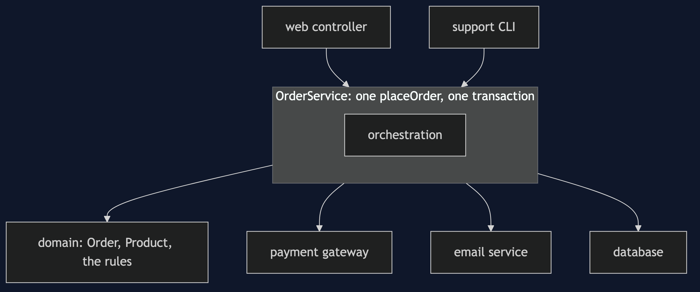
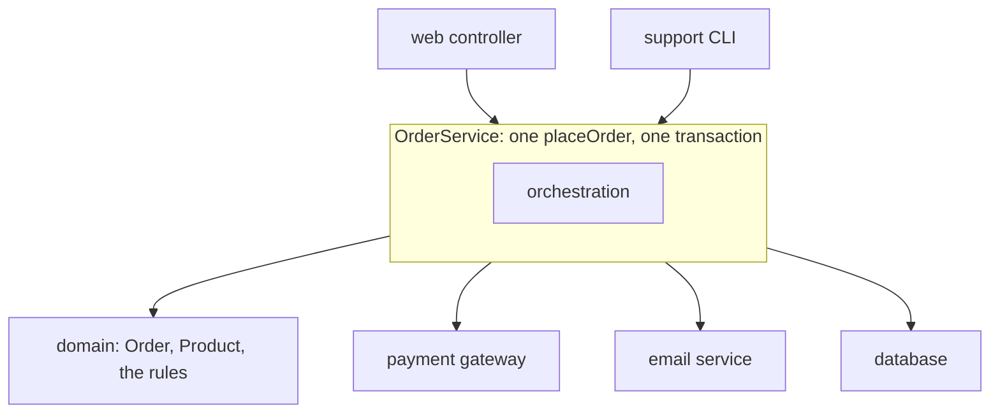

# Service Layer Pattern — Architecture Diagram

Every door goes through the service, and the service calls the domain.

Mermaid source

```mermaid
flowchart TB
    W["web controller"] --> S
    C["support CLI"] --> S
    subgraph S["OrderService: one placeOrder, one transaction"]
        O["orchestration"]
    end
    S --> D["domain: Order, Product, the rules"]
    S --> P["payment gateway"]
    S --> E["email service"]
    S --> DB["database"]
```

