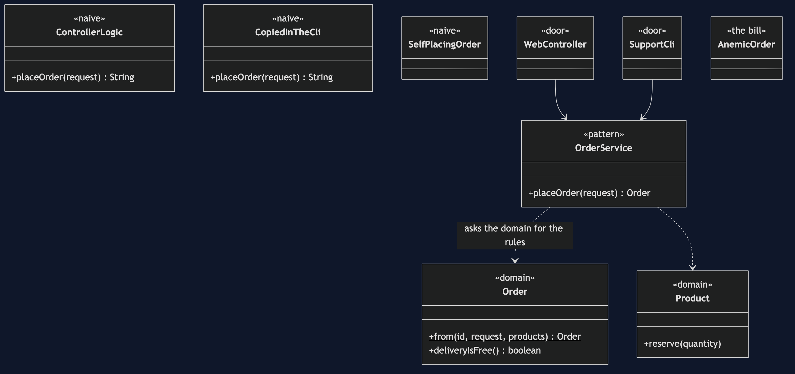
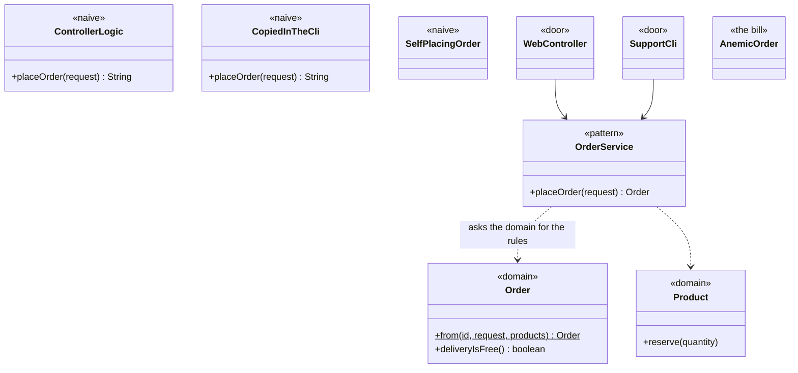

# Service Layer Pattern — Class Diagram

Two doors and one service. The rules stay in `Order` and `Product`.

Mermaid source

```mermaid
classDiagram
    class ControllerLogic {
        <<naive>>
        +placeOrder(request) String
    }
    class CopiedInTheCli {
        <<naive>>
        +placeOrder(request) String
    }
    class SelfPlacingOrder {
        <<naive>>
    }
    class OrderService {
        <<pattern>>
        +placeOrder(request) Order
    }
    class WebController {
        <<door>>
    }
    class SupportCli {
        <<door>>
    }
    class Order {
        <<domain>>
        +from(id, request, products)$ Order
        +deliveryIsFree() boolean
    }
    class Product {
        <<domain>>
        +reserve(quantity)
    }
    class AnemicOrder {
        <<the bill>>
    }
    WebController --> OrderService
    SupportCli --> OrderService
    OrderService ..> Order : asks the domain for the rules
    OrderService ..> Product
```

