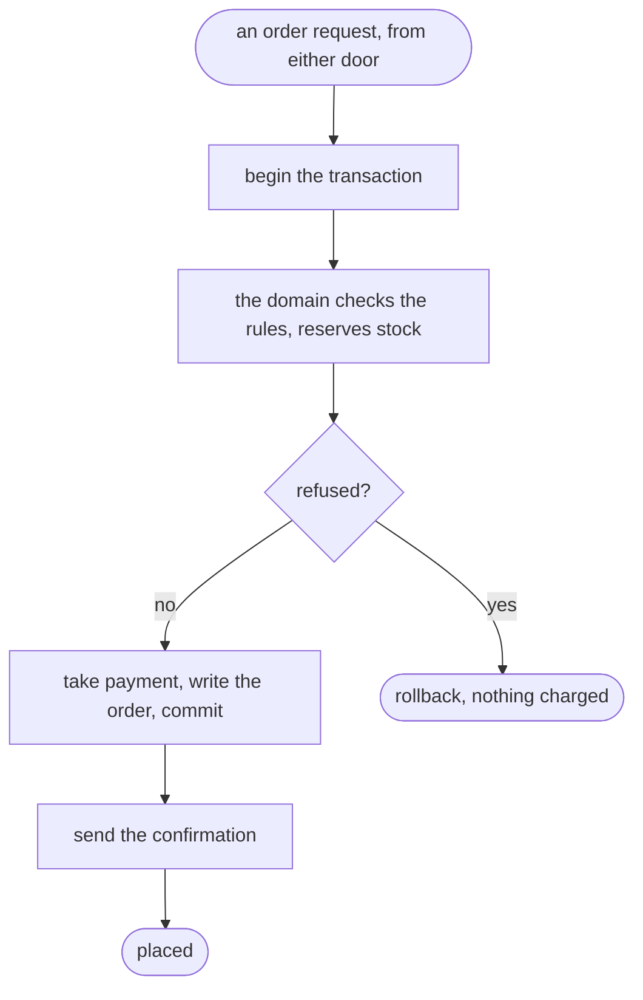

# Service Layer Pattern — Data Flow Diagram

One order, from a door to a confirmed or refused order.

Mermaid source

```mermaid
flowchart TD
    Req(["an order request, from either door"])
    Begin["begin the transaction"]
    Rules["the domain checks the rules, reserves stock"]
    Ok{"refused?"}
    Pay["take payment, write the order, commit"]
    Mail["send the confirmation"]
    Undo(["rollback, nothing charged"])
    Done(["placed"])
    Req --> Begin --> Rules --> Ok
    Ok -- yes --> Undo
    Ok -- no --> Pay --> Mail --> Done
```

