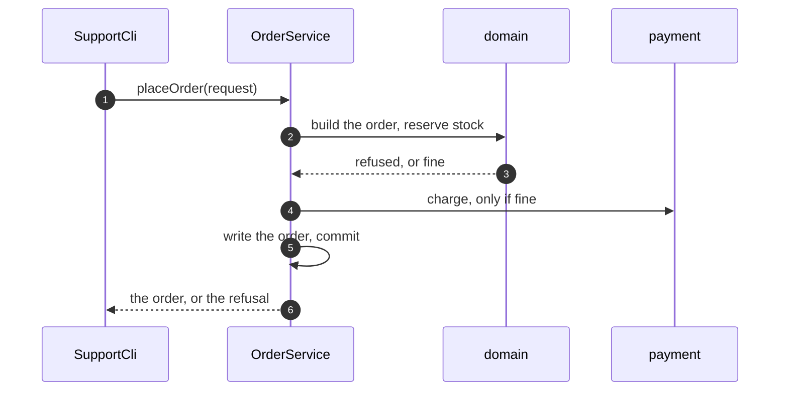

# Service Layer Pattern — Sequence Diagram

Written for a listener with the screen off.

Say it in words. The support agent uses the command line. The command line does not decide anything. It hands the request to the order service. The service opens a transaction, asks the domain to build the order and reserve stock. If the domain refuses, the service rolls back and nothing was charged. If not, it takes payment, writes the order, commits, and only then sends the email. The web door would do exactly the same, because it calls the same service.

Mermaid source

The load-bearing sentence: **both doors call the same placeOrder, so they cannot disagree.**
