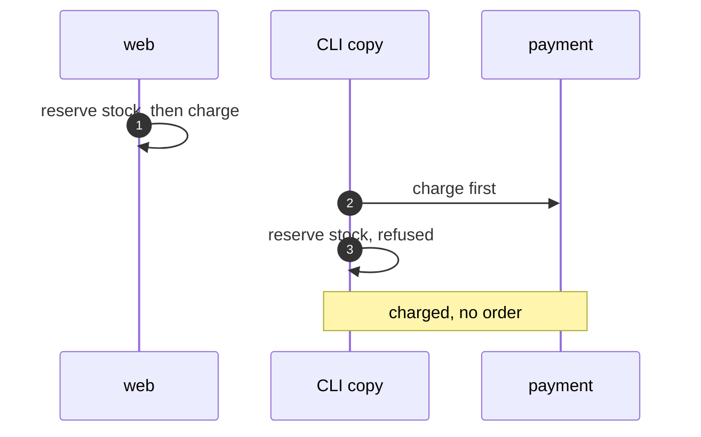
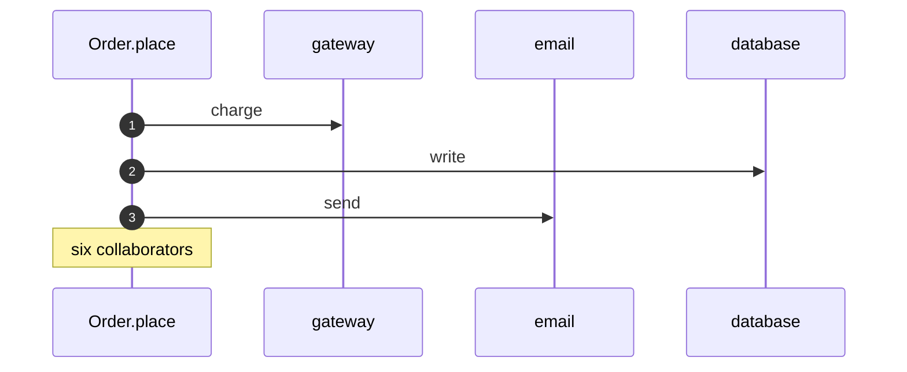
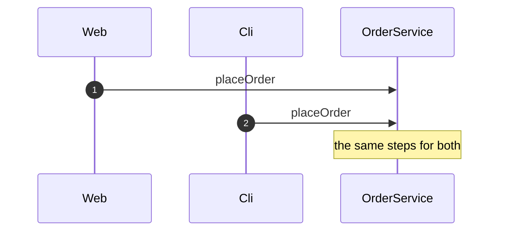
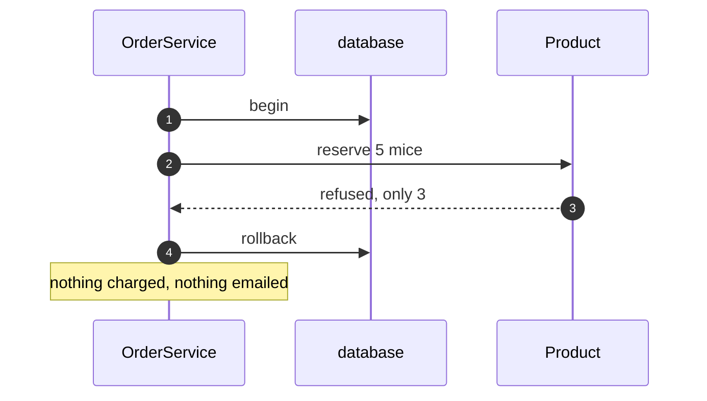

# Service Layer Pattern — UML Sequence Diagrams

Four sequences.

## 1. Two Doors, Two Copies

Mermaid source

## 2. Everything In The Order

Mermaid source

## 3. One Service

Mermaid source

## 4. A Refused Order

Mermaid source

