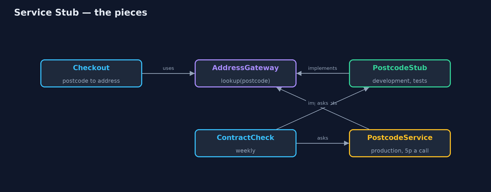

# Service Stub Pattern

```
src/main/java/com/jk/explore/servicestub/
├── AddressGateway.java   The shop's one door to the postcode service: a postcode in, an address out, or nothing if unknown
├── Checkout.java         The part of checkout that fills in the delivery address from a postcode, and copes when it cannot
├── ContractCheck.java    Asks the stub and the real service the same questions and lists where they disagree
├── PostcodeService.java  The real, external postcode service: 5p and 400 ms a lookup, needs the network, and insists on capital letters
├── PostcodeStub.java     The pattern: a free, instant, in-memory stand-in for the postcode service, used in development and tests
└── ServiceStubDemo.java  The five acts: developing against the real service, the stub, edge cases on demand, the contract check, and the bill
```

**Put an external service behind a gateway interface, and during development and testing plug in a small, free, in-memory stub that behaves like it, checked regularly against the real thing.**

Service Stub is one of Martin Fowler's enterprise application patterns. When
your code depends on an external service that is slow, costs money per call,
or needs the network, you put that service behind a gateway interface. In
development and in tests you plug in a stub: a small in-memory class that
implements the same interface and answers like the real service would.

The stub is free and instant, works offline, and can be told to behave badly
on purpose, so the awkward cases can be tested. Because it is a copy of
someone else's behaviour, it must be checked against the real service from
time to time.

## The idea in everyday terms

Think of a flight simulator. Pilots practise in it every day: it costs nothing
to fly, and it can give them an engine failure on demand, which nobody would
arrange on a real aircraft. But the simulator is only useful while it behaves
like the real plane, so it is checked against the real aircraft's data.

## The scenario

At checkout, the online store turns a postcode into an address using an
external postcode service. Each lookup costs 5 pence and takes 400
milliseconds, and it needs the network. Developers called it for every test
checkout, paid for it, waited for it, and could not work on the train.

## Run

```bash
./gradlew run
```

The demo tells the story in 5 acts, each printing exact numbers that the tests check:

| Act | What it shows |
| --- | --- |
| 1. The real service in development | 50 test checkouts cost £2.50 and 20 seconds of waiting; offline, the lookup is unavailable. |
| 2. A service stub | PostcodeStub implements the same AddressGateway: 50 checkouts, £0.00, no network, no waiting. |
| 3. Awkward cases on demand | The stub answers an unknown postcode and can pretend to be down; checkout asks the customer to type the address. |
| 4. The contract check | Asked the same postcodes, stub and real agree except "ls1 4ap": the stub finds it, the real service errors. |
| 5. The bill | The stub is a second, simpler copy of someone else's service: it must be kept in step and knows only what you gave it. |

## Test

```bash
./gradlew test
```

8 tests in `CheckoutTest`, `DemoRunsTest`. Every number the demo prints is asserted, and nothing depends on the clock, so every run gives the same result.

## Technologies and versions

| Technology | Version | Used for |
| --- | --- | --- |
| Java | 21 | the code (toolchain set in `build.gradle`) |
| Gradle | 9.2.1 (wrapper) | build and run, nothing to install |
| JUnit | 5.10.2 | the tests |
| videokit | repository tool | the narrated video and animation: Piper `en_US-amy-medium`, speed 0.8, longer pauses (the approved `amy-slow` voice) |

## Learning Material

| Document | What it is for |
| --- | --- |
| [Problem statement](docs/problem-statement.md) | the situation and what the project must show |
| [Prerequisites](docs/prerequisites.md) | what you need to know first |
| [Service Stub, explained](docs/service-stub-pattern-explained.md) | the acts in prose |
| [Session guide](docs/session.md) | a one-hour lesson with exercises |
| [Animated walkthrough](docs/animation.html) | the acts step by step, narrated |
| [Spec](docs/spec.md) | what this project must be true of |

### The pattern in one picture

Checkout sees only the gateway; the stub or the real service sits behind it.



### Where each piece sits

One interface, two implementations, one check between them.


### How the data moves

The stub can produce every answer checkout must handle.


### Who calls whom, in order

No network, no fee.


### Video

`video/service-stub-pattern-explained.mp4` (with `.m4a` audio and `.srt` subtitles) is built by `video/build_video.sh`. Rendered media is not committed.

## What it costs

- **A second copy to keep in step.** The stub is someone else's behaviour, rewritten; when the real service changes, the stub does not.
- **It only knows what you told it.** A handful of postcodes, not millions.
- **Stubs can lie.** Here the stub accepted small letters, which the real service refuses; only the contract check noticed.

## When this is too much

When the real service is free, fast, reliable and available offline, such as
a library inside your own program, call it directly. And do not stub your own
database or your own code just to make tests fast; stub what is genuinely
outside your control.

## Where you have already met this

- WireMock and MockServer, which stand in for HTTP services.
- Payment providers' test modes and sandbox accounts.
- LocalStack, which stands in for cloud services on a laptop.
- Pact and other contract-testing tools, which check that stubs still match the real thing.

## Where this sits

This project is in [enterprise-design-patterns](..). It is a close relative of
the [Test Double](../../testing-design-patterns/test-double-pattern) family:
a service stub is a long-lived fake for a whole external service, used for
development as well as tests.
