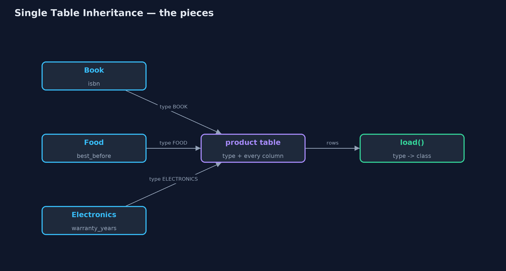
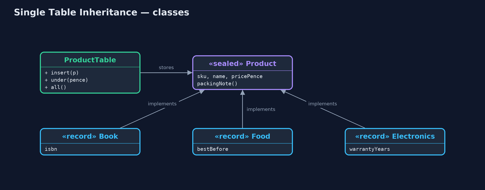
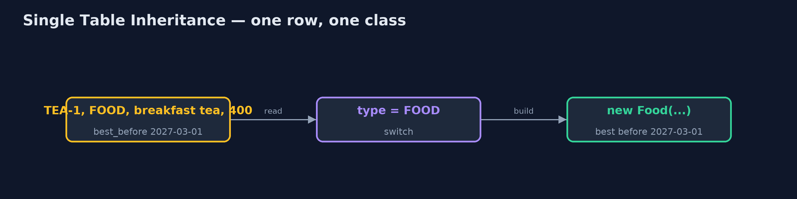
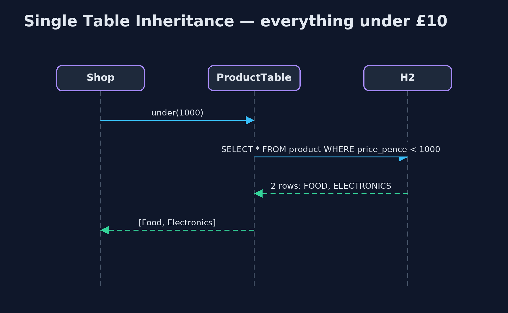

# Single Table Inheritance Pattern

```
src/main/java/com/jk/explore/singletable/
├── ProductTable.java     The pattern: every product type in one table, with a type column saying which class each row becomes
├── Products.java         The shop's product types
├── SingleTableDemo.java  The five acts: a table per type, one table for all, each row becoming its own class, a new type, and the bill
└── TablePerType.java     Without the pattern: one table per product type, so a question about all products asks every table
```

**Store every subclass in one table, with a type column that says which class each row becomes, and leave the columns another type needs empty.**

Single Table Inheritance is one of Martin Fowler's enterprise application
patterns for storing a class hierarchy in a relational database. Every
subclass (book, food, electronics) is stored in the same table. A type column
says which class each row is, and there is a column for every field any
subclass has; a row simply leaves empty the columns that do not apply to it.

A question about all products is one query on one table, and each row is
turned back into the right class when it is loaded. The price is empty cells,
and rules the database can no longer enforce.

## The idea in everyday terms

Think of one travel expenses form used for every kind of trip. It has a
section for car journeys (miles driven), one for trains (ticket number) and
one for flights (flight code). You fill in the section for your trip and leave
the others blank. The finance team keeps one pile of forms, and a stamp in the
corner says which kind each one is.

## The scenario

The online store sells books, food and electronics. Each shares a code, a
name and a price, and each has one field of its own: an ISBN, a best-before
date, a warranty. They were stored in one table per type, so any question
about all products, such as "everything under £10", had to ask every table.

## Run

```bash
./gradlew run
```

The demo tells the story in 5 acts, each printing exact numbers that the tests check:

| Act | What it shows |
| --- | --- |
| 1. A table per type | Everything under £10 needs 3 queries, one per table: breakfast tea and a desk lamp. |
| 2. One table for all | One product table with a type column: everything under £10 is 1 query. |
| 3. Each row becomes its own class | Loading reads the type column: BOOK-1 becomes a Book, KETTLE-1 an Electronics, TEA-1 a Food, each with its own packing note. |
| 4. A new type | Gift cards need one class and one new column, value_pence; existing rows are untouched. |
| 5. The bill | 15 of 20 type-specific cells are empty; a book without an ISBN is saved because the column cannot be NOT NULL. |

## Test

```bash
./gradlew test
```

7 tests in `DemoRunsTest`, `ProductTableTest`. Every number the demo prints is asserted, and nothing depends on the clock, so every run gives the same result.

## Technologies and versions

| Technology | Version | Used for |
| --- | --- | --- |
| Java | 21 | the code (toolchain set in `build.gradle`) |
| Gradle | 9.2.1 (wrapper) | build and run, nothing to install |
| JUnit | 5.10.2 | the tests |
| H2 Database | 2.5.252 | an in-memory SQL database, so the demo runs real SQL with nothing installed |
| videokit | repository tool | the narrated video and animation: Piper `en_US-amy-medium`, speed 0.8, longer pauses (the approved `amy-slow` voice) |

## Learning Material

| Document | What it is for |
| --- | --- |
| [Problem statement](docs/problem-statement.md) | the situation and what the project must show |
| [Prerequisites](docs/prerequisites.md) | what you need to know first |
| [Single Table Inheritance, explained](docs/single-table-inheritance-pattern-explained.md) | the acts in prose |
| [Session guide](docs/session.md) | a one-hour lesson with exercises |
| [Animated walkthrough](docs/animation.html) | the acts step by step, narrated |
| [Spec](docs/spec.md) | what this project must be true of |

### The pattern in one picture

Many classes in, one table, many classes out.



### Where each piece sits

A sealed interface with four records, stored by one class.



### How the data moves

The type column decides.



### Who calls whom, in order

One query, mixed types back.



### Video

`video/single-table-inheritance-pattern-explained.mp4` (with `.m4a` audio and `.srt` subtitles) is built by `video/build_video.sh`. Rendered media is not committed.

## What it costs

- **Empty cells.** Every row leaves most type-specific columns empty: 15 of 20 in the demo.
- **Weaker rules.** A book's ISBN cannot be `NOT NULL`, because food and kettles leave that column empty; the database accepts a book without one.
- **One wide table.** Every new type adds columns everyone else carries.

## When this is too much

When subclasses differ a lot, with many fields of their own, the table fills
with empty columns; Class Table Inheritance (a table per class, joined) or
Concrete Table Inheritance (a full table per concrete class) fit better. And
when types are rarely queried together, separate tables are simpler.

## Where you have already met this

- JPA's `@Inheritance(strategy = SINGLE_TABLE)` with `@DiscriminatorColumn`.
- Ruby on Rails' `type` column on ActiveRecord models.
- Product tables in shop platforms with a `product_type` column.

## Where this sits

This project is in [enterprise-design-patterns](..), next to
[Table Data Gateway](../table-data-gateway-pattern), which is the simplest way
to put a table's SQL in one place.
