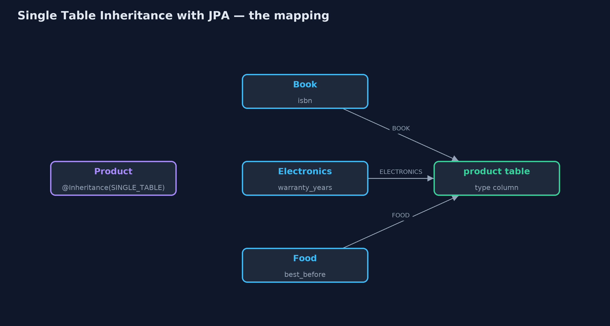
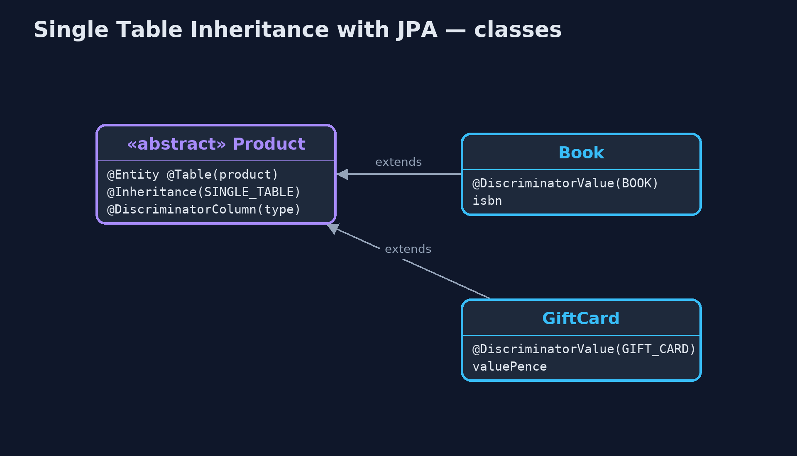
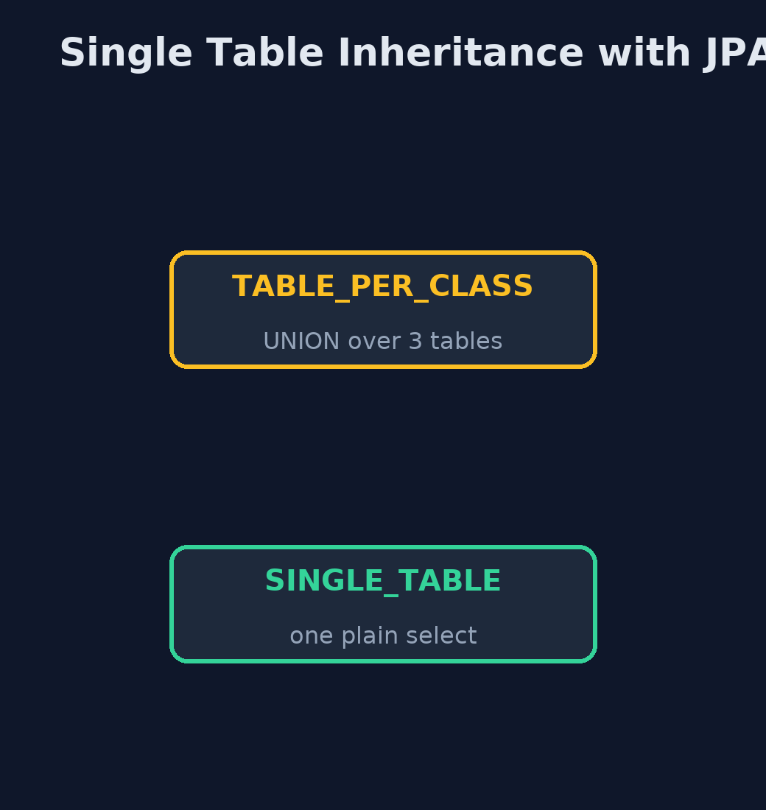
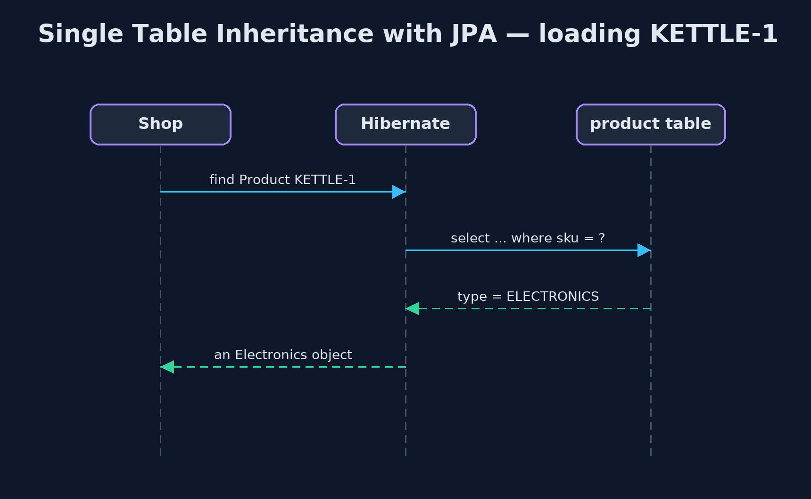

# Single Table Inheritance with JPA Pattern

```
src/main/java/com/jk/explore/stijpa/
├── JpaSingleTableDemo.java        The five acts, with JPA annotations and the SQL Hibernate writes for them
├── ShopApp.java                   The Spring Boot application: an in-memory H2 database and Hibernate, with no web server
├── SqlLog.java                    Hibernate hands every SQL statement it is about to send to this class first, so the demo can show exactly what JPA's annotations turned into
├── perclass/BookItem.java         Its own table, with its own copy of the shared columns
├── perclass/CatalogItem.java      Before: the same products with a table for every class (JPA's TABLE_PER_CLASS strategy)
├── perclass/ElectronicsItem.java  Its own table, with its own copy of the shared columns
├── perclass/FoodItem.java         Its own table, with its own copy of the shared columns
├── single/Book.java               A product row whose type column says BOOK
├── single/Electronics.java        A product row whose type column says ELECTRONICS
├── single/Food.java               A product row whose type column says FOOD
├── single/GiftCard.java           A product row whose type column says GIFT_CARD
└── single/Product.java            The pattern: every kind of product in one table, called product
```

**Map the shop's product classes to one table with JPA's @Inheritance(SINGLE_TABLE), let Hibernate write the SQL and pick each row's class from a type column, and compare the SQL with a table per class.**

This is the framework version of the Single Table Inheritance pattern. The
plain Java version, a separate project in this category, writes the SQL and
the type column by hand. Here JPA, the Java standard for mapping classes to
tables, does it with one annotation, and Hibernate, the JPA implementation
Spring Boot uses, writes the SQL. The database is an in-memory H2, so nothing
has to be installed.

`@Inheritance(strategy = SINGLE_TABLE)` puts every product class in one table,
with a `type` column that Hibernate fills in on save and reads on load to
build the right class. The demo captures the SQL Hibernate actually sends,
to compare it with JPA's table-per-class strategy.

## The idea in everyday terms

Think of a shop's single stock book with a column for each kind of detail:
ISBN for books, warranty for electronics, best-before date for food. Every
item gets one line, with a word at the start saying what kind it is, and the
columns that do not apply are left blank.

## The scenario

The online store sells books, electronics and food, each with its own
details. With a table for each kind, the question "everything under £10" had
to search every table, and each new kind of product made every such question
bigger.

## Run

Nothing to install beyond a Java 21 JDK: Spring Boot, Hibernate and an
in-memory H2 database all run inside the program.

```bash
./gradlew run
```

The demo tells the story in 5 acts, each printing exact numbers that the tests check:

| Act | What it shows |
| --- | --- |
| 1. A table per class | With @Inheritance(TABLE_PER_CLASS), everything under £10 comes from one query that UNIONs 3 tables. |
| 2. One table | With @Inheritance(SINGLE_TABLE), the same question is one plain select from the product table. |
| 3. Each row as its own class | Rows load as Book, Electronics and Food, each with its own detail; the type column holds BOOK, ELECTRONICS and FOOD. |
| 4. A new type | A GiftCard subclass adds one class and one column, value_pence; GIFT-1 loads as a GiftCard. |
| 5. The bill | 15 of 20 type-specific cells are NULL; isbn cannot be made NOT NULL, so a book with no ISBN is saved. |

## Test

```bash
./gradlew test
```

1 tests in `DemoRunsTest`. Every result the demo prints is asserted, with Hibernate and an in-memory H2 database.

## What the simulation got right, and what it left out

The plain Java version got the idea right: one table, a type column, one query
for questions about every product, each row read back as its own class, a new
type costing one class and one column, and the price of empty cells and rules
the database cannot keep. What it left out is that JPA makes this one
annotation, and hides the SQL. Capturing Hibernate's statements shows the
real difference: table-per-class became a UNION over three tables, single
table one plain select. And the framework has a sharp edge the plain version
could not show: putting @Column(nullable = false) on a subclass field made the
shared column NOT NULL, and no kettle or tea could be saved at all.

## Technologies and versions

| Technology | Version | Used for |
| --- | --- | --- |
| Java | 21 | the code (toolchain set in `build.gradle`) |
| Gradle | 9.2.1 (wrapper) | build and run, nothing to install |
| JUnit | 5.10.2 | the tests |
| Spring Boot | 4.1.1 | starts Hibernate and the database |
| Hibernate ORM | with Spring Boot 4.1.1 | the JPA implementation that writes the SQL |
| Jakarta Persistence (JPA) | with Spring Boot 4.1.1 | @Entity, @Inheritance, @DiscriminatorColumn |
| H2 | with Spring Boot 4.1.1 | the in-memory database |
| videokit | repository tool | the narrated video and animation: Piper `en_US-amy-medium`, speed 0.8, longer pauses (the approved `amy-slow` voice) |

## Learning Material

| Document | What it is for |
| --- | --- |
| [Dependencies](docs/dependencies.md) | what the framework and infrastructure are, and why they are here |
| [Problem statement](docs/problem-statement.md) | the situation and what the project must show |
| [Prerequisites](docs/prerequisites.md) | what you need to know first |
| [Single Table Inheritance with JPA, explained](docs/single-table-inheritance-with-jpa-pattern-explained.md) | the acts in prose |
| [Session guide](docs/session.md) | a one-hour lesson with exercises |
| [Animated walkthrough](docs/animation.html) | the acts step by step, narrated |
| [Spec](docs/spec.md) | what this project must be true of |

### The pattern in one picture

Four classes, one table.



### Where each piece sits

Annotations decide the tables.



### How the data moves

Same question, two strategies.



### Who calls whom, in order

The type column picks the class.



### Video

`video/single-table-inheritance-with-jpa-pattern-explained.mp4` (with `.m4a` audio and `.srt` subtitles) is built by `video/build_video.sh`. Rendered media is not committed.

## What it costs

- **Empty cells.** 15 of 20 type-specific cells were NULL.
- **Rules the database cannot keep.** isbn could not be made NOT NULL; the rule must live in Java, with Bean Validation.
- **Annotations with side effects.** @Column(nullable = false) on a subclass field broke saving every other type.

## When this is too much

If the types share almost nothing, or have many columns each, JPA's JOINED
strategy, a table per class joined to a shared one, keeps the data tidier.
Single table pays off when types share most columns and queries span them all.

## Where you have already met this

- `@Inheritance(strategy = InheritanceType.SINGLE_TABLE)` in JPA entities.
- Ruby on Rails' single table inheritance with a type column.
- Hibernate's default inheritance mapping, which is single table.

## Where this sits

This project is in [enterprise-design-patterns](..). It is the framework
version of the plain Java Single Table Inheritance project in the same
category, which is left unchanged.
